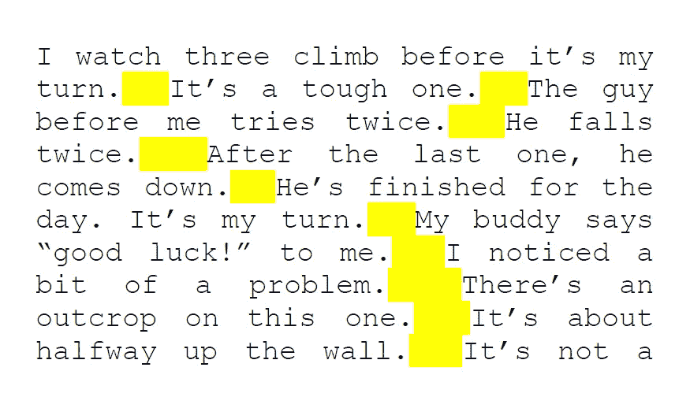

# 读完这篇文章后，你可能会成为一名正则表达式大师！

> 原文：<https://levelup.gitconnected.com/you-might-become-a-regex-master-after-reading-this-efe63db7d3c9>

# 什么是正则表达式？

美国数学家[斯蒂芬·科尔·克莱尼](https://en.wikipedia.org/wiki/Stephen_Cole_Kleene)描述并形式化了这些在文本中寻找特定模式的字符序列。

**(？< =\。) {2,}(?=[A-Z])** 至少匹配两个空格，前提是它们直接出现在句点(.)和一个大写字母之前(图片来自维基百科)

# 如何在 Python 中使用 Regex？

*   导入`re`库
*   使用`re.findall()`方法返回包含所有匹配的列表。
*   使用返回 Match 对象的`re.search()`方法，该对象可进一步用于检索更多信息。

要了解更多信息，请点击以下链接:

 [## Python 正则表达式

### 正则表达式是构成搜索模式的一系列字符。正则表达式可以用来检查是否…

www.w3schools.com](https://www.w3schools.com/python/python_regex.asp) 

# 如何在 JavaScript 中使用 Regex？

可以使用 JavaScript 以下列方式构造正则表达式:

在此之后，可以使用以下内容来处理正则表达式:

*   `RegExp`方法(`[test()](https://developer.mozilla.org/en-US/docs/Web/JavaScript/Reference/Global_Objects/RegExp/test)`和`[exec()](https://developer.mozilla.org/en-US/docs/Web/JavaScript/Reference/Global_Objects/RegExp/exec)`)
*   `[String](https://developer.mozilla.org/en-US/docs/Web/JavaScript/Reference/Global_Objects/String)`方法(`[match()](https://developer.mozilla.org/en-US/docs/Web/JavaScript/Reference/Global_Objects/String/match)`、`[replace()](https://developer.mozilla.org/en-US/docs/Web/JavaScript/Reference/Global_Objects/String/replace)`、`[search()](https://developer.mozilla.org/en-US/docs/Web/JavaScript/Reference/Global_Objects/String/search)`和`[split()](https://developer.mozilla.org/en-US/docs/Web/JavaScript/Reference/Global_Objects/String/split)`)

要了解更多信息，请点击以下链接:

 [## 正则表达式- JavaScript | MDN

### 正则表达式是用于匹配字符串中字符组合的模式。在 JavaScript 中，正则表达式…

developer.mozilla.org](https://developer.mozilla.org/en-US/docs/Web/JavaScript/Guide/Regular_Expressions#creating_a_regular_expression) 

# Regex 游乐场

在继续之前，请使用以下网站来试用下面文章中的示例:

 [## regex101:构建、测试和调试 regex

### 正则表达式测试器，语法高亮，解释，PHP/PCRE，Python，GO，JavaScript 的备忘单…

regex101.com](https://regex101.com/) 

# 正则表达式的基础

## 1.匹配精确字符

正则表达式可以包含文本中要匹配的精确的字符。

**例子:**

*   `Ashish`的正则表达式将在`My name is Ashish`中找到匹配项
*   在`My name is ashish`找不到匹配

## 2.匹配给定集合中的一个字符

一个包含方括号`[]`中的一组字符的正则表达式将匹配该组字符中的一个。

**例子:**

*   `[bd]ig`的正则表达式将在字符串`big`和`dig`中找到匹配
*   在字符串`fig`和`rig`中找不到匹配

照片由[替代代码](https://unsplash.com/@altumcode?utm_source=medium&utm_medium=referral)在 [Unsplash](https://unsplash.com?utm_source=medium&utm_medium=referral) 上拍摄

## 3.匹配任何字符

正则表达式`.`将与任何单个字符**匹配。**

**例子:**

正则表达式`...`将匹配:

*   字母(`act`)
*   数字(`123`)
*   特殊符号(`$%#`)
*   空白(`a c`)

## 4.匹配某个范围内的字符

包含一组由`-`分隔的字符的正则表达式将与该范围内的一个**单个**字符匹配。

**例子:**

*   `[A-Z]`匹配单个大写字母
*   `[a-z]`匹配单个小写字母
*   `[0-9]`匹配单个数字
*   `[A-Za-z0-9]`匹配单个大写/小写/数字
*   `[A-C]`匹配`A`和`C`之间的一个大写字母

照片由[Piotr askawski](https://unsplash.com/@tot87?utm_source=medium&utm_medium=referral)在 [Unsplash](https://unsplash.com?utm_source=medium&utm_medium=referral) 拍摄

## 5.匹配不在给定集合中的字符

包含`^`字符的正则表达式后跟一组方括号`[]`内的字符，将与不在该组中的字符**中的一个**匹配。

> 把`^`(插入符号)想象成`NOT`

**例子:**

*   `[^ABC]`匹配不是`A`、`B`或`C`的单个大写字母
*   `[^123]`匹配不是`1`、`2`或`3`的单个数字

## 6.匹配不在范围内的字符

包含`^`字符后跟一组由`-`分隔的字符的正则表达式，将匹配一个**单个**字符，**不在该范围内**。

> 把`*^*`(插入符号)想象成`*NOT*`

**例子:**

*   `[^A-C]`匹配不是`A`、`B`或`C`的单个大写字母
*   `[^5-9]`匹配不在`5`到`9`之间的单个数字

[制作者 UX 设计工作室](https://unsplash.com/@weareprocreator?utm_source=medium&utm_medium=referral)在 [Unsplash](https://unsplash.com?utm_source=medium&utm_medium=referral) 上拍摄的照片

## 7.两个字符之一的匹配

包含由`|`字符(竖线)分隔的字符的正则表达式将与其中任何一个匹配。

> 把`*|*`(烟斗)想成`*OR*`

**例子:**

*   `cat|dog`与`cat`或`dog`匹配
*   `123|234`与`123`或`234`匹配

## 8.分组字符

可以使用括号`()`对正则表达式字符进行分组。

**例子:**

*   `My name is (Ashish|ashish)`与`My name is Ashish`或`My name is ashish`匹配
*   `My name is Ashish|ashish`与`My name is Ashish`或`ashish`匹配

*注意到区别了吗？*

照片由 [Emile Perron](https://unsplash.com/@emilep?utm_source=medium&utm_medium=referral) 在 [Unsplash](https://unsplash.com?utm_source=medium&utm_medium=referral) 拍摄

## 9.字符的快捷键

*   `\w`匹配单个 ASCII 字母、数字或下划线，即`[A-Za-z0-9_]`
*   `\d`匹配`0`到`9`之间的单个数字，即`[0-9]`
*   `\s`匹配单个空白/制表符/换行符/回车/垂直制表符，即`[ \t\n\r\v]`

**例子:**

*   `\w\w`与`AB`、`12`和`_a`匹配
*   `\w\s\d`与`1 2`和`a A`匹配

## 10.否定字符的快捷键

上述**的**大写**版本否定了**中的那些字符。

*   `\W`匹配未被`\w`表示的单个字符
*   `\D`匹配未被`\d`表示的单个字符
*   `\S`匹配不是由`\s`表示的单个字符

**例子:**

*   `\D\D`与`Aa`匹配
*   `\D\D`与`12`不匹配

伊利亚·巴甫洛夫在 [Unsplash](https://unsplash.com?utm_source=medium&utm_medium=referral) 上拍摄的照片

## 12.匹配特定数量的前置字符

包含一个字符，后跟一个花括号中的数字`{}`的正则表达式将匹配指定字符的那个数字。

**例子:**

*   `b{5}`与`bbbbb`匹配
*   `\d{2}`与`12`和`32`匹配，但不与`123`和`2`匹配

## 13.与前面字符的特定范围匹配

包含一个字符后接一个花括号中的范围的正则表达式`{min, max}`将匹配指定范围中指定字符的数量。

**例子:**

*   `\d{1,2}`与`1`和`12`匹配，但不与`123`匹配
*   `w{2,3}`与`ww`和`www`匹配，但现在与`w`匹配

照片由[阿玛多·洛雷罗](https://unsplash.com/@amadorloureiro?utm_source=medium&utm_medium=referral)在 [Unsplash](https://unsplash.com?utm_source=medium&utm_medium=referral) 上拍摄

## 14.将字符与可选的

*   `?`:前面的字符可能存在，也可能不存在
*   `*`:可以出现任意数量的前置字符(**包括 0 或空字符串**)
*   `+` : **可能存在至少一个**或多个前置字符

**例子:**

*   `a**\w?**b`与`ab`、`asb`和`a3b`匹配
*   `This**\s+**is`与`This is`匹配，但与`Thisis`不匹配
*   `This**\s***is`与`This is`匹配，也与`Thisis`匹配

由[克里斯托弗·高尔](https://unsplash.com/@cgower?utm_source=medium&utm_medium=referral)在 [Unsplash](https://unsplash.com?utm_source=medium&utm_medium=referral) 上拍摄的照片

## 15.转义特殊字符

反斜杠(`\`)字符用于转义特殊字符。

**示例:**

*   `He**y?**`与`Hey`和`He`匹配
*   `Hey\?`只与`Hey?`匹配，而不与`Hey`或`He`匹配，因为我们使用反斜杠(`\`)对它的正则表达式功能进行了转义

## 16.表示一行的开始和结束

当与表示行尾的`$`一起使用时，字符`^`表示行首。

这些用来指定**与**精确匹配的线。

**例子:**

*   `^Hey there!$`与`Hey there!`匹配
*   `^Hey there!$`与`Hey there! Ashish`不匹配

斯文·布兰德斯马在 [Unsplash](https://unsplash.com?utm_source=medium&utm_medium=referral) 上的照片

# 进一步阅读

 [## 正则表达式基础| Ubuntu

### 这是直接转贴在我博客上的原文章。在我的团队中，我们每隔几周就举办一次“大师班”…

ubuntu.com](https://ubuntu.com/blog/regex-basics)  [## 正则表达式-维基百科

### 正则表达式(缩写为 regex 或 regexp 有时被称为有理表达式)是一系列…

en.wikipedia.org](https://en.wikipedia.org/wiki/Regular_expression)  [## PCRE2 规格

### PCRE2 的 HTML 文档由以下按字母顺序列出的许多页面组成。如果你是…

www.pcre.org](https://www.pcre.org/current/doc/html/) 

*就这些了！*

非常感谢你的阅读！

 [## 通过我的推荐链接加入 Medium-Ashish Bama nia 博士

### 阅读 Ashish Bamania 博士(以及 Medium 上成千上万的其他作家)的每一个故事。您的会员费直接…

bamania-ashish.medium.com](https://bamania-ashish.medium.com/membership) 

# 分级编码

感谢您成为我们社区的一员！在你离开之前:

*   👏为故事鼓掌，跟着作者走👉
*   📰查看[升级编码出版物](https://levelup.gitconnected.com/?utm_source=pub&utm_medium=post)中的更多内容
*   🔔关注我们:[Twitter](https://twitter.com/gitconnected)|[LinkedIn](https://www.linkedin.com/company/gitconnected)|[时事通讯](https://newsletter.levelup.dev)

🚀👉 [**加入升级达人集体，找到一份惊艳的工作**](https://jobs.levelup.dev/talent/welcome?referral=true)