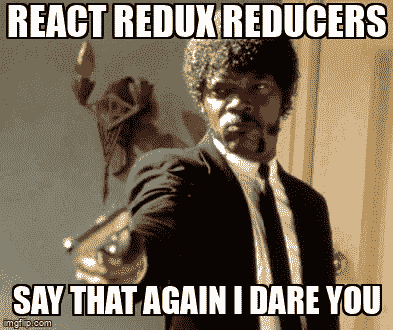

# 你可能不需要 Redux

> 原文：<https://levelup.gitconnected.com/you-might-not-need-redux-883cd1fcbab0>

我们应该何时在 React 应用中实现 Redux？

反应和还原

# 介绍

有一段时间，每当我们开始一个新的 React 项目，我们几乎毫不犹豫地立即设置 Redux。这已经成为一种习惯，根植于我们的脑海中，每当我们有一个 React 应用程序时，我们就需要恢复。

在过去的几年里，Redux 已经成为许多开发人员使用的状态管理工具。但是现在我们有了[上下文 API](https://reactjs.org/docs/context.html) 和[反应钩子](https://reactjs.org/docs/hooks-intro.html)。

# 状态管理

对于不熟悉状态管理的人来说，这是一个简单的解释，它帮助我们管理应用程序中的数据，这些数据可能会从许多不同的位置被多次访问。

例如，它可以保存用户是否经过身份验证/登录的数据。这将取代在本地存储中单独存储身份验证令牌。

从 React 的角度来看，使用状态管理工具有助于防止我们将道具从顶级组件向下传递给它们的孙辈。

在这种情况下，存储重要数据的全局状态将被证明是有用的，低级组件可以轻松地访问这些数据位。

# Redux

回到 2015 年，Redux 发布了，它为我们解决了很多问题，我们可以轻松地访问整个应用程序中的数据，而不必通过每个组件传递数据。您不仅可以读取这些数据，还可以在应用程序的任何地方操作状态。

Redux 也有一些很棒的中间件，如 [redux-thunk](https://www.npmjs.com/package/redux-thunk) 和很棒的开发工具，如 [Redux 开发工具](https://chrome.google.com/webstore/detail/redux-devtools/lmhkpmbekcpmknklioeibfkpmmfibljd?hl=en)，它们可以很容易地设置。

反应-还原模因

**优点:**

*   为经常刷新数据而设计
*   [React Redux](https://react-redux.js.org/) 包有助于与 React 集成
*   使用 Redux 的 React 应用程序通常具有相似的代码结构和组织

**缺点:**

*   可能会增加最终束的大小，因为没有内置反应
*   对初学者来说可能很难学
*   大量的初始设置

# 上下文 API

从 2020 年开始，我们现在可以访问钩子和一个稳定的公共上下文 API。通过[用户减速钩](https://reactjs.org/docs/hooks-reference.html#usereducer)准备好动作和减速模式。换句话说，拜拜 Redux。

这种管理 React 应用程序状态的新方法简单、高效且内置。

**优点:**

*   对最终的包大小几乎没有影响，因为这是一个内置特性
*   初学者易于理解和操作
*   更适合静态数据
*   需要少量的设置

**缺点:**

*   它不是为不断刷新数据而设计的
*   可能会遇到更复杂的 React 应用程序的问题，尤其是定制解决方案和助手

# 什么时候用 Redux？

你必须了解你正在构建什么样的应用程序，你试图解决什么问题，你将使用什么数据，什么工具可以最好地解决你的问题。

使用 Redux 肯定会增加更多的开发时间，它也会带来更多的概念需要学习。更不用说，你需要遵循一定的限制。

**那么什么时候应该使用 Redux 呢？**

*   你有一个非常大而复杂的应用程序，在应用程序的许多地方都需要多个状态
*   你经常刷新状态
*   每当某些状态更新时，您都需要添加复杂的逻辑
*   代码库是中型或以上的，有许多贡献者

# 你的 React 应用不需要 Redux

现在有了 React 钩子和上下文 API，您可能根本就不需要使用 Redux。

**什么时候不应该用 Redux？**

*   小代码库，只有少数状态需要跨组件共享
*   你仍然在使用 React 获得经验
*   您的应用程序仅包含用户界面更改
*   顶级组件道具只被传递到它们的子代
*   你的应用不需要大量不断刷新的数据
*   不需要身份验证系统，例如检查用户是否已经过身份验证/登录

作为一个初学者，你应该试着用 React 来思考，你可以在一个普通的 React 应用程序中应用 Redux 的思想，而不用使用它。

# 哪个更好？

你现在可能在想，那么哪个更好呢？至于哪个更好，没有答案。相反，这和其他几乎所有的工具都是一样的，这取决于你在构建什么。

如果你有一个几乎没有任何状态变化的小代码库，使用 vanilla React 或者甚至是 Context API。

如果你有一个很大的应用程序，很多人都在使用它，并且你的应用程序的很多地方都在使用状态，你可能需要考虑使用 Redux。

更新状态时需要复杂的逻辑，请使用 Redux。

在开始下一个伟大的想法之前，需要做大量的计划。大多数时候，新手会认为 React 和 Redux 是一个组合交易，而实际上他们应该专注于掌握 React 的基本原理。

# 上下文 API 呢？

上下文 API 呢？Context API 可能是一个更加舒适和灵活的解决方案，尤其是对于新手来说。你甚至不需要安装额外的软件包，它都是内置的，随时可以使用。

与使用 Redux 相比，设置时间也更少，但这并不意味着它比 Redux 更好。如上所述，它不太适合需要复杂逻辑的大型应用程序。

但是在一些应用程序中，Redux 在上下文 API 更适合的地方简直是大材小用。在某些情况下，你两者都不需要，使用本地状态完全没问题。

在较小的应用程序中使用上下文 API 的例子是更新选定的语言或颜色主题。

# 结论

现在是结论，如果你是一个新手，现在避开 Redux。每当你有一个大的想法想要建立，计划计划计划。您将处理哪些数据？app 需要认证吗？对我们的应用和团队来说，什么会更好？

如果你是团队工作，考虑你的同事使用 Redux 的经验。有些人可能需要额外的时间来学习和理解 Redux 的工作流程。当然，如果你的应用程序的最佳选择是 Redux，这可能是需要的。

考虑通过此链接注册来支持我和其他作者:

 [## 阅读 JrPotatoDev(以及媒体上成千上万的其他作家)的每一个故事

### 作为一个媒体会员，你的会员费的一部分会给你阅读的作家，你可以完全接触到每一个故事…

jrpotatodev.medium.com](https://jrpotatodev.medium.com/membership) 

我和 [Tenish](https://medium.com/u/1c8632e9068e?source=post_page-----883cd1fcbab0--------------------------------) 的其他一些阅读:

 [## 7 个 Repos 帮助你掌握 JavaScript

### 帮助成为更好的 JavaScript 开发人员的资源列表。

levelup.gitconnected.com](/7-repos-to-help-you-master-javascript-c7d61792f59c)  [## 您应该知道的 13 个有用的 JavaScript 数组技巧和窍门

### 数组是 Javascript 最常见的概念之一，它给了我们很多处理数据的可能性…

medium.com](https://medium.com/codex/13-useful-javascript-array-tips-and-tricks-you-should-know-85185e805d4d)  [## 什么才算是干净的代码

### 让开发人员定义干净的代码，他们都会告诉你一些不同的东西。

javascript.plainenglish.io](https://javascript.plainenglish.io/what-actually-counts-as-clean-code-cc5db5f74301)