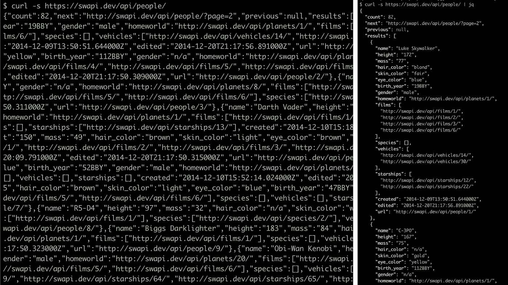

# 您需要开始使用 jq 工具来满足您所有的 JSON 需求

> 原文：<https://levelup.gitconnected.com/you-need-to-start-using-the-jq-tool-for-all-your-json-needs-5716c158f6c>

## 在终端中格式化和过滤 JSON


**[**jq 命令行工具**](https://stedolan.github.io/jq/) 绝对是我最喜欢的发现之一。如果您曾经通过将 JSON 复制到 VScode 中来“美化”它，我将通过展示如何格式化(甚至过滤)来为您节省 6 秒钟的时间！)就在终端里。**

> **[下载页面](https://stedolan.github.io/jq/download/)，但在 mac 上最容易`brew install jq`**

# **漂亮的打印 json**

**首先，看看这个命令行输出的区别:**

****

**现在是白天和黑夜。这样做的方法再简单不过了，只需将一些输出通过管道传输到`jq`:**

```
**# from a curl**
curl -s [https://api.spacexdata.com/v3/launches/latest](https://api.spacexdata.com/v3/launches/latest) | jq**# from a file** 
cat raw.json | jq
```

# **过滤您的输出**

**除了很好地格式化你的输出，`jq`还可以做一些对象和数组过滤。查看[官方文档](https://stedolan.github.io/jq/tutorial/)，但这里的***TL:dr；*上**最灵巧的特征。**

## **抓取特定的属性或索引**

**有时您的数据不在顶级:**

```
curl -s [https://swapi.dev/api/people/](https://swapi.dev/api/people/) | **jq**
{
  *"count"*: **82**,
  *"next"*: **"**[**http://swapi.dev/api/people/?page=2**](http://swapi.dev/api/people/?page=2)**"**,
  *"previous"*: **null**,
  *"results"*: [
    {
      *"name"*: **"Luke Skywalker"**,
      *"height"*: **"172"**,
***# ...***
```

**如果我们只关心`results`数组，我们可以指定:**

```
curl -s [https://swapi.dev/api/people/](https://swapi.dev/api/people/) | jq **.results**
[
  {
    "*name*": "**Luke** **Skywalker**",
    "*height*": **"172"**,
**# ...**
```

**那个`jq .results`告诉`jq`给我们看`results`属性。`.`代表当前输入，本例中为旋度响应。如果响应已经是一个数组，你可以使用`.[0]`，或者如果一个属性指向一个数组，你可以先放属性名，然后放索引:**

```
curl -s [https://swapi.dev/api/people/](https://swapi.dev/api/people/) | jq **.results[0]**
{
  *"name"*: **"Luke Skywalker"**,
 * "height"*: **"172"**,
**# ...**
```

## **格式化数组中的对象**

**我们可以很容易地过滤每个对象中的特定属性:**

```
curl -s [https://swapi.dev/api/people/](https://swapi.dev/api/people/) | jq **'.results[] | .name'**
*"Luke Skywalker"*
*"C-3PO"*
**# ...**
```

**我们不使用索引，而是使用`[]`来表示我们想要整个数组。通过使用`|`管道，我们说“将数组中的每一项传递给这个过滤器，并只显示选择的属性”。这里有两件重要的事情:整个参数需要被包装在一个字符串中，第二个`.`现在指的是每个被传入的对象，而不是原始的响应。**

## **多重属性**

**您可以通过使用逗号分隔值来选择多个属性，但这并不十分简洁:**

```
curl -s [https://swapi.dev/api/people/](https://swapi.dev/api/people/) | jq **'***.results[]* | ***.name, .mass*'**
*"Luke Skywalker"
"77"
"C-3PO"
"75"*
**# ...**
```

**相反，我推荐对象语法:**

```
curl -s [https://swapi.dev/api/people/](https://swapi.dev/api/people/) | jq **'***.results[] |* **{name: .name, character_mass: .mass, vehicles: .vehicles[0] }'**
{
  *"name"*: **"Luke Skywalker",**
  *"character_mass"*: **"77",**
  *"vehicles"*: **"**[**http://swapi.dev/api/vehicles/14/**](http://swapi.dev/api/vehicles/14/)**"**
}
{
  *"name"*: "**C-3PO"**,
  *"character_mass"*: **"75",**
  *"vehicles"*: **null**
}
```

**该属性的名称可以是任何名称，并且请记住，您可以根据自己的需要选择最深的名称。最后，你会注意到这些物体只是漂浮在太空中。如果你想把它输出到一个 JSON 文件中，这样不好，所以我们可以把整个字符串参数包装在一个数组中，得到一个数组输出:**

```
curl -s [https://swapi.dev/api/people/](https://swapi.dev/api/people/) | jq **'[***.results[] | {name: .name, character_mass: .mass, vehicles: .vehicles[0]}***]'**
[
  {
    "name": "Luke Skywalker",
    "character_mass": "77",
    "vehicles": "[http://swapi.dev/api/vehicles/14/](http://swapi.dev/api/vehicles/14/)"
  },
  {
    "name": "C-3PO",
    "character_mass": "75",
    "vehicles": null
  },
**# ...**
```

**这就对了。这可能是您将使用这个小工具完成的 90%的工作。不过，[还是去 jq 网站](https://stedolan.github.io/jq/)看看[更多的方法](https://stedolan.github.io/jq/manual/)和一个[在线游乐场](https://jqplay.org)**

**大家编码快乐，**

**麦克风**