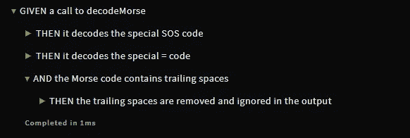
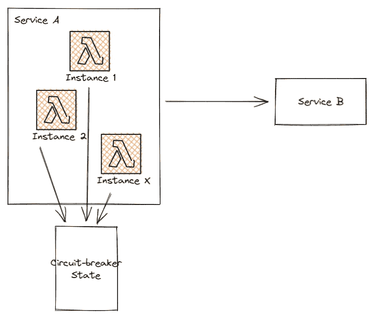

# 你应该忘记你的代码是如何工作的

> 原文：<https://levelup.gitconnected.com/you-should-aim-to-forget-how-your-code-works-154abc67110>

进入这种心态将有助于未来的你和你的队友。

照片由[那是她的事](https://unsplash.com/@thatsherbusiness?utm_source=medium&utm_medium=referral)上 [Unsplash](https://unsplash.com?utm_source=medium&utm_medium=referral)

软件编程是非常有趣和有益的。我绝对渴望解决难题。将所有的部分放在一起，得到一个满足需求并通过我所有测试的算法，这绝对是令人满意的。但是每隔 5 分钟就不得不离开那个区域去理解一些你需要接触的晦涩的代码，这让你很不满意。

这就是为什么你应该忘记你的代码是如何工作的。尽管如此，这并不是说要积极地试图从你的大脑中抹去你工作过的每一行代码。你应该采取这样的心态:你会忘记关于你的任务的一切，并且你将来会需要这些信息。如果你是这种心态，你会采取必要的步骤让你(或任何人)尽快达到你所创造的速度。

在这篇短文中，我将向你展示几件你可以做到的事情。所有的代码示例都是用 JavaScript 编写的，但是您应该能够在没有任何语言知识的情况下理解。

## 编写干净、简单、易读的代码

> 聪明是好代码的敌人

将一个函数重构到一行，而不是 5 行，这会让你感觉很好，但是这额外花费的 15 分钟可能会让你和你的队友在试图破解上下文之外发生的事情之后变得很少。

让我们以 [*Codewars*](https://www.codewars.com/) 中的一个例子来说明几种不同的方式来编写**干净、简单、可读的代码**。

在这个练习中，我们必须编写一个莫尔斯电码解码器。

这是我写的代码:

下面是[最*巧妙*实现](https://www.codewars.com/kata/reviews/54be2a15518b8dcff90001f2/groups/57b13b068491f986e800019a)投票选出的解决方案:

甚至不知道莫尔斯电码的语法和字典，你应该能够通过阅读我的代码弄清楚一些事情:

1.  莫尔斯单词由 3 个空格分隔
2.  莫尔斯字母由 1 个空格分隔
3.  有一种从莫尔斯字母到英语字母的直接翻译

你应该也能猜出我是如何解码输入的莫尔斯电码的:

1.  将整个句子拆分成单词；
2.  将每个单词拆分成字母；
3.  将每个字母翻译成英语

以上 6 项只能通过阅读代码来发现，只需很少的努力。你能对聪明的解决方案说同样的话吗？我不能。事实上，我正在重读一天前粘贴的代码，我完全忘记了它是如何工作的……(编辑:如果你对它实际上是如何工作的感兴趣，我试图在[的一条评论](https://link.medium.com/csXOtsoTQib)中解释它)

那么，在第一段代码中，到底是什么在帮助我们收集信息呢？

代码有**有意义的名字**。变量表示它们持有什么，函数表示它们完成什么。这使得我们几乎可以像阅读简单英语一样阅读代码:

这个函数将返回一个字符串，由翻译成英语的莫尔斯单词组成，并由一个空格连接。

> 有意义的名字可以让我们在没有任何背景信息的情况下，用最少的努力理解代码在做什么。

代码还有**注释**，描述*为什么* 我们在做一个操作，而不是*操作在做什么*(描述代码在做什么的注释是多余的，是维护的额外负担)。

有了上面的评论，我立刻知道了为什么我们要用空格来分隔字符串，以及莫尔斯单词中的每个字母都要用空格来分隔。从阅读外部文档和需求中学到的东西少了一件。

> 注释应该告诉我们为什么一些代码以某种方式完成，或者为什么它们在做某些事情。

## 编写名称正确、完整的测试

在前面的章节中，我们已经了解到，编写干净、简单、可读的代码可以帮助读者理解代码做什么，也有可能了解一些关于代码正在解决的问题的信息。它应该给你一个好的，整体的，正在发生的事情的想法，你可能有你需要的一切去做别的事情。*但是*，如果你想要*完整的图片*(并且讨厌需求文档)，这就是伟大的测试能帮上大忙的地方。

在以前的莫尔斯码解码器中，有些信息从实现本身来看并不明显。例如，有一些特殊的莫尔斯电码，比如著名的*SOS*(-)，其中的字母不用空格分隔。你也可能很快就忽略了我们忽略了尾随空格的事实。代码完美地处理了这些*边缘*情况。

这些是可以从莫尔斯电码解码器的单元测试中快速收集到的东西:

我真的认为清晰和描述性的测试用例有助于发现它测试的代码中有意义的东西。

我也喜欢给定的*一个事件*和*一些条件*然后*这是为你的测试命名所期望的*语法。这允许简单地阅读测试标题来了解测试中使用的标准*准备-动作-断言*。大多数 JavaScript 测试运行程序也应该给你一个漂亮的、人类可读的输出结果。

Codewars 测试运行程序的输出

> *测试应该通知我们关于边缘情况和由实现处理的特殊问题。*

## 记录实施过程

太好了！有了干净的代码和出色的测试，我们现在应该有工具来大致 100%地理解某段代码做了什么，它覆盖的边缘情况，以及潜在的一些需求。但是……嗯……为什么我们又需要一个莫尔斯电码解码器呢？

我在日常工作中遇到过很多次，我不得不记住为什么我们使用某种设计模式或某种算法来完成某件事，或者为什么代码以某种方式构造。有时，仅仅看代码和测试是不完全清楚的。

在这种情况下，记录任务执行过程中所做的不同决策(以及原因)会非常有帮助。为了说明这个想法，我将带你看一下我最近做的一个任务。

我的团队正在构建的服务之一必须向不同团队拥有的另一个服务发出请求。为了保护我们的服务免受外部服务间歇性停机的影响，也为了保护外部服务在停机期间不会过载，我们决定在两个服务之间引入一个断路器(如果您不熟悉，我鼓励您去阅读一下[这种微服务领域的流行模式](https://martinfowler.com/bliki/CircuitBreaker.html))是一个好主意。

我首先考虑的是，我们的服务是在 AWS Lambda 中运行的。如果我们想真正保护我们自己和我们的邻居，我们需要一个断路器，它在我们服务的所有实例之间具有共享状态。

*这是我为该任务记录的第一个决策:断路器状态必须在我们服务的所有实例之间共享。我们不能使用只在一个运行时间内存在的传统断路器。*

有了第一个决定，我继续实施断路器。使用 JavaScript 的一个很大的好处是，我能够在几秒钟内找到一个断路器实现，这也满足了我在生态系统方面的需求(AWS Lambda 和 DynamoDB)。

*这是我为该任务记录的第二个决定:使用第三方模块***来实现我们的断路器。**

*在将新模块引入我们的代码库并使用它进行原型开发之后，我无意中发现了使用 JavaScript 的一个巨大缺点:公共模块是非常异构的。在我们的代码库中，我们遵循一个函数式的范例，但是我发现的模块使用了对象。虽然我们可以让两者一起工作，但这会使代码不容易理解。这就是为什么我决定创建一个 facade(在这里阅读关于这个设计模式的更多信息)并将模块封装在其中。这允许我们通过使用已经实现的断路器来节省时间，同时具有遵循我们的编程范例的接口(*干净、简单和可读的代码*；-))，再加上门面给我们的其他好处。*

**这是我为该任务记录的第三个决定:为第三方断路器实现一个外观，以防止泄露我们代码库中的内部实现细节。**

*有了这个，我就能够在我们的服务中添加一个断路器模式，同时也为我在这个过程中做出的一些重要决定留下了笔记。这些注释可以添加到该存储库的自述文件中，添加到该任务的相关标签中，添加到我为这些变更打开的 PR 中，等等。他们会让你毫不费力地记住在实现过程中遇到了什么问题，以及做出了什么决策来解决这些问题。*

> *你的实施日志应该允许任何人(包括未来的你)重现在一项任务中所面临的问题和做出的决定。*

*本文到此为止！但是让我们快速回顾一下我们所学的一切:*

*   ****有意义的名字*** *可以让我们理解代码在做什么，用最少的努力，不需要任何背景信息。**
*   ****评论*** *应该告诉我们为什么一些代码片段是以某种方式完成的，或者为什么它们在做某些事情。**
*   ****测试*** *应该通知我们关于边缘情况和由实现处理的特殊问题。**
*   **你的* ***实现日志*** *应该允许任何人(包括未来的你)重现一个任务中面临的* ***问题*** *和做出的* ***决策*** *。**

*有了这几条建议，你应该可以在完成一项特定任务后从大脑中释放一些内存，而不用担心会忘记任何有用的信息！*

*我希望你喜欢这篇文章，并在评论中留下你喜欢的方式，让你未来的自己过上更轻松的生活！编码快乐！*