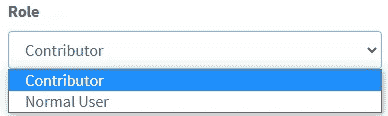
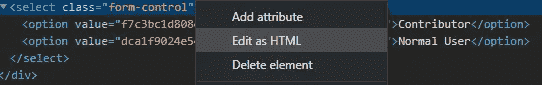

# 您应该始终进行服务器端验证！永远！

> 原文：<https://levelup.gitconnected.com/you-should-always-do-server-side-validation-always-bea5ada4d2e9>


在过去的几年里，Web 技术在服务器端和客户端都有了很大的发展。有许多 web 框架、UI 工具包、JavaScript 库和您需要的一切来轻松快速地开发网站或 web 应用程序。JavaScript 库已经成熟，变得非常强大，即使在低端计算机上，处理能力也不会对大多数网络应用程序造成问题。正因为如此，网络应用变得越来越复杂，用户界面越来越花哨，程序员也越来越懒。

因为 JavaScript 框架如此强大，许多人都想在应用程序的客户端部分编写业务逻辑。虽然这可以通过将计算任务卸载给用户来节省服务器的处理能力，并且在任何可能的情况下都是强烈推荐的，但是它可能会带来一些安全问题。如果用户可以通过表单或其他输入方法向服务器提交数据，这一点尤其正确。

因此，总是对任何请求执行服务器端验证，即使(通常)在服务器和用户之间有一个客户端。让我们看三个场景，以及未能验证接收到的输入是如何造成安全漏洞的。此外，尽管看起来很明显存在问题，但情况并非总是如此，我在真实产品中看到的所有三种场景的变体都是真实的问题。

## 场景 1:通过改变用户角色提升权限

在第一个场景中，我们将看到一个为注册用户提供不同角色的应用程序。它可以是任何这样的网络应用程序，但我会认为它是像 Wordpress 一样的内容管理系统。在这里，用户可以有不同的角色:管理员、编辑、贡献者、普通用户。任何贡献者或以上的用户都可以更改另一个用户的角色，但他不能授予比他更高的权限。例如，编辑不能让别人成为管理员。

为此，用户编辑页面有一个包含用户信息的表单和一个包含可能的用户角色的下拉框。页面使用模板引擎呈现(在本例中，我将使用 Play Framework 中的 Twirl ),可接受的值确实由服务器提供。我们的恶意用户是一个“贡献者”，所以只有两个角色可供他使用。

```
<select>
@for(role<-acceptableUserRoles) {
  <option value="@role.getIdHash()">@role.getName()</option>
}
</select>
```



现在，我们的程序员认为他很聪明，为了这个值，他显式地将其设置为 ID Hash。这是数据库中角色 ID 的散列，因为该应用程序非常复杂，如果需要，可以添加新的角色。他甚至确保用户保存时收到的是有效的，并且对应于实际的角色。处理请求的方法如下所示。

```
public Result saveUserRole(Http.Request request) {
    Form<UserInfoDTO> form = formFactory.form(UserInfoDTO.class).bindFromRequest(request);
    if (form.hasErrors()) return badRequest();

    List<Role> roles = rolesDao.getRoles();
    Role submitedRole = null;
    for (Role role:roles) {
        if (role.getIdHash() == form.get().role()) {
            submitedRole = role;
            break;
        }
    }if (role == null) return badRequest();UserDO user = userDao.find(form.get().userId());
    if (user == null) return notFound();user.setRole(role);
    userDao.update(user);return ok();
}
```

乍一看，似乎一切正常。表单被验证，角色被验证，从数据库请求用户，我们甚至假设有一个 CSFR 令牌可以防止恶意提交。你能发现问题吗？服务器假设，因为 UI 代码是在服务器上生成的，所以收到的角色是用户有权提供的角色之一。没有检查来查看所归属的角色是否不高于当前用户所拥有的角色。



我们的恶意用户可以简单地在浏览器中打开检查器，并编辑 HTML 以向<select>添加新值</select>

是的，他必须知道散列，但是如果没有其他保护机制，他可以直接强行破解，因为他知道格式。如果这些是缺省值，并且不是在每次安装时随机生成的，那么任务可能会更容易，因为用户可以在他的计算机上安装一个虚拟应用程序，并以这种方式找到散列。

## 场景 2:通过知道/猜测 URL 访问机密页面

另一个常见的错误是无法检查用户是否有权访问页面。这种情况有多种变化，要么是未能验证页面对于特定角色是可访问的，要么是未能验证页面的可见性。我们将在这里查看这两种情况。

这次我们将为一家公司处理演示网站，他们即将推出新产品。编辑撰写所需的材料，准备新的产品页面，并等待产品在几天后展示，以便他们可以发布页面。一切都准备好了，包括新产品页面的最终 URL，因为它必须事先发送给新闻媒体。

有一个这样的渠道没有出现在最初的新闻稿中，但是因为它是一家知名度很高的公司，而且有关于新产品的传言，所以他们也想要所有有趣的信息。所以他们开始尝试并猜测新产品页面的 URL。他们知道产品的名称，并根据传递的产品，对新页面的 URL 可能是什么样子有一个想法。由于 CMS 无法验证一篇文章是否真的发表了，通过访问 URL，新闻媒体可以获得他们需要的所有信息，并可以比任何其他新闻网站更快地免费发布这些信息。

在复杂的系统中也可能发生这种变化。如果用户没有正确的角色，网站的某些功能或页面无法访问的情况并不少见。开发人员制作了一个对每个用户可见的页面列表，并基于该列表和当前登录的用户，在 HTML 文件中构建菜单。这与第一个场景中的 select 表单类似。如果开发人员假设用户只通过单击 UI 中的菜单项来导航，他可能会监督服务器端的验证。这样，用户只需输入正确的 URL 就可以访问他不应该访问的页面。这是一个在不成熟或仍在开发中的网络应用中经常遇到的问题，但是已经发布了公共版本。

## 场景 3:滥用 API 调用导致服务器过载

在下一个场景中，问题不仅在于服务器端验证，还在于导致服务器停机的多个编码决策。这一切都是从使用 Google Maps API 反向查找地址坐标(纬度和经度)开始的。服务器将根据地址(国家，州/县，城市)在城市上放置点。特定位置的地址越多，地图上的点就越大。如果找不到完整地址的坐标，它将删除城市并尝试搜索州/县，如果也失败，则只搜索国家。

现在，对于每个新地址，都会有一个对 Maps API 的调用，之后坐标会被缓存，这样就不会有新的调用了。这样做既是为了提高效率，也是为了降低成本，因为 API 调用是有负担的。问题是如果地址不正确，什么都不会被缓存。因为 UI 对所有三个输入字段都有下拉框，所以假设这些值是正确的。

现在，让我们稍微改变一下场景，假设我们的服务器实际上处理的是具有数千个条目的大文件，而不是一个用户从一个网页上发帖(这很容易通过限速器来管理)。其中一个国家中的一个打字错误导致每次查找失败，结果是为文件中的每个条目重新调用 API，成本迅速上升，处理速度变慢，并最终停止，因为 API 可用的所有令牌都被消耗。

服务器端验证是唯一的罪魁祸首吗？肯定不会，但是至少做一些基本的验证会有助于大大减少调用次数。有效国家的列表很容易包含，甚至州/县也不需要太多努力。

## 结论

在这一点上，我希望很明显为什么总是需要输入数据的服务器端验证。这可能不足以防止问题的发生，但至少会使问题变得更容易管理。在某些情况下，它只会造成轻微的不便，但在大多数情况下，它会带来严重的后果，数据泄露或公司成本的增加。

*文章最初发表在我的个人网站上* [*下你应该一直做服务器端验证！永远！*](https://petrepopescu.tech/2021/01/you-should-always-do-server-side-validation-always/)