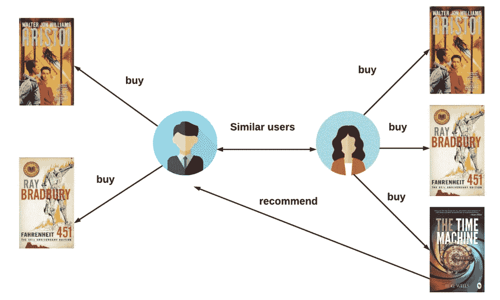

# 你应该知道协同过滤和推荐系统

> 原文：<https://levelup.gitconnected.com/you-should-know-collaborative-filtering-and-recommendation-systems-4d1a3a2f9bc2>

## 利用机器学习进行个性化推荐

欢迎来到协同过滤和推荐系统的世界，在这里，机器学习算法可以根据您过去的偏好和行为，预测和建议产品、内容和其他推荐，从而帮助您个性化在线体验。

从网飞推荐电影和电视节目到亚马逊推荐购买的产品，推荐系统已经成为许多行业不可或缺的一部分，为公司和消费者提供了宝贵的帮助。

但是你有没有停下来考虑过这些推荐是怎么产生的？在本文中，我们将深入研究协同过滤和推荐系统的内部工作原理，探索它们如何收集数据、分析用户偏好以及生成个性化推荐。

我们还将讨论各种类型的协同过滤算法及其优缺点，以及在您自己的企业或组织中实现推荐系统的最佳实践。

## 期待什么:

*   协同过滤和推荐系统综述
*   这些系统如何工作以及它们使用的算法的分类
*   讨论协同过滤的挑战和局限性
*   实施推荐系统的最佳实践
*   展望推荐系统的未来和该领域的潜在发展。

# 协同过滤的工作原理

其核心是，协同过滤是一种通过收集和分析一组用户的数据来预测用户对特定项目的偏好或评级的方法。协作过滤有两种主要方法:

1.**基于用户的协同过滤**:在这种方法中，推荐是基于相似用户的偏好和行为产生的。例如，如果用户 A 和用户 B 都有喜欢浪漫喜剧并且对类似电影给予高评级的历史，则推荐系统可以基于用户 B 的评级向用户 A 建议浪漫喜剧。

2.**基于项目的协同过滤**:这种方法包括比较不同项目的偏好和评分。例如，如果用户 A 和用户 B 都对同一本书给出了高评级，则推荐系统可以推荐也从这些用户获得了高评级的其他书。

基于用户和基于项目的协同过滤都依赖于算法来根据收集的数据进行分析和预测。这些方法中使用的一些常见算法包括[余弦相似度](https://en.wikipedia.org/wiki/Cosine_similarity)和[皮尔逊相关度](https://en.wikipedia.org/wiki/Pearson_correlation_coefficient)。

# 矩阵分解技术除了基于用户和基于项目的协作过滤之外，另一种常用的方法是矩阵分解。这种技术包括将一个大的用户项目评分矩阵分解成两个较小的矩阵，一个代表用户，另一个代表项目。这允许推荐系统基于用户和项目之间的交互进行预测。

两种流行的矩阵分解技术是:

1.**奇异值分解(SVD)** :这种方法包括将用户-项目矩阵分解成三个矩阵，分别代表用户、项目以及它们之间的交互。奇异值分解因其简单有效而被广泛应用于推荐系统中。

2.**非负矩阵分解(NMF)** :类似于奇异值分解，NMF 将用户项矩阵分解成两个更小的矩阵。但是，NMF 只允许非负值，这在某些情况下可能是有益的，例如在处理只包含正值的数据时(如评级)。

奇异值分解和 NMF 都被证明能有效地产生准确的推荐，但是合适的技术将取决于特定的用例以及数据集。

# **协同过滤的挑战和局限**

尽管它们很有效，但是协同过滤和推荐系统确实有一些限制和挑战。一个常见的问题是“冷启动”问题，当一个新的用户或项目被引入到系统中，并且没有足够的数据来进行准确的预测时，就会出现这种问题。这使得系统很难为这些用户或项目生成有意义的推荐。

另一个挑战是处理多个用户的兴趣或偏好。例如，既喜欢恐怖电影又喜欢浪漫喜剧的用户可能会收到基于他们过去的评级偏向于一种类型或另一种类型的推荐。结合额外的因素，如上下文或用户反馈，可以帮助缓解这个问题。

最后，协同过滤系统在整合外部信息或环境的能力方面可能受到限制。例如，推荐系统在做出推荐时可能不考虑当前事件或趋势，这可能导致不太相关或不太及时的建议。

# 实现协同过滤和推荐系统的最佳实践

尽管存在这些挑战，但在实现协同过滤和推荐系统时，仍有一些最佳实践需要考虑:

*   准确多样的数据收集:确保用于训练推荐系统的数据准确多样，对于生成高质量的推荐至关重要。这可以通过仔细的数据清理和监管以及使用各种数据源来实现。
*   选择合适的算法:不同的协同过滤算法将根据具体的用例及数据集表现不同。仔细考虑不同算法的优势和局限性并选择最适合推荐系统需求的算法是很重要的。
*   整合其他因素:如前所述，整合其他因素，如上下文或用户反馈，有助于提高推荐的准确性和相关性。这可能涉及使用外部来源的数据，如社交媒体或天气数据，或通过评级或评论纳入用户反馈。
*   测试和评估系统:定期测试和评估推荐系统的性能以确保它生成高质量的推荐是很重要的。这可以通过 A/B 测试或通过收集用户反馈并使用点击率或购买率等指标来衡量推荐的有效性来实现。

# 未来方向

协同过滤和推荐系统已经成为在广泛的行业中向用户提供个性化推荐的必要工具。通过收集关于用户偏好和行为的数据，使用算法分析这些数据，并基于预测的偏好生成建议，这些系统能够提供针对单个用户的定制建议。

然而，在实现推荐系统时需要考虑一些挑战和限制，包括冷启动问题和处理多个用户兴趣的困难。坚持最佳做法，如准确的数据收集和纳入其他因素，有助于克服这些挑战，提高系统的有效性。

展望未来，推荐系统可能会继续发展，变得更加复杂，纳入更多样化的数据源，并利用机器学习和人工智能的进步。推荐系统改善用户在线体验和推动业务增长的潜力使其成为一个令人兴奋的持续研究和开发领域。

# 协同过滤和推荐系统:利用机器学习进行个性化推荐

在本文中，我们探索了协同过滤和推荐系统的内部工作方式，包括用于分析用户数据和生成个性化推荐的各种算法。我们还讨论了这些系统的挑战和局限性，比如冷启动问题和处理多个用户兴趣的困难。最后，我们概述了实现推荐系统的最佳实践，包括准确的数据收集、选择合适的算法以及合并其他因素。

尽管面临挑战，协同过滤和推荐系统已经成为向用户提供个性化推荐的重要工具，并且随着这些系统在未来变得更加复杂，这种趋势可能会继续下去。随着我们继续在庞大而复杂的在线信息和选择世界中导航，推荐系统将在帮助我们找到真正感兴趣的内容方面发挥至关重要的作用。

感谢您阅读这篇关于协同过滤和推荐系统的文章。如果你喜欢它，并想了解机器学习和人工智能的最新发展，请务必关注我的 [Medium](https://medium.com/@johnvastola) 。

## 如果读完这篇文章后你仍然不头疼，你可能会喜欢我的其他作品。因此，请随时关注更多内容！

 [## 数据科学和机器学习:自学路线图

### "没有数据是干净的，但大多数是有用的."-院长艾伯特

johnvastola.medium.com](https://johnvastola.medium.com/data-science-and-machine-learning-a-self-study-roadmap-439bf27216f3)  [## 成为数据科学家的基本指南

### 欢迎阅读“成为数据科学家的基本指南”，这是理解数据角色的全面指南…

johnvastola.medium.com](https://johnvastola.medium.com/the-essential-guide-to-becoming-a-data-scientist-2b53fe3858e2)  [## 通过我的推荐链接加入媒体-约翰瓦斯托拉

### 阅读约翰·瓦斯托拉的每一个故事你的会员费直接支持约翰·瓦斯托拉和你阅读的其他作家…

johnvastola.medium.com](https://johnvastola.medium.com/membership)