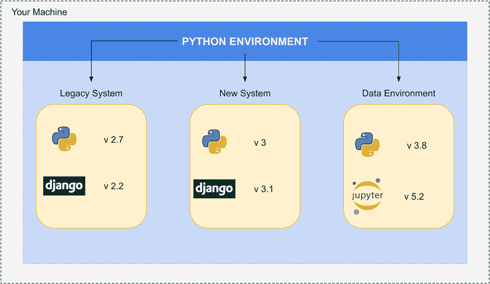
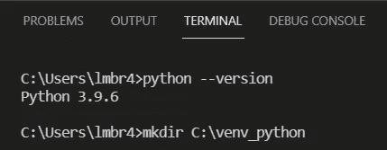
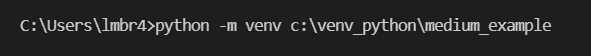
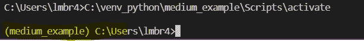
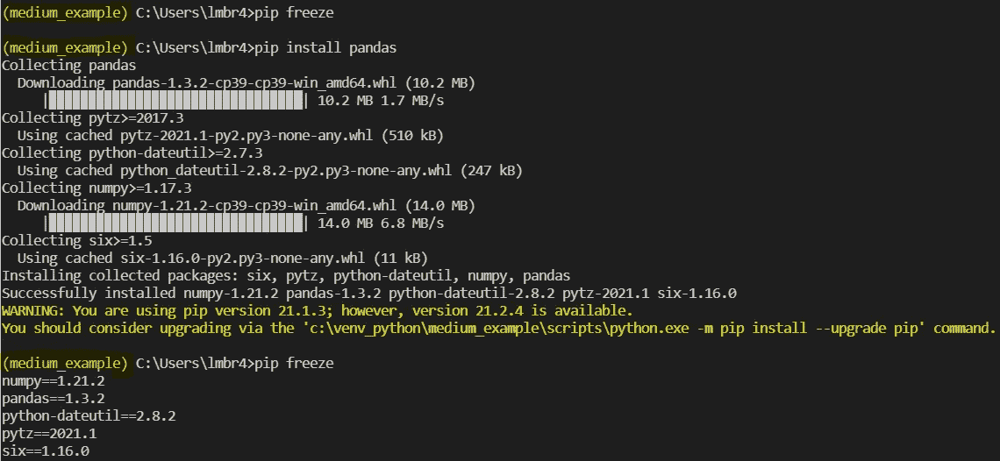

# 您现在应该使用虚拟环境

> 原文：<https://levelup.gitconnected.com/you-should-work-with-virtual-environments-now-ba197aa7db38>

阅读本文，了解更多关于 Python 虚拟环境的知识。


Nubelson Fernandes 在 [Unsplash](https://unsplash.com?utm_source=medium&utm_medium=referral) 上的照片


照片由[杰夫·谢尔登](https://unsplash.com/@ugmonk?utm_source=medium&utm_medium=referral)在 [Unsplash](https://unsplash.com?utm_source=medium&utm_medium=referral) 上拍摄

想象一下你想做一个新的食谱。

你读一段描述，选择必要的配料，按照规则烹饪。

当我们需要使用 Python 开发解决方案时，我们也是这样想的。配方是虚拟环境，成分是系统工作的依赖。

而且我们也不希望其他食谱干扰对方的准备。

**这时，Python 虚拟环境开始工作了！**

## 什么是 Python 虚拟环境？

这是创建一个独立环境来运行您的项目的方法，另一方面，我们创建了一个文件夹来开发独立于其他系统的解决方案，但它不仅仅是一个文件夹，它是一个真正的独立 python 环境！
我们可以拥有完全不同特征的不同环境。

## 这是为了什么？

*   隔离:*我们可以运行不同的 Python 环境，一个解决方案不会干扰另一个。*
*   依赖管理:*我们可以在特定版本的 Python 及其库上工作。*

虚拟环境还有其他应用，但您现在需要记住的主题是:

> “虚拟环境允许我独立工作，不会影响其他环境，而且我可以在不中断其他正在运行的解决方案的情况下管理依赖性。”

## 我为什么要用它？

*   避免不兼容问题。
*   轻松复制您的作品。
*   安全地测试和部署新功能。
*   组织！你确切地知道你需要什么来运行那个应用程序。

## 它的功能如何？

*   首先，定义您想要使用哪个 Python 版本。
*   然后用选择的 python 二进制文件创建一个虚拟环境。
*   接下来，您需要激活环境。
*   之后，您可以安装项目依赖项。
*   终于有了工作的环境。



关于 Python 虚拟环境的景观

# 实践

1.  我喜欢创建一个路径文件夹来组织我的虚拟环境。

```
Windows 
>>> mkdir C:\venv_pythonLinux/Mac
>>> mkdir venv_python
```



2.创建一个虚拟环境。

```
Windows 
>>> python -m venv c:\venv_python\medium_exampleLinhux/Mac 
>>> cd venv_python
>>> python3 venv medium_example
```



3.激活环境

```
Windows
>>> C:\venv_python\medium_example\Scripts\activateLinux/Mac
>>> source medium_example/bin/activate
```



4.恭喜你！！！您的环境已激活，现在您可以对其进行操作。



# 参考

*   [PEP 405 — Python 虚拟环境](https://www.python.org/dev/peps/pep-0405/)
*   [虚拟环境和包](https://docs.python.org/3/tutorial/venv.html)

感谢您阅读这篇文章！
跟着我读更多这样的文章。