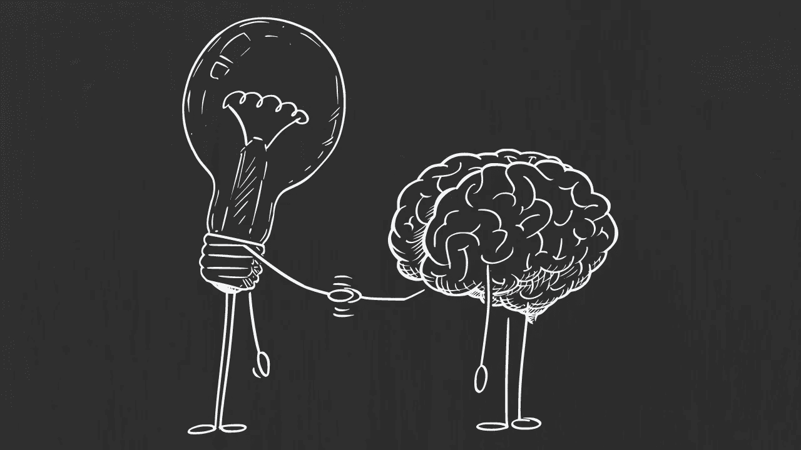
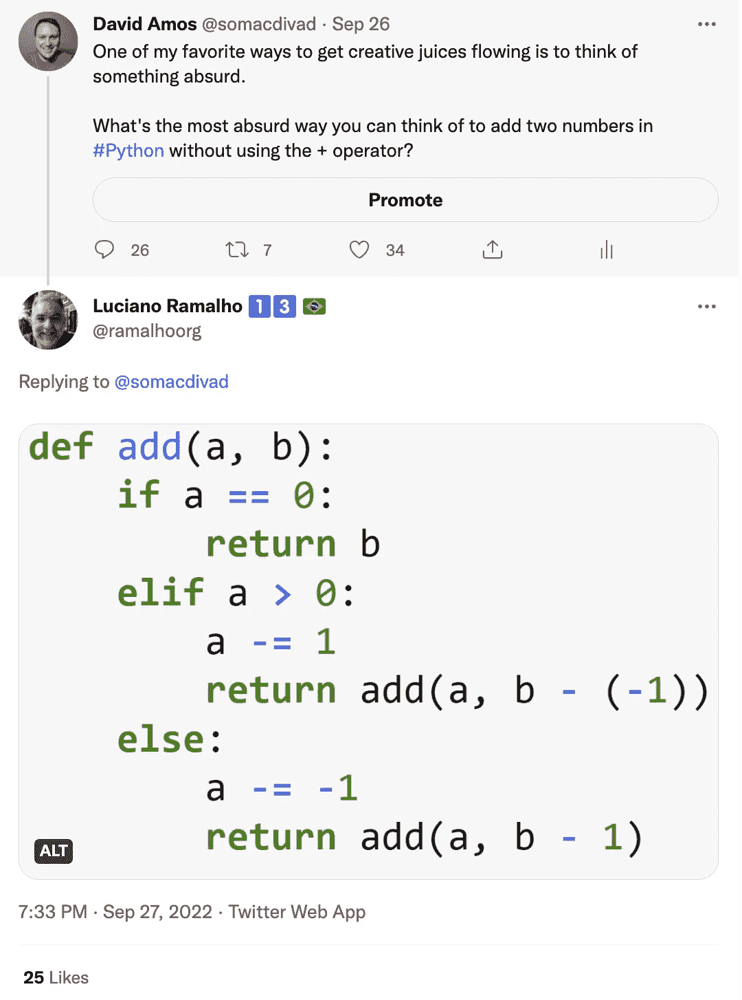
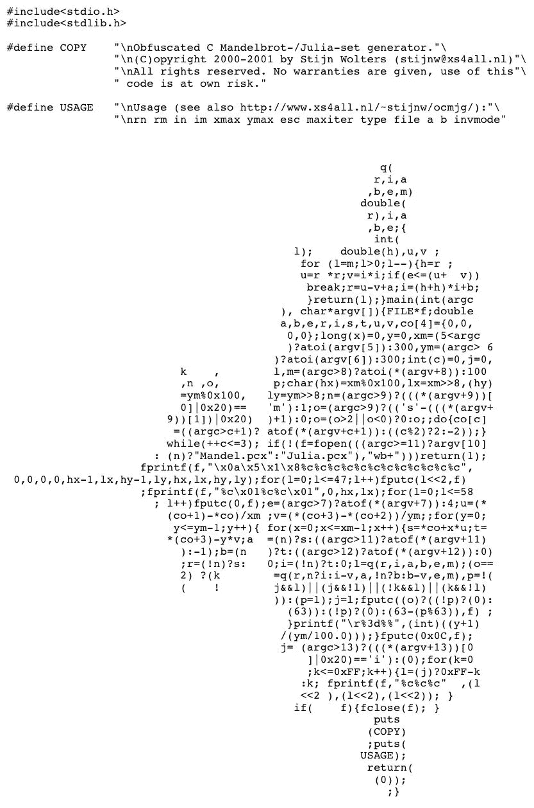

# 你应该写糟糕的代码

> 原文：<https://levelup.gitconnected.com/you-should-write-bad-code-78d4b5f31a38>

## 如何拥抱荒谬并解锁更多创造性的编码



作者提供的图片(带 Canva)

这听起来可能很疯狂，但是…我喜欢练习有荒谬的想法。

我挑选一个问题，头脑风暴出荒谬的解决方案。任何事都会发生，不管有多疯狂。用代码做这件事特别有趣。这不仅仅是为了消遣。

练习荒谬有助于解决现实世界的编码问题。

# 享受乐趣，激发创造力

我让 Twitter 上的人们分享他们能想到的最荒谬的方法，即在不使用`+`运算符的情况下用 Python 将两个数字相加。

卢西亚诺·拉马尔霍是《流畅的 Python 》(任何中级 Python 开发人员的必备读物)的作者，他对此做出了回应:



在[推特上的观点](https://twitter.com/ramalhoorg/status/1574920145331539973)

我喜欢卢西亚诺的解决方案，因为基础相对驯服。

他没有将两个数字`a`和`b`相加，而是从`b`中减去`-a`。然而，正是这种递归将它带到了下一个层次。我甚至不介意它只对整数有效！这真是荒谬至极。

但是这样写代码有什么意义呢？

首先，荒谬很有趣。


Gerard van Honthorst，公共领域，[通过维基共享资源](https://commons.wikimedia.org/wiki/File:Gerrit_van_Honthorst_-_Smiling_Girl,_a_Courtesan,_Holding_an_Obscene_Image_-_63-1954_-_Saint_Louis_Art_Museum.jpg)

快乐和乐趣与创造性产出有关。因此，想出像卢西亚诺这样荒谬的代码示例是一种为创造性工作做准备的方式。它让你进入一种创造性的情绪。

好处不止于此。

# 建立惊人的概念联系

荒谬的代码以不寻常的方式将概念联系在一起。

你的大脑形成记忆的一种方式是通过突触可塑性。神经元之间的突触——即连接——当它们一起放电时会得到加强，当它们不一起放电时会被削弱。更强的连接增加了特定神经模式对给定刺激做出反应的可能性。

换句话说:

> 编写荒谬的代码加强了概念之间的联系，否则这些联系可能不会得到加强。

并非所有这些联系都是有用的。

许多人不会长久。但是在一次严肃的编码会议中，有些会让你大吃一惊。突然，你有了一个新的、潜在的解决问题的方法。

有时你会以重要的方式打破东西。

# 暴露系统中的弱点

荒谬的代码有多种形式。

像卢西亚诺这样用愚蠢的方法解决简单问题的例子比比皆是。然后是 [*迷惑不解的 C·曼德尔布罗——和朱丽亚——集合生成器*](http://www.funiter.org/ocmjg/index.shtml) *。*它用 ANSI-C 编写，其源代码类似于 Mandelbrot 集合:



混淆的 C Mandelbrot 和 Julia 集生成器

喜欢吃巧克力蛋糕，而巧克力蛋糕的配方是一个有效的“你好，世界”节目？试一试。

当你写荒谬的代码时，所有的规则都被忽略了。

荒谬可能在于这个问题的解决方案的愚蠢。或者可以在代码本身的表示中找到。有时候，它是关于写一些看起来无害的代码，却有着险恶的秘密。

莱纳斯·奥克松在赢得 2015 年[秘密 C 级比赛](http://www.underhanded-c.org/)时就是这么做的。

凯森的代码利用浮点类型的微妙混淆来歪曲核弹头的能谱。核威胁倡议的技术顾问佩吉·斯托特兰德(Page Stoutland)说，核武器检查员可能会被光谱所欺骗，“可能会让各国在没有实际裁军的情况下获得裁军的荣誉。”

说真的。

一场糟糕的代码竞赛暴露了核不扩散的一个严重缺陷。

# 把创造力变成一种习惯

觉得自己不够聪明，写不出“好”的坏代码？

我有好消息告诉你。你并不是生来就有有限的“创造力”你出生在一个充满创造力的海洋中。你可以学习如何驾驭这些潮流，探索你想象力的深度。创造力是一种你可以练习的技能。

你可以从小处着手。

**这里有五个编码提示让你入门:**

*   你能想到的最荒唐的打印`"Hello world"`的方式是什么？
*   写一个程序，使用大量资源，但什么也不做。
*   编写一个用两种不同的编程语言编译和运行的程序。
*   用代码解决一个确实不应该用代码解决的问题。
*   写一个没有无限循环但是永远不会停止运行的程序(如果它*会*停止运行也没问题，但是从现在到宇宙热寂时间不够。)

一个月做一到两次新的提示。

别忘了为荒谬的快乐举杯。


Gerard van Honthorst，公共领域，[通过维基共享资源](https://commons.m.wikimedia.org/wiki/File:Gerard_van_Honthorst_-_The_Happy_Violinist_with_a_Glass_of_Wine_-_WGA11668.jpg#mw-jump-to-license)

想了解更多关于编码和创造力的交集吗？

曼宁刚刚推出 [*创意程序员*](https://www.manning.com/books/the-creative-programmer) 早期接入。

当你这么做的时候，看看迪伦·贝蒂的经典演讲 [*代码的艺术*](https://www.youtube.com/watch?v=6avJHaC3C2U) 。

```
**Become a better coder in 5 minutes.**One email, every Saturday, with one actionable tip.
Always less than 5 minutes of your time.[Subscribe here](https://davidamos.dev/curious-about-code-newsletter)
```