# 你不应该为 Convertkit 或 Mailchimp 付费

> 原文：<https://levelup.gitconnected.com/you-shouldnt-be-paying-for-convertkit-or-mailchimp-96c8d79210b9>

## 没有理由付钱


卡罗琳娜·格拉博斯卡的照片

无论你是创作者还是程序员，拥有受众都不可小觑。你的听众可以包括你现在的顾客，未来的雇主，或者任何对你所提供或所说的感兴趣的人。

在这种情况下，电子邮件服务提供商会很方便。有各种选项可供选择。Convertkit 和 Mailchimp 是其中的佼佼者，也同样受欢迎。

下一个问题是，你应该为这些服务付费吗？

解决不付费的方法是设置你的电子邮件服务。不仅如此，我指的是像 ConvertKit 一样酷的东西。

对于不了解的人来说，搭建这样一个平台并不复杂。这很简单，不应该花你一个多小时。

# 像 ConvertKit 一样酷(是免费的)

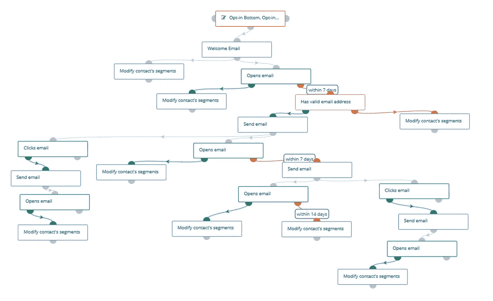

我的入职活动截图。归功于作者

上图是我在即将分享的平台上的入职活动。正如你所看到的，这是一个类似于 ConvertKit 和 Mailchimp 以夸大的价格提供的滴滴运动。

Mailchimp 没有滴滴运动。他们长期使用传统的自动回复器。他们在最新的改造中包括了滴滴运动，这是一个只有付费会员才能访问的高级功能。

我要分享的平台让你可以免费参与滴滴营销活动。你要做的就是设置好。这样做很容易。

# 为什么 MailChimp 很烂

Mailchimp 采用了一种相当糟糕的策略向你推销它的定价等级。它使用功能封顶。您支付的费用越高，您获得的功能就越多。下面是他们定价页面的截图。


来源: [Mailchimp](https://mailchimp.com/pricing/marketing/) ，定价 500 订户。

示例:免费层没有*客户旅程*。基本层有一个*客户旅程*，但没有完整版本。要通过*分支点*访问*客户旅程*，您必须升级至标准套餐。

从本质上讲，这不仅仅是你拥有的订户数量转化为你可能产生的收入的问题，还有一些特性的问题。

这个 299 美元的包在我即将分享的平台上拥有完全免费的功能。无论你有多少用户，这个平台都是免费的。以下是 Mailchimp 对 2500 名用户的收费。

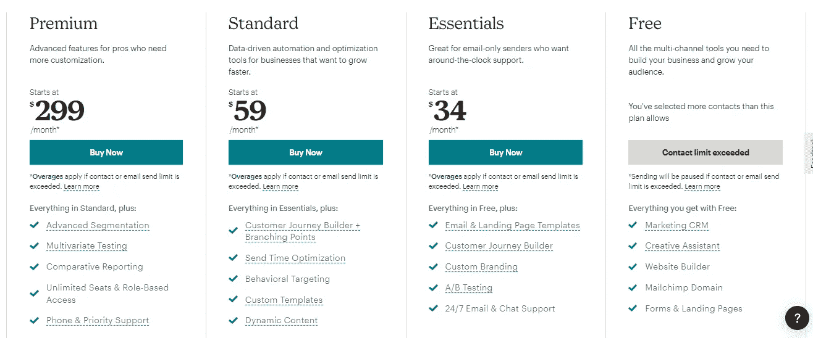

来源: [Mailchimp](https://mailchimp.com/pricing/marketing/) ，定价为 2500 订户。

正如你所看到的，价格上涨了。您仍然是功能受限的。使用 2500，您无法作为付费客户访问他们的完整客户旅程构建器。

# 为什么 ConvertKit 很烂

Convertkit 也好不到哪里去。他们使用和 Mailchimp 一样的策略。不拿出你的信用卡，你就不能参加滴滴活动。

作为他们的客户，不管你是不是付费客户，你的功能都取决于你所在的层级。

令人难过的是，他们的价格随着用户数量的增加而大幅上涨。

以下是他们对 1000 名订户的定价。

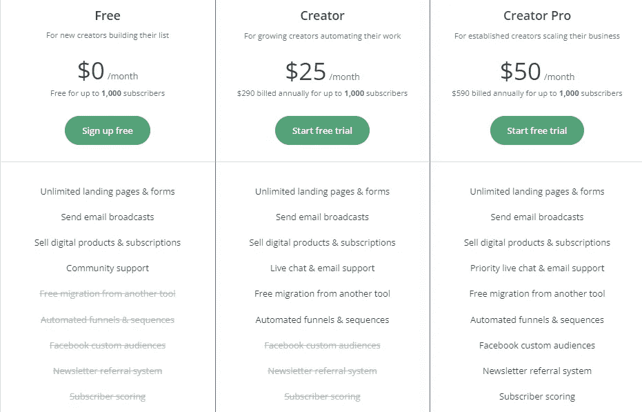

来源: [ConvertKit](https://convertkit.com/pricing) ，针对 1000 名订户的定价。

只有 1000 名用户每月支付 50 美元的费用，并按年计费以获得全部功能。

像 s *ubscriber scoring* 这样的功能只在 Creator Pro 套装中提供，该套装每月售价 50 美元，仅面向 1000 名订户。(根据他们的条款，每年收费 590 美元)

我将要分享的平台*用户评分*对任何其他数量的用户都是免费的。不管是 10 万还是 100 万。没关系。除此之外，你还可以免费使用滴滴广告和其他精彩功能。

# 功能(与 Convertkit 相比如何)

我要建议的是无与伦比的。你可以从 Convertkit 或 Mailchimp 获得几乎所有的东西，甚至更多。以下是它的一些特点。

*   无限联系人
*   无限发送
*   无限制的登录页面和表单
*   电子邮件和登录页面模板
*   营销 CRM
*   高级自动化(自动化漏斗和序列)
*   行为目标
*   高级分段
*   高级跟踪
*   A/B 测试
*   自定义模板
*   自定义域
*   高级报告
*   社交媒体定制受众
*   线索评分
*   定制品牌(没有品牌标识，即邮件末尾的 Mailchimp 或 Convertkit 标识)
*   短信功能等。

功能列表越来越长。我不得不就此打住。我确信我还没有用尽它们。

你得到的是无与伦比的。Convertkit 和 Mailchimp 都不能给你这些。比他们两个 0 美元的都好。

唯一的问题是你必须设置它。这没关系，因为其他平台也需要一些设置，或者至少了解一些诀窍。这样做很容易。根据我给你的指南，你应该不会花超过一个小时。

# 如何设置它

如果你是一个创作者或者程序员，你至少应该拥有一个个人网站。否则，你为什么需要电子邮件自动化服务？从哪里收集销售线索？

如果你是一名程序员，你至少应该为你的项目拥有某种形式的主机。

假设你已经有一个作为创作者或程序员的个人网站，我们将利用这个项目你的托管空间。最常见和低入门形式的主机是共享主机。我们将利用这一点。

我所说的期待已久的电子邮件自动化平台是 Mautic。它是开源的，胜过 Convertkit 和 Mailchimp。问题是你必须自己主持，这很容易。

## 步骤 1:安装(5 分钟)

在安装之前，你需要有一个将要安装的子域。创建一个只需在子域下的 Cpanel 中单击一下。mautic.yourdomain.com、convert.yourdomain.com、fans.yourdomain.com 等都是很好的例子。

通过*软件应用安装程序下的 *Cpanel* 进行安装。*进入你的 *Cpanel* 然后 *Softaculous App 安装程序，*在 *Others* 下找到 *Mautic* 并安装。下图。

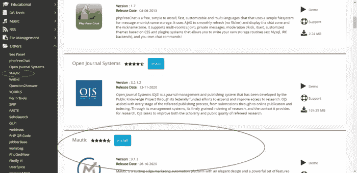

作者截图

如果你需要更详细的指南，你可以在这里找到。

## 第二步:获取 SMTP 或 API (10 分钟)

开箱即用的 Mautic 缺少两个必不可少的东西，SMTP 和 Cron 作业。

SMTP 是允许发送电子邮件的传输协议。另一方面，Cron 作业可以自动处理电子邮件序列和自动回复邮件。

这两个是手动设置的。这样做很容易。一旦完成，你可以享受 Mautic 的全部功能。

要将您的 SMTP 添加到 Mautic，您需要先获得它。

有两种方式获得 SMTP，第一种方法是免费的，由您的主机提供商。共享主机带有一个电子邮件发送 SMTP，无论你选择哪个包。

第二种选择是通过 SMTP 提供商。这是一项高级服务，将向您收取额外费用。

在我们的例子中，我们将使用第一个选项，使用我们的托管服务提供的 SMTP。

共享主机通常会限制你一个小时可以发送多少封邮件。不管怎样，好的主机提供商对此相当慷慨。

以 Namecheap 为例，他们的共享主机计划有以下限制。

*   恒星计划每个域名每小时 50 封电子邮件(每年收费 16.56 美元，每年续费 42.88 美元)
*   在 Stellar Plus 计划中，每个域每小时 200 封电子邮件(每年收费 26.16 美元，每年续费 68.88 美元)
*   Stellar 业务计划中每个域每小时 10，000 封电子邮件(每年收费 58.88 美元，每年续费 118.88 美元)

有了 NameCheap，对我们来说最好的套餐就是起价 58.88 美元的 Stellar Business。这是他们的云产品包，还附带了疯狂的 SMTP 功能。

**从您的主机检索 SMTP**

要从您的共享主机中检索 SMTP，请前往您的 *CPanel* 上的*电子邮件帐户*。

在*电子邮件账户*下，创建您想用来在 Mautic 上发送电子邮件的电子邮件地址。

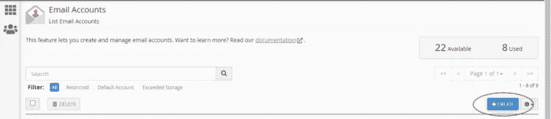

创建电子邮件后，点击*连接设备*检索 SMTP 详细信息。


下面是您的 SMTP 详细信息的样子。

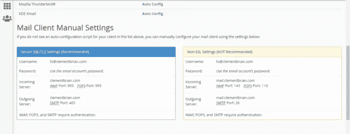

简单来说，我们的 SMPT 详情如下。

```
Encryption = SSL
Username = hi@clementbrian.com
Password = [the password you used for the email]
Host = clementbrian.com
Port = 465
```

现在我们有了 SMTP 细节，让我们继续下一步。

## 步骤 3:将 SMTP 添加到 Mautic (10 分钟)

登录您的 Mautic，点击右上角的*设置图标*。从下拉菜单中找到*配置*并点击它。然后点击*邮件设置*。下图。

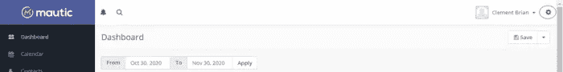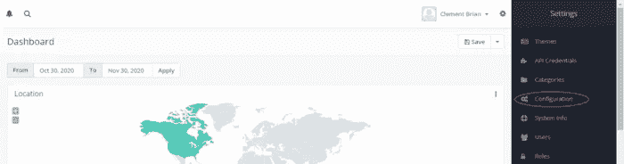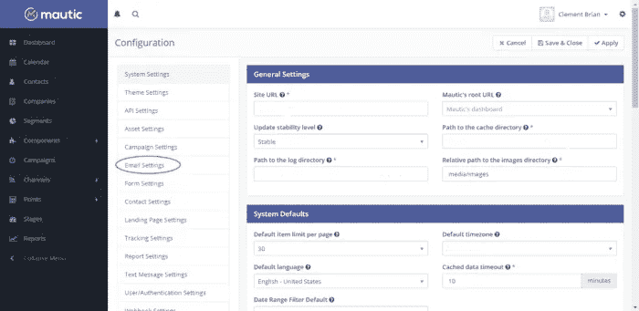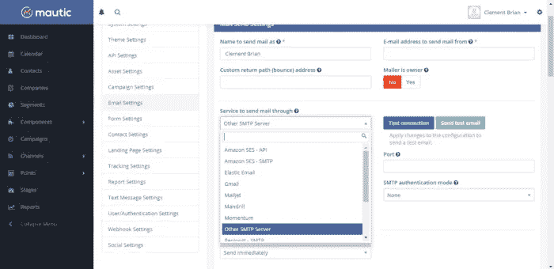

在*邮件设置*页面，点击选择*其他 SMTP 服务器*，如图所示。该选项将允许您添加我们从上一节获得的 SMTP 细节。

上一节中的 SMTP 细节。

```
Encryption = SSL
Username = hi@clementbrian.com
Password = [the password you used for the email]
Host = clementbrian.com
Port = 465
```

如下所示添加它们并点击测试连接按钮，如果你做对了，你会得到一个成功消息。

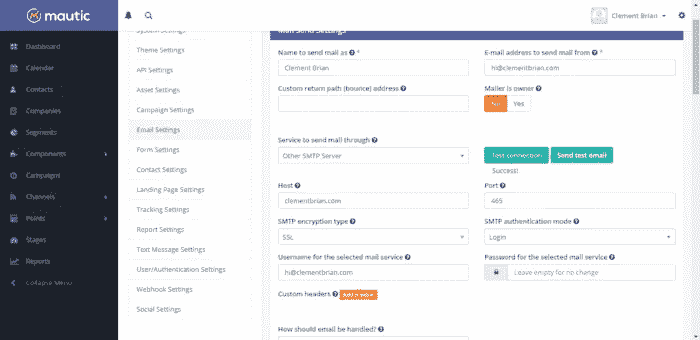

连接起作用了。我们将改变它，虽然我创造了一些自定义。下图。

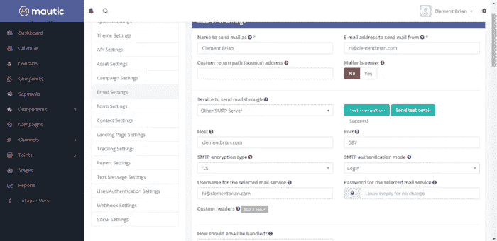

我的定制配置工作，它在技术上更好。我们将 SSL 改为 TLS，后者是一种更新的加密技术。我们也从 465 端口换到了 587 端口。后者是默认的 SMTP 端口。

更改后，当您看到*成功时，不要忘记点击*测试连接*以查看是否一切正常！*消息一切正常。

更进一步，发送一封测试邮件。您应该会在收件箱中收到一条成功消息和一封电子邮件。下图。

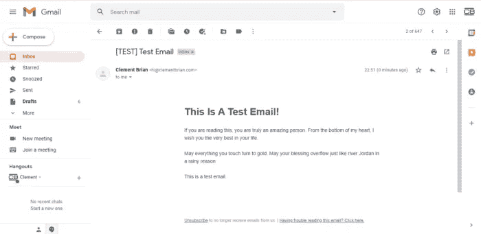

## 步骤 4:设置记录作业(15 分钟)

Cron Jobs 在您不在时为您执行任务。无论是发送定期简讯，还是确保发送滴滴活动电子邮件。

您可以根据您希望作业触发的频率来设置记录作业。下面是 Cron 作业的一般结构。

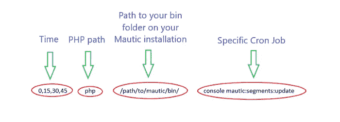

由作者创建

每个计时工作的时间是独立设置的。从*开始，PHP 路径*，用一个实际的 cron 作业替换上面的 Cron 作业结构，应该是这样的。下图。

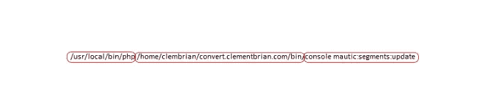

从上图中，我们可以推断出*PHP 路径*、Mautic 安装上 bin 文件夹的*路径*，以及*具体的 chron job* 。

在每个 chron job 的末尾，我们要加上 *> /dev/null 2 > & 1，以空格开头。这是为了防止 Mautic 在每次记录作业启动时通知我们。我们不希望这种情况发生。*

为了让 Mautic 高效地工作，它需要五个 cron 作业来完成五个功能。下面是我使用的确切的工作记录和我为它们选择的时间。您可以复制它们，并用包含您的域的安装路径替换 Mautic 安装上 bin 文件夹的*路径。*

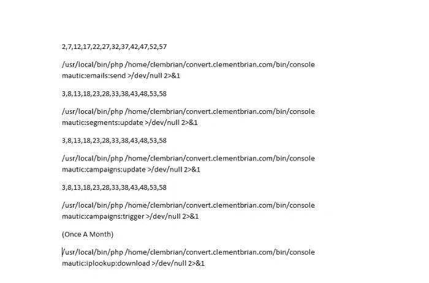

在 Cpanel 上添加 chron jobs 非常简单。转到你的 *CPanel* 并点击 *Chron Jobs。*

在出现的页面中，逐个添加您的记录作业。下图。

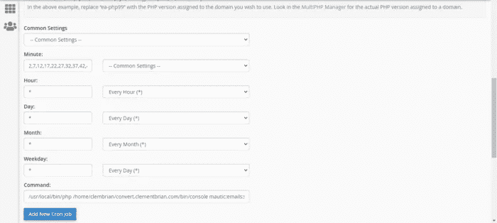

一旦你添加完所有五个工作，恭喜你！您已经完成了您的 Mautic 设置。你现在可以享受 Mautic 的全部力量。

# 最后的想法

设置 Mautic 并不难，即使您使用 MailChimp 的 ConvertKit，我们已经执行的一些步骤仍然是必需的。创建商务电子邮件就是一个例子。他们不能容忍普通邮件，会提示你必须从 Cpanel 创建一封商务邮件。

我们来看看用了多长时间。

*   步骤 1:安装(5 分钟)
*   步骤 2:获取 SMTP (10 分钟)
*   步骤 3:将 SMTP 添加到 Mautic (10 分钟)
*   步骤 4:设置记录作业(15 分钟)

总共 40 分钟。我对时间很慷慨。安装只需 2 分钟。因此，我们可以有把握地说，1 小时是体面的完成设置，并有一个完全成熟的 Mautic。

如果你不太理解这篇文章，你可以[参考这篇更长的指南](https://bettermarketing.pub/tutorial-how-to-set-up-mautic-a-free-open-source-email-marketing-software-ef322b925c60)。

一旦设置完成，就是这样。你再也不用做其他任何事了。最多，可能更新一下。Mautic 是开源的，并且它还在被开发得更好。只需点击一下，更新就很简单。

这就是了。无与伦比的强大而复杂的电子邮件服务。价格为每月 0 美元。