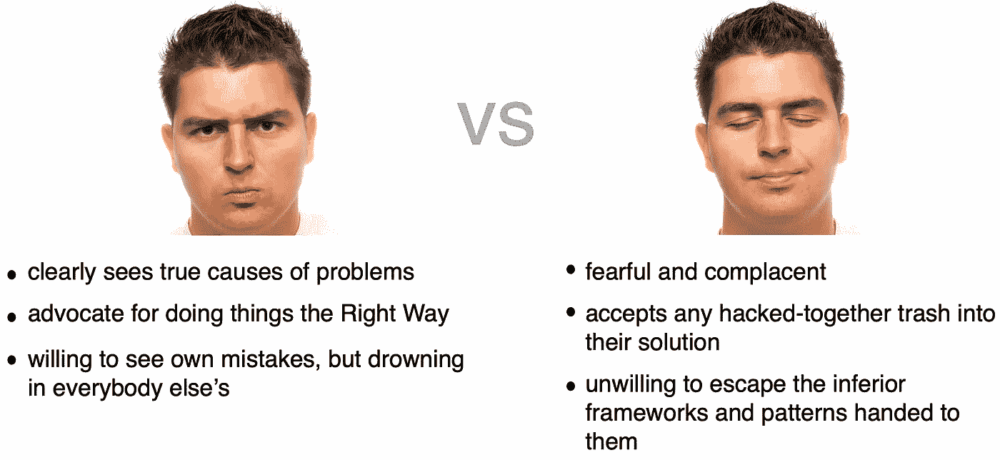

# 你与愚蠢的世界——给愤怒的工程师的建议

> 原文：<https://levelup.gitconnected.com/you-versus-a-world-of-stupidity-advice-for-angry-engineers-819550142477>

我希望读到这篇文章的人会像我一样:

*   在编写代码或做其他技术工作时，经常因为事情没有“正常工作”而感到烦躁。
*   在“我与愚蠢的世界”的脉络中，倾向于正义的咆哮，也就是“[黑爵士](https://en.wikipedia.org/wiki/Blackadder)综合症”
*   有足够的自我意识和神经可塑性来塑造自己的人格。

好吧，那实际上是上面的憨豆先生——不是埃德蒙·黑爵士。这是我能找到的最好的免版税的罗温·艾金森。

假设你就是那个人。我的下一个问题是让你在这篇文章上停留足够长的时间，让我对你说一些有价值的事情。因为如果你在我试图赶走你的那个地方，那么这篇文章就不符合你的典型口味。还有其他内容会更加闪亮，符合你的心情。

如果你想要一个令人满意的技术咆哮，而不是弄清楚如何在工作中变得更快乐，我真心推荐这个来自乔纳森·布洛的演讲:

一个经典的 JBlow 宣言。

这个视频是愤怒工程的宝库——宏伟的，精英的，是的。但是他好几次一针见血。一开始，乔纳森谈到了一个实验，他记下了每次软件以一种令人困惑或混乱的方式对他做出反应。他说的非常对，软件已经变得如此低劣。

假设你还在这里…

# 你想成为哪种人？

归结起来就是这个。有一个人你会和他共度一生——你！不像你将与之共度时光的其他人，你可以把那个人变成一个值得相处的人。

当某些习惯最初让你受益，但后来让你不好过时，麻烦就来了。如果你用实际上对你没有帮助的模式来包装你的身份，那就很难改变了。

下图显示了“两种人”中的一种，这种切片注定是简化的，不能捕捉每个人的细微差别。包括你。如果你和左边或右边的人的特征完全匹配，我会非常惊讶。这只是一个我们可以暂时使用的框架。

工程师版的古佛斯和格兰特。

当我在这里说“左”或“右”时，这些术语没有政治含义。像你的左手一样“左”——而不是像乔治·索罗斯一样“左”。

上面的第一张图似乎是由右边自鸣得意的技术大师创造的。它把他所有的特点都描绘成美德，把左伊描绘成一个痛苦的书呆子男孩。让我们给左边的反叛者一个机会来展示他对同一图表的看法…

和之前的图一样，但是转向左边的人如何看待事物。

这里有几个原型。我是说，虽然两者都有价值，但你的个性有向自私自利的愤世嫉俗倾斜的危险，这会让你的生活变得不必要的不愉快。理想情况下，我们会捕捉到左派的勇气、激情和洞察力，以及右派的务实、机智和无我的清晰。

是的，我仍然在这里谈论软件开发。工程师们在一个看似简单的软件和硬件的数字环境中工作。然而，在这个世界上，你很难不被其他人的决定所左右。你对这些人和他们的工作的反应对你的幸福很重要。

# 工程师的诅咒

如果我不认为工程师和他们的思维方式有什么独特之处，我就不会写这篇文章。让心理学家来谈谈适用于更多人群的更普遍的问题。你和我都遭受着一种还没有进入 DSM-5 的痛苦…

*我们真的希望事情能够成功。*

当事情不顺利时，它会困扰我们。而且说实话，我觉得就是这么低级，这么简单。你可以从[马斯洛的金字塔](https://en.wikipedia.org/wiki/Maslow%27s_hierarchy_of_needs)中找到其他的好处，来解释为什么我们希望软件是高性能和无错误的。但我认为你不需要。

如果你不相信我所说的需要工作是最基本的，就想想下面的*令人不满意的*视频吧。这是一系列简单的失败。

平行工作室的一个失败杰作。

我曾经在一个铁路交叉路口停下来，那里的门一直关着，没有火车来，阻碍了交通。我等了五分钟，等着大门打开或火车来。我下了车，顺着铁轨寻找火车。没有。钟声响起，红灯闪亮，等待一列永远不会到来的幽灵列车。

它看起来就像这样，但是…没有火车。

所有其他等待的汽车早就掉头开走了更好的路线。但是我对工程师特别着迷。我在这里还有事要做。

我在附近的路牌上发现了一个“有问题打电话……”的电话号码，于是打电话给铁路公司。电话那头的男人听到了我描述的情况，我希望他戴着那顶经典的细条纹帽子。然后，他向我要了一个“交叉号码”(也许是一个不同的术语)，我发现它印在附近的设备上。他谢过我，说他们会派人来修理。

我基本上为一个铁路道口提交了一份错误报告。

我这样做不是为了人类的利益。我没有这样做，因为我担心我的旅程在未来会受阻。我这么做是因为工程师的诅咒。我真的，真的，非常希望一切顺利。

# 破碎的世界

然而，我们生活在一个不断让我们失望的世界。这是一个权力围绕金钱的地方，建造东西是达到目的的手段，而不是目的本身。

腐败的经济势力建造的劣质船只。

我们看到的几乎每一个项目或事业都没有达到它可能达到的最佳状态。市场方程式并不能解决最佳设计的解决方案，而是产品或服务成功的最佳解决方案。消费者愿意接受一定数量的低质量工程，以换取更低的价格和其他好处。因此，我们似乎注定会有应用程序、设备、人员和机构不符合我们的标准。

以下是驱使我进行技术演讲的众多因素中的一部分:

*   可挤压的芥末容器(我可以写一整篇文章来描述他们是多么勇敢的新世界主义者)
*   HVACs 不会简单地加热或冷却到设定的温度，而是要求你永远不停地摆弄它们的控制器。
*   基于云的语音识别([离线](https://towardsdatascience.com/how-to-start-with-kaldi-and-speech-recognition-a9b7670ffff6)工作更快，不会威胁到你的隐私)
*   基于云的视频游戏流(Reddits 充满了落后的声音)
*   基于云的*任何不想基于云的东西*。人们应该更乐意考虑边缘计算和[离线优先](https://offlinefirst.org/)解决方案。
*   CSS 框架(今年就不用了。杰森·奈特[强行给我吃了红色药丸](https://medium.com/codex/stop-fighting-the-reason-css-exists-with-these-dumbass-frameworks-91732f5993c7)。)
*   [工作证明](https://en.wikipedia.org/wiki/Proof_of_work)作为数字稀缺的一种手段。

老实说，我不得不阻止自己打字。它就这样溢出来了！

有太多东西可以修复。在我看来，有太多的事情像是懒惰、忽视和彻头彻尾的懒惰的产物。

# 小心抖动的膝盖

对于我们这些受到工程师诅咒的人来说，我们可以开始将这个世界视为一场失败的游行。

一匹懒惰又粗心的马。

随着我们越来越频繁地使用这种镜头，我们会错过那些美好甚至刚刚好的时光。我们忽略了工程严谨性之外的其他考虑。有时候，有些用例更适合其他人，而不是我们，我们的挫败感不应该作为一种普遍的批评来表达。

例如，在完成了一个为期四年的项目后，我已经到达了一个点，在这里，我不会选择将 [Unity](https://unity.com/) 作为商业游戏的游戏引擎。我不得不做的框架安装和暗箱操作浪费了我很多时间。重新开始，我可能会[按照这些思路](https://medium.com/geekculture/how-to-make-your-own-game-engine-and-why-ddf0acbc5f3)制作一个手工引擎。但是对于一个新的游戏开发者或者善于利用其可视化编程特性的人来说，Unity 仍然是一个优秀的工具。

我在使用用于地理空间数学的 [TurfJS](https://turfjs.org/) 库的一些布尔运算时有过痛苦的经历。开始的时候，我挥了很多拳头，进行了很多指责。但是经过两年对我发现的错误的修复，我开始熟悉一个导致这些错误的非常困难的问题。站在一边大声指责写糟糕代码的人很容易。但是越接近这个问题，情况就越不同。一路上，我遇到了一些为开源做出巨大贡献的工程师。

# 将移情与工程相结合

即使当工程解决方案是一个不可否认的怪物时，除了工程还有其他事情要考虑。

这个项目是完全由志愿者编码的无资金支持的开源项目吗？(我们用来开发的软件大部分都是！)如果是这样，我们可以对它的问题感同身受，有建设性。捐赠一些时间、金钱或委婉的建议来帮助它变得更好。或者只是悄悄地切换到不同的解决方案，而不是对其他人的工作发泄不满。

有时你在你工作的同一家公司或组织内部的工程上有问题。在这种情况下，你将能够见到那些因为他们的错误而让你生活一团糟的人。但是你和他们谈得越多，一起工作得越多，你就越能理解他们是如何做出决定的。仔细观察，这些“错误”甚至可能不是错误。

也许你讨厌的小部件库已经计划被更好的东西取代。该团队正在等待他们的替代工作获得批准。与产品经理的一次对话可能是提升其优先级所需的投票。

也许您调用的慢速服务端点最初只是为批量下载而设计的。您的问题可以通过简单地调用一个不同的端点来解决，而您在查询之前并不知道这个端点。

也许你会把一个工程师逼到墙角，问:“你为什么要把你的东西做得这么可笑？”然后他们解释了一些复杂的原子数据库事务或其他什么。你离开时不同意昨天的自己。嘿，有时候你就是会犯错！

# 一个有许多缺点的混乱世界，总是可以改进的

我怀疑我能在这篇文章中告诉你任何你没有考虑过的事情。我只是一个花了一点时间思考“我和愚蠢的世界”的人。它很阴险，会让你远离更好的东西。因此，我真诚地建议培养一种更加开放和积极的世界观。

她故意摔倒。挺好的。

* * * [媒体学分](https://medium.com/@ErikH2000/where-my-media-comes-from-59761dc4be7) * * * [想要一份工作？](https://medium.com/@ErikH2000/yes-i-can-help-you-get-an-it-job-b0b51fee4c95) * * * [领英简介](https://www.linkedin.com/in/erikhermansen) * * *