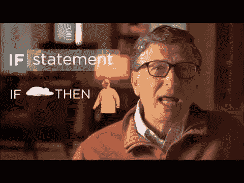
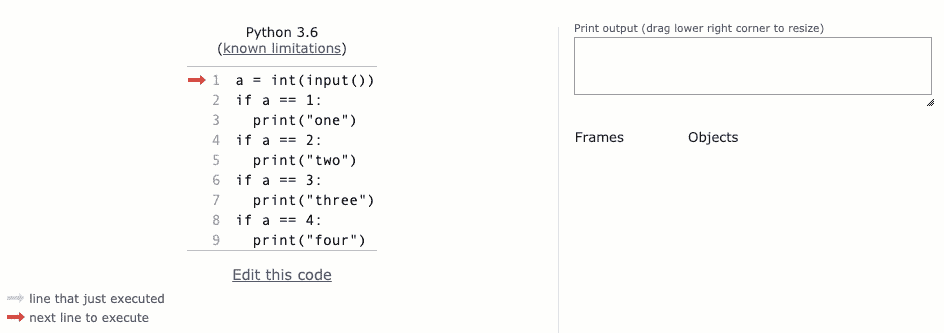

# 读完这篇文章，你将最终 100%理解编程

> 原文：<https://levelup.gitconnected.com/you-will-finally-100-understand-programming-after-reading-this-97a3813e4143>

初学者编程入门

# 问题是

我教编程已经超过 20 年了。而通常情况下，当人们开始学习编程时，他们面对的是给出语法、数据类型的课程或书籍，然后立即转向数据结构等等。



最大的问题是:

*   初学者不了解程序流程
*   初学者不理解变量
*   初学者认为他们知道，但他们没有概念

# 解决办法

*   学习算术运算、打印、输入和 IF 语句(包括在本文中)
*   以此为基础，写至少 50 个程序
*   学习循环和数组(或列表)
*   以此为基础，开始在互联网上解决问题

信不信由你，这就足够了。其余的你将“按需”学习。

# 编程的核心

你已经见过很多次了:

> 计算机程序是可以由计算机执行以完成特定任务的指令的集合。

这是学校给出的定义。但是很多人忽略了。他们会想:好吧，我知道。那么，到底什么是编程？

慢慢重读这个。理解这个定义至关重要:

> 计算机程序是可以由计算机执行以完成特定任务的指令的集合。

# 简单的说明

我给你介绍几个简单的操作。

不失一般性，本文基于 Python 编程语言。绝对没有区别，你在努力学习哪种语言。主旨是一样的。

```
a = 5
```

这条指令执行后，“a”将等于 5。
在这个指令之前，我们根本不知道“a”是什么。

```
print(a)
```

这是一条简单的指令，将“a”打印到屏幕上。

这意味着这个程序:

```
a = 5
print(a)
```

将输出" 5 "、

这个程序:

```
print(a)
a = 5
```

将引发一个错误。

为什么？因为当“print(a)”在赋值前执行时，计算机根本不知道“a”是什么。如果它不知道" a ",怎么能打印出" a "?

首先，分配。然后打印。简单。

一些算术运算入门。

```
a = 5
b = 2
c = a + b
print(c)
```

你可能会猜测“c”等于 7。而且大家都懂。

问题是初学者不明白这一点

```
a = 5
c = a + b
b = 2
print(c)
```

会引发错误！

# 程序是如何执行的

取上面的程序，试着一步一步执行。

在`a = 5`之后，下一个语句是`c = a + b`。所以，你是让你的电脑把“a + b”相加，赋给“c”。但是电脑不知道“b”是什么！

你会说:就在下一行，我证明了“b”等于 2！

但那是下一句台词。它将在第二行之后执行！

# 如果语句

如果没有 if 语句，编程几乎没有任何意义。

> 有时候编程语言有一个“GOTO”语句。不幸的是，GOTO 现在隐藏在其他循环中。这使得程序更容易读写。但这让理解编程变得有点困难。

但是“如果”从一开始就存在。

这是一个简单的语句，意思是:如果有东西存在，只执行下一行。

例如:

```
a = 5
if a > 3:
  print("Greater than three")
```

这个程序将输出“大于三”。

但是这个:

```
a = 5
if a > 10:
  print("Greater than 10")
```

不会输出任何东西。

请注意，下一行向右缩进。这是 Python 的语法。在其他语言中，这不是必需的。但它也更容易阅读。

# 二加二等于四

考虑这个程序:

```
if 2 + 2 = 4:
  print("Of course")
```

—错误。什么？！是的。错误。因为“=”是为变量赋值保留的。
——那我该如何比较呢？
—使用“==”

```
if 2 + 2 == 4:
  print("Good!")
```

:)

好的。让我们看更多的例子。

```
a = 2
if a == 1:
  print("one")
if a == 2:
  print("two")
if a == 3:
  print("three")
if a == 4:
  print("four")
```

你在这里期待什么？

正确。它输出“二”。

如果你改变第一行，整个程序流程都会改变。

# 投入

通常，用户不会更改程序。但是用户与程序进行交互。

为此，有一个“int(input())”语句。照原样记住就行了。它从键盘上获取用户输入，并将其赋给某个变量。

```
a = int(input())
if a == 1:
  print("one")
if a == 2:
  print("two")
if a == 3:
  print("three")
if a == 4:
  print("four")
```

现在，如果你运行程序，它将等待一些键盘输入。那么无论你输入什么，都会被分配给 a。

如果用户键入“1”，程序输出“1”。如果用户键入“2”，程序输出“2”。诸如此类。

以下是输入“3”在 pythontutor.com 上制作的可视化效果:



可视化是由 pythontutor.com

注意，第 3、5 和 9 行没有被执行。但是其余的行被执行，即使例如“a”不等于 2。程序仍然需要执行第 4 行来检查条件是否成立。

我们还可以用输入做什么？

```
a = int(input())
b = int(input())
print(a + b)
```

这个程序等待两个输入:一个是“a”，一个是“b”。然后输出它们的和。很酷吧。

# 结论

我希望这能帮助你更好地理解什么是编程。

一旦你理解了这些基本原则，你就可以随意继续或开始任何其他课程。

您可能会对我在 medium 上对 Python 的缓慢介绍感兴趣:

[](https://medium.com/analytics-vidhya/programming-principles-with-python-lesson-1-e63d6952dffb) [## Python 编程入门，第 1 课

### 算法简介

medium.com](https://medium.com/analytics-vidhya/programming-principles-with-python-lesson-1-e63d6952dffb) [](https://timurbakibayev.medium.com/programming-principles-with-python-lesson-2-9042c4fa2fd6) [## Python 编程入门，第 2 课

### 使用列表

timurbakibayev.medium.com](https://timurbakibayev.medium.com/programming-principles-with-python-lesson-2-9042c4fa2fd6) [](https://medium.com/analytics-vidhya/a-very-slow-introduction-to-programming-with-python-lesson-3-56348171629e) [## Python 编程入门，第 3 课

### 条件(如果)

medium.com](https://medium.com/analytics-vidhya/a-very-slow-introduction-to-programming-with-python-lesson-3-56348171629e) [](https://medium.com/analytics-vidhya/a-very-slow-introduction-to-programming-with-python-lesson-4-3c6a5f16a238) [## Python 编程入门，第 4 课

### 循环、列表和条件

medium.com](https://medium.com/analytics-vidhya/a-very-slow-introduction-to-programming-with-python-lesson-4-3c6a5f16a238) [](https://medium.com/analytics-vidhya/a-very-slow-introduction-to-programming-with-python-lesson-5-3766fe462294) [## Python 编程入门，第 5 课

### Python 练习

medium.com](https://medium.com/analytics-vidhya/a-very-slow-introduction-to-programming-with-python-lesson-5-3766fe462294)