# React.js 的基本道具指南

> 原文：<https://levelup.gitconnected.com/your-basic-props-guide-for-react-js-825cb9574018>

关于在构建应用程序中使用 props 的演练。


今天，我们将讨论如何在 React 中使用道具。对于那些没有意识到的人来说，根据[的反应文件](https://reactjs.org/docs/components-and-props.html)，道具是可以给组件的输入。

在我们进一步讨论如何在我们的代码中使用 props 之前，让我们先回顾一下我们将要构建的应用程序。以下是我们待办事项列表的 gif 图:

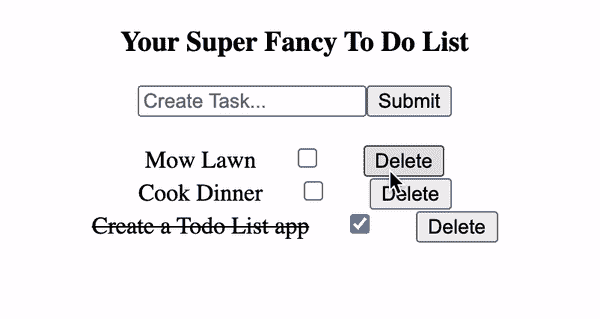

我将这个应用程序链接到了一个公共的 GitHub 库，以防你想更深入地研究你将在这个博客中看到的代码。你可以在这里找到这个仓库[。](https://github.com/jonathanbrierre/ToDo-Props-Demo)

从 gif 上可以看到，这是一个完整的 CRUD 应用程序(创建、读取、更新、删除)。为了能够像我们看到的那样操作页面内容，我们必须使用**道具**在组件层次结构中上下发送数据。

下面是我们的 App.js 文件内容的截图，这是这个应用程序的主要组件。

**状态:**

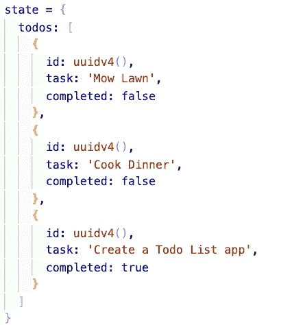

我们的状态包含一个对象数组，这些对象作为我们的待办事项列表呈现在屏幕上。如果你不熟悉 uuid 和我如何使用它，你可以在这里找到一些文档。它基本上为每个对象生成一个随机的字符串作为惟一的 ID。

**功能:**

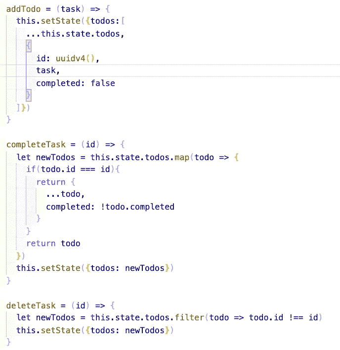

这些函数将作为修改状态的道具，沿着组件树向下传递。当我们在 CRUD 中检查每一个字母时，我将单独进入每一个函数。

**JSX:**

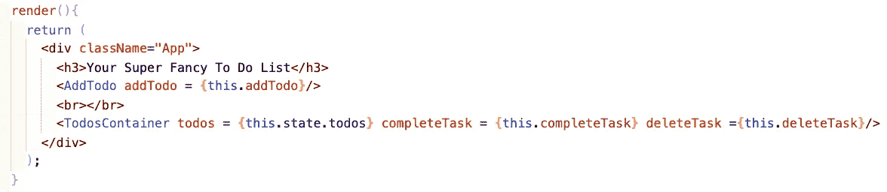

在这里，您可以看到我们使用了两个组件 AddTodo 组件，它在页面上呈现一个表单以创建一个任务，以及 TodosContainer 组件，它呈现每个单独的待办事项。

以下是我们的 AddTodo 组件:

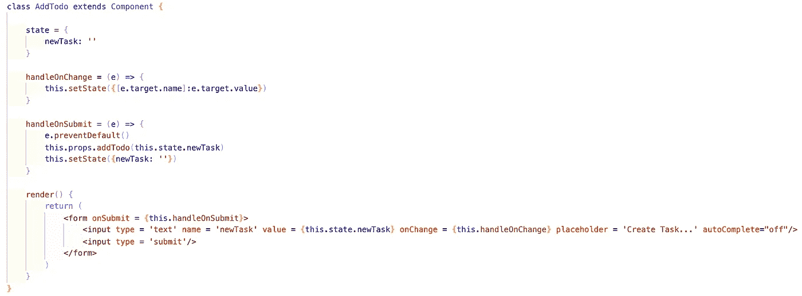

以下是我们的 TodosContainer 和 Todo 组件:

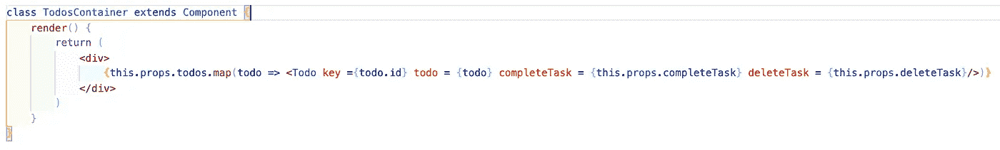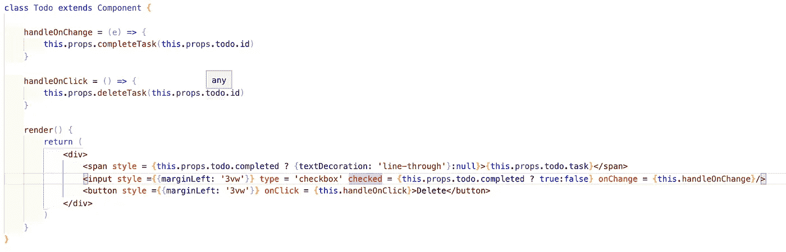

我知道这可能看起来很多，特别是如果这对您来说是一个新概念，所以让我们使用 CRUD 缩写来分解这个应用程序。

# 创建:

要为我们的待办事项列表创建一个新任务，我们必须将事情输入到一个表单中。这里也是我们的 AddTodo 组件:


如果您回忆一下上面的内容，您会知道这个组件是从 App.js 组件呈现的，它存储了我们的状态。如何从 AddTodo 组件中编辑 App.js 中的状态？这里是我们使用**道具**的地方！

首先，我们将在 App.js 文件中创建一个函数，该函数接受一个任务名称的参数，并使用给定的名称创建一个新的任务对象。

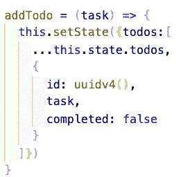

现在，当我们从 App.js 中呈现 AddTodo 组件时，我们将像这样为它提供这个函数:


现在，在我们的 AddTodo 组件中，我们可以使用以下语法调用此函数:

```
this.props.addTodo()
```

这是在我们提交受控表单时完成的。

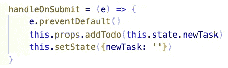

当受控表单提交时，我们获取 AddTodo 组件状态中的内容，然后将其传递给我们传递的函数，从而将其添加到 App.js 中的状态中。如果您不熟悉受控表单，我建议您看看我的博客文章，了解如何在这里构建简单的受控表单[。](/building-a-simple-controlled-form-in-react-js-b7e28236bf2e)

# 阅读:

这部分很简单。我们将获取 App.js 状态中的对象数组，然后将它们传递给我们的 TodosContainer 组件，如下所示:


**注意:**该组件还接收其他更新和删除功能的道具。

现在，在我们的 Todos 容器组件中，我们映射对象数组中的每个任务，并为每个任务创建单独的 Todo 组件。


# 更新和删除:

当我们将对象数组传递给 TodosContainer 组件时，我们也将这两个函数作为道具传递下去:

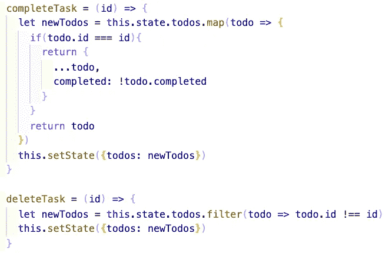

当我们回到 TodosContainer 组件时，我们还需要将这些函数作为道具传递给每个 Todo 组件。这样，每个任务负责更新或删除自己。下面是我们的 Todo 组件。


如果有人希望通过将任务标记为完成(选中复选框)来更新任务，则会触发 onChange 事件处理程序，调用作为 props 传递的 completeTask 函数。该函数接受一个唯一 ID 的参数，并使用该 ID 更新 App.js 状态。关于这个特殊功能的更多细节，你可以点击查看[！](/using-the-map-function-in-javascript-react-b433736759d4)

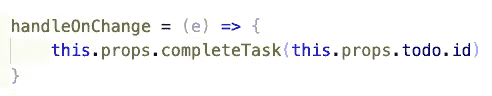

如果一个人想通过按 delete 按钮删除一个任务，那么就会触发一个 onClick 事件处理程序，调用作为 props 传递的 deleteTask 函数。该函数还接受一个惟一 ID 的参数，并根据该 ID 过滤我们的 App.js 状态。关于这个特殊功能的更多细节，你可以点击查看[！](/using-the-filter-function-in-javascript-and-react-317ff155da73)

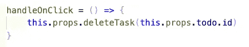

现在你知道了！我们已经成功地使用 props 创建了一个完整的 CRUD 待办事项列表应用程序。请记住，随着应用程序的扩展，不推荐使用这种道具(称为道具训练)。为了易于伸缩，我们将使用像 Redux 这样的状态管理库。但是对于小的应用程序，像这样的道具钻应该足够了！

# 资源:

[](https://github.com/jonathanbrierre/ToDo-Props-Demo) [## 乔纳森·布里尔/托多-道具-演示

### 这个项目是用 Create React App 引导的。在项目目录中，您可以运行:在…中运行应用程序

github.com](https://github.com/jonathanbrierre/ToDo-Props-Demo) [](https://reactjs.org/docs/components-and-props.html) [## 组件和道具-反应

### 组件可以让你将用户界面分割成独立的、可重用的部分，并独立地考虑每一部分。这一页…

reactjs.org](https://reactjs.org/docs/components-and-props.html) [](/building-a-simple-controlled-form-in-react-js-b7e28236bf2e) [## 在 React.js 中构建简单的控件表单

### 今天，我们将在 React.js 中构建一个简单的受控表单。

levelup.gitconnected.com](/building-a-simple-controlled-form-in-react-js-b7e28236bf2e) [](https://www.npmjs.com/package/uuid) [## uuid

### 对于 RFC4122 UUIDs 的创建完整-支持 RFC4122 版本 1、3、4 和 5 UUIDs 跨平台-支持…

www.npmjs.com](https://www.npmjs.com/package/uuid) [](/using-the-filter-function-in-javascript-and-react-317ff155da73) [## 在 JavaScript 和 React 中使用过滤函数！

### JavaScript 的。filter()函数是一个高阶数组函数，它接受回调函数作为参数。这是…

levelup.gitconnected.com](/using-the-filter-function-in-javascript-and-react-317ff155da73) [](/using-the-map-function-in-javascript-react-b433736759d4) [## 在 Javascript 和 React 中使用 Map 函数！

### 今天我将复习一下如何使用？在 Javascript 中映射高阶函数并作出反应。地图是一种功能…

levelup.gitconnected.com](/using-the-map-function-in-javascript-react-b433736759d4)