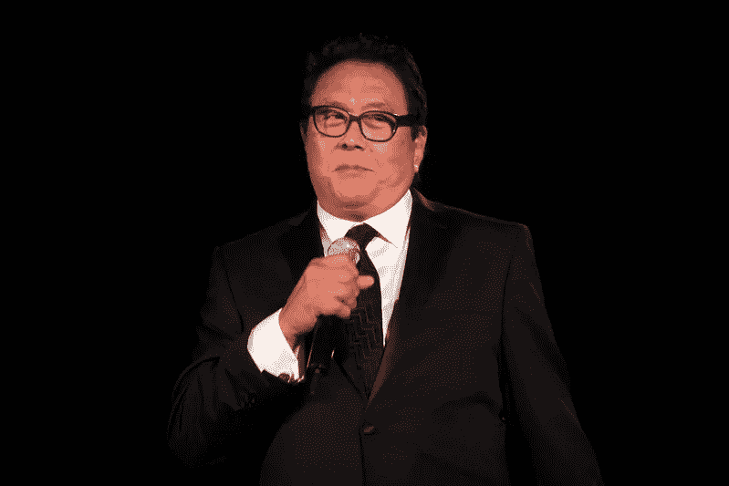
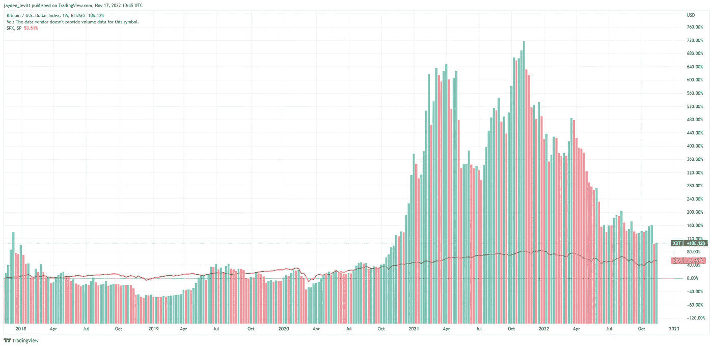

# 你的比特币将会贬值很多——你应该感到兴奋(R .清崎)

> 原文：<https://levelup.gitconnected.com/your-bitcoin-is-about-to-become-worth-a-lot-less-you-should-be-excited-r-kiyosaki-512ef2e10ded>

这位世界著名作家表示，比特币可能不会保护你的收入，但它会保护你的财富。

由 Flikr 上的 [Gage Skidmore](https://www.flickr.com/photos/gageskidmore/) 拍摄

让我们开门见山地解决房间里的大象。

罗伯特清崎在经营实际业务方面取得了有限的成功，但他的世界名著《富爸爸，穷爸爸》的销售却取得了巨大的成功，这使他成为主要的收入来源，即商业研讨会。

清崎的研讨会因其激进的促销策略而受到批评。

他们依赖那些愿意花钱接受商业教育以改善生活的人。

如果你浏览他的商业生涯，很难看到他背后的商业成功，以证明包装商业教育并出售它是一笔财富。

是的，他做到了，而且做得非常好。

当我十几岁时阅读《富爸爸穷爸爸》时，清崎的无术语交流模式和他用简单易懂的语言解释复杂金融话题的能力引起了我的注意。

虽然我觉得书中没有多少可操作的步骤，但他购买资产而非负债的概念已经让我铭记了一段时间。

你可能已经注意到，在你的 YouTube 和脸书频道上出现了大量罗伯特·清崎和[的视频。](https://en.wikipedia.org/wiki/Robert_Kiyosaki#cite_note-Road_To_Rich_Dad_CBC-2)

这是因为这位商业教育巨头现在开始对比特币等流行的加密货币直言不讳。

他称比特币是一个购买机会，并暗示，鉴于 FTX 崩盘，如果美联储继续加息，这种加密货币可能会跌至 1 万美元。

举个例子，世界第三大密码交易所 FTX，几乎在一夜之间从一个 320 亿美元的公司崩溃到零。

他们的创始人利用客户存款进行交易。当媒体通过链上分析发现这一点时，这导致了 Crypto 版本的银行挤兑，每个人都想同时将存款从 FTX 取出。

FTX 有 90 亿美元的负债，只有 10 亿美元的资产来支付客户提款，因此已经申请破产。

FTX 的灭亡最终导致了密码市场的进一步崩溃。

清崎没有隐瞒最近的事件，并批评了推动 FTX 和民主党的人，他们接受了 FTX 4000 万美元的竞选捐款。

这些捐款让 FTX 创始人山姆·班克曼·弗里德成为了[乔·拜登的第二大捐款人](https://fortune.com/2022/11/10/sam-bankman-fried-ftx-joe-biden-democratic-party-second-biggest-donor/)。

> 罗伯特·清崎:
> 
> “WTF: FTX 中期选举民主党最大的捐赠者。
> 
> 凯文·奥利里和吉姆·克莱默对萨姆·班克曼-弗里德赞不绝口，称他为加密界的沃伦·巴菲特。SBF 更像是加密领域的伯尼·麦道夫。
> 
> 硅谷和好莱坞还能腐败到什么程度？现在付钱去偷选举？"

值得一提的是，据说政客们正在收回山姆·班克曼-弗里德的捐款，以此来疏远这位声名狼藉的 FTX 创始人。

班克曼-弗里德送出的无关紧要的捐款是 FTX 的客户存款。因此，难怪政客们会把它退回去，至于他们会退回多少还不清楚，因为中期选举已经结束了。

不管怎样，FTX 的余波已经严重影响了比特币的市值——以下是清崎的话。

> 罗伯特·清崎:
> 
> “比特币？担心？号码
> 
> 我是比特币投资者，因为我是实物黄金、白银和房地产的投资者。
> 
> 我不是交易者或投机者。
> 
> 当比特币创出新的底部，10 美元到 12 k 美元？我会很兴奋，而不是担心。
> 
> 我赌美联储、财政部和拜登，赌 G、S 和比特币。"

# 你应该为你的比特币价值大幅缩水感到兴奋。

我喜欢清崎的建议，他澄清说，利率的提高将继续抑制轻率的投资，推动比特币价格下跌，并将投机者赶出市场。

由于 FTX 崩盘，比特币的价格被进一步压低。

我不同意他的主要营销策略，即把恐惧武器化，并把它作为一根棍子来击败看不见的敌人。

他的敌人:

*   学校教师
*   金融顾问，他说他们是假老师。
*   像拜登这样的政治家
*   他说股市在偷你的钱
*   他说这是失败者的储蓄。
*   你会很穷，为了钱而工作。

有时候，他说的话听起来有些道理。

清崎坚持认为，你需要在美联储转向加息立场之前购买比特币，但他认为比特币将进一步下跌。

> 罗伯特·清崎:
> 
> “提高利率会扼杀经济。股票、债券和房地产将会崩溃。
> 
> 美联储将转向。
> 
> 在美联储转向之前购买黄金、白银和比特币。
> 
> 保重。"

# 比特币可能不会在短期内保护你的收入，但会保护你的财富。

清崎认为，美元将像英镑一样崩溃，迫使美联储转向，降低利率。

他认为这可能会在 2023 年 1 月发生，然后，他预计比特币的价格会保持稳定。

> 罗伯特·清崎:
> 
> “美元会追随英镑吗？我相信会的。
> 
> 我认为，在美联储转向后，美元将在 2023 年 1 月崩溃，”
> 
> "我不会成为该死的美联储的受害者."

众所周知，比特币的价格和五年的增长在过去一年中被抹去了市值。

包括股市在内的所有资产都崩溃了。

这是比特币相对于 S&P500 的表现，后者是美国 500 家上市公司的指数

值得注意的是，如果你对比特币和标准普尔 500 11 个板块中的任何一个进行了投资，你的投资都会缩水。

自 2018 年以来，比特币对标准普尔 500 升值了 50%。

标准普尔 500 =橙色线

比特币=专栏

来源— [交易视图](https://www.tradingview.com/chart/4oOVDETy/?symbol=BITMEX%3AXBT)

# **最后的想法**

清崎拥有的财富不是靠运气赚来的。

他是一个精明的商人，利用了人们对贫穷的恐惧和对致富的渴望。

就好像穷人是不同种类的人，他说的任何话都没有中间立场或平衡的表象。

为什么？平衡不能满足人们的愿望，也不能吸引他们获得 YouTube 的浏览量，从而导致图书销售和售罄的研讨会。

无论你对比特币的立场是什么，清崎都不是傻瓜，他有一种专家的方式来解释复杂而又容易理解的话题。

与清崎对股市的看法相反，我认为比特币旁边有一个巨大的机会。

如果你相信比特币是一种资产，并且有一个长期的时间视野，那么完美地把握市场触底的时机会很好，但这不是必须的。

> *如果你想在 Web3 上读到更多我的观点，请考虑成为会员。你的会员费直接支持你读的作家。如果你用我的链接* [*注册，我会赚一小笔佣金。点击这里*](https://medium.com/@jayden_levitt/membership) *。*

*本文仅供参考；不应将其视为财务、税务或法律建议。在做出任何重大的财务决定之前，你可以咨询财务专家。*