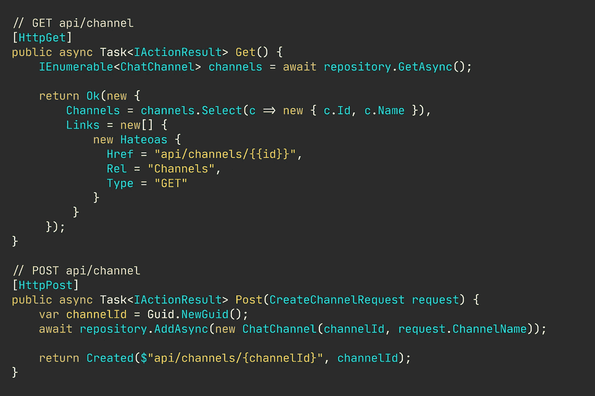
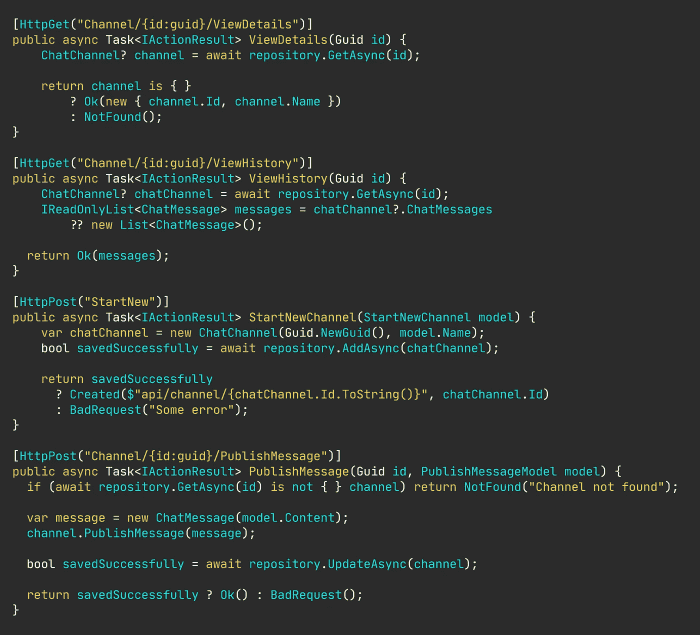

# 你的域类不是休息资源，句号。

> 原文：<https://levelup.gitconnected.com/your-domain-classes-are-not-rest-resources-period-5a62ba8875b9>

## 固执己见的观点

## 以“良好实践”为幌子的任意的、自我强加的约束不应该限制您表达自己领域的能力。

图片由[尼可拉斯·米勒德](https://medium.com/u/7c7a43b3d9de?source=post_page-----5a62ba8875b9--------------------------------)提供

因此， [REST 显然没有按照我们希望的方式运行](/whats-wrong-with-your-crudy-interfaces-besides-everything-bde4f4c8cb8a)。大公司很好地营销了 REST 来销售他们的软件，开启了所谓的 [API 经济。](https://www2.deloitte.com/content/dam/Deloitte/us/Documents/financial-services/us-fsi-api-economy.pdf)

但我们应该知道事情不会像预期的那样发展。

一路上有一大堆迹象表明…普遍缺乏标准的实践。这一切的普遍性。专注于遵循任意的、合成的规则，而不是构建特定于业务的 API。

然后我们有了可能是最明显的迹象 REST 在现代 DDD 驱动的应用程序中不起作用:

> 将面向文档的范例应用到业务领域的复杂现实中，在实践中是行不通的。

像我一样，其他开发人员也注意到了这一点。但是理论上说，休息是好的，但是在今天的实践中只有部分是好的。

# 我觉得休息时经常会有些尴尬。

我对 REST 的一个主要问题是，我们如何突然变得“面向资源”而不是面向业务。

如果您真的只是在处理可以存储、检索、更新、替换和删除的资源，那么(CRUDy) REST 可能是好的。

一些粗糙的 REST 约定也适用于您的业务领域，比如创建或检索一个聊天通道实体，如下所示。

`GET api/channel`检索和`POST api/channel`创建。

简单粗暴的 REST API。

但是在基本的实体交互之外，REST 显示了它的笨拙。

显然，上面的例子太简单了，以至于不允许在产品代码中使用。我很清楚这一点。至少，我希望没有人会直接从他们的控制器访问存储库类。

## 对于外行来说，RESTful 端点没有什么意义。

隐式或有点隐式的规则实际上是管理 REST API 的规则。例如，我们只需知道对根资源的`GET`请求获取该资源的所有条目。另一方面，对同一个端点的`POST`请求将创建一个实体或资源。

我们花了很多时间学习通过代码清楚地表达我们的意图。我们阅读关于[清洁代码](/writing-cleaner-code-with-examples-69be2160b4c1)和[如何编写可读代码](/writing-readable-code-exemplified-bd387cd93b6b)的文章。但是，出于某种原因，我们可以对所有事情使用相同的端点，只改变请求动词，就像这足以解释我们在 API 服务器上调用什么功能一样。

顺便说一下，对于 REST 的实现方式有一个常见的误解。REST API 公开的模型既不是域中的实体，也不是数据库中的行。从资源到数据库行没有一对一的映射。让它深入人心。

# 强大的 API 可能是我们所需要的。

所以，我显然没有所有的答案。差远了。但我确实喜欢质疑现状，尤其是当似乎每个人都在盲目地向同一个方向行进，仅仅因为前面有人开始走。

我有一个疯狂的想法——而且不止我一个人有这种想法。老实说，这种想法很古老了。

我们把同样的原则应用到我们的 HTTP 端点，就像我们写我们通常的代码一样，怎么样？不如我们把事情说清楚…

不说`GET api/channel/{id}`，说`api/channel/{id}/ViewDetails`，不说`POST api/channel`，说`api/channel/StartNew`怎么样？

基于任务的强大 API。

我把新 API 的帽子撕下来了。HATEOAS 可能是我在设计 RESTful APIs 时遇到的最笨拙的概念之一。

此外，请注意，我使用基于任务的方法来设计端点是多么容易地捕捉到了其他意图。其中一些端点在粗糙的 REST 接口中难以实现。

根据用户实际感兴趣的操作来建模你的界面。根据您的领域如何工作来对它们建模。基于任务的界面也与领域驱动设计(DDD)中无处不在的语言概念相一致。

我很确定你的领域专家和产品负责人不会说“后聊天频道”—他们宁愿说“开始一个新的聊天频道。”您需要在界面中捕捉这种意图。

## “但那只是 RPC！”

不，不是的。但是差不多了。我们可以把它扩展到称之为 RPC-like。

基于任务的 API 的伟大之处在于绝对没有猜测。它公开了一个接口，该接口是按照您在业务领域的上下文中对某个实体的思考和交互方式设计的。

一个类似 RPC 的接口——如果我们选择这样称呼它的话——不仅与这种无处不在的语言很好地结合在一起，它还与现代的[命令和查询分离(CQS)模式](/replacing-if-else-with-commands-and-handlers-527e0abe2147)几乎完美地映射在一起。

# 总之…

你不需要*盲目地认为一个架构模式是实现你的领域的标准。*

常见的是将 REST 实现为 HTTP 上的 CRUD，但是这样做的话，最多只能得到一个过于普通的应用程序。

考虑你的业务领域和你的客户的意图，以及他们实际上想如何与你的实体互动。

# 让我们保持联系！

[点击这里](https://nmillard.medium.com/subscribe)订阅时事通讯，获得类似文章的通知，并查看新的 YouTube 频道*[(@ Nicklas Millard)](https://www.youtube.com/channel/UCaUy83EAkVdXsZjF3xGSvMw)*

**连接上*[*LinkedIn*](https://www.linkedin.com/in/nicklasmillard/)*

# *好奇者的资源*

*   *📚[源代码【GitHub】](https://github.com/NMillard/SimpleWebApps/tree/master/src/GeneralPractices/CrudOrTaskBased/CrudApp)作者[尼可拉斯·米勒德](https://medium.com/u/7c7a43b3d9de?source=post_page-----5a62ba8875b9--------------------------------)，作者*
*   *架构风格和 T21 基于网络的软件架构的设计*
*   *除此之外，你的 CRUD APIs 有什么问题吗？作者简介*
*   *微软的 RESTful API 设计*
*   *[Crud 对休息不好吗？鲍里斯·卢布林斯基](https://www.infoq.com/news/2009/07/CRUDREST/)*
*   *特洛伊·格里菲兹的《为什么休息很糟糕》*

# *我想你也会喜欢这些文章的。*

*   *[编写更干净的代码(附例子)](/writing-cleaner-code-with-examples-69be2160b4c1)*
*   *[拿掉你的 If-Else 和 Switch Cases](/remove-your-if-else-and-switch-cases-1ed2b625b4cf)*