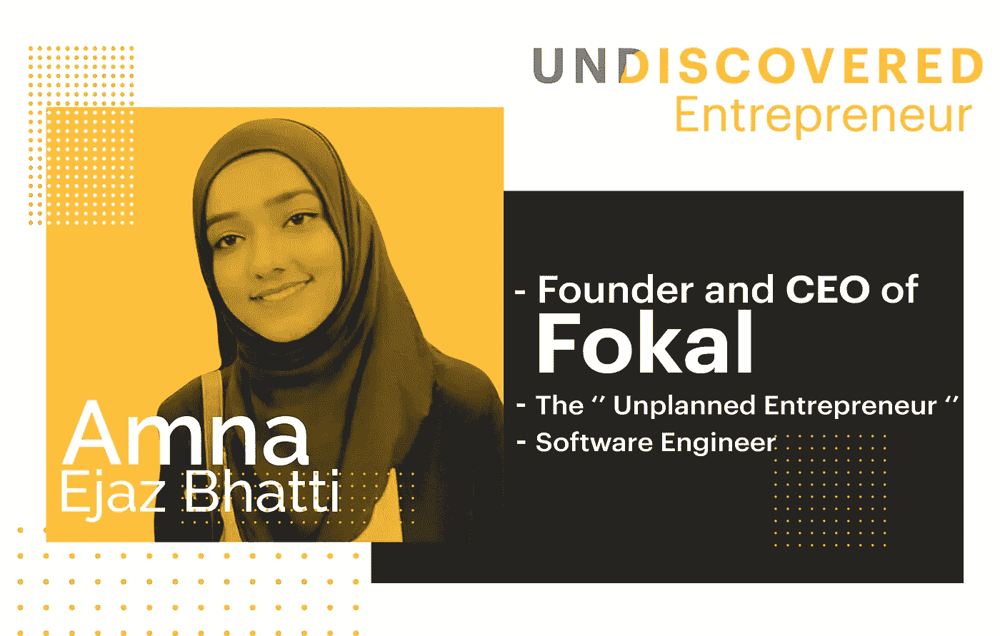

# 你最后一年的项目不能是你的产品——句号

> 原文：<https://levelup.gitconnected.com/your-final-year-project-cannot-be-your-product-full-stop-6596e0900b60>

## 这个真实的故事是一个改变人生的警告。

埃文·马赫在 [Unsplash](https://unsplash.com?utm_source=medium&utm_medium=referral) 上的照片

情绪高涨，斗志昂扬，我们大多数人都曾在喧嚣的大学生活中考虑过将我们的项目变成独角兽创业公司。

这样的目标来自于赢得荣誉的激情，以证明自己，解决问题，或者只是否定在就业市场上屈服于任何人权威的需要。毫无疑问，对这些动机进行抨击，这是非常令人鼓舞和兴奋的，但不考虑图片的另一面可能是宿命论。

这篇文章强调了人们在进入创业世界之前可以评估的潜在原因。

在这里，我总结了 3 个令人信服的理由，同时举例说明了我的一个走类似路线的密友的经历！

样本案例研究

[阿姆娜·埃贾兹](https://www.linkedin.com/in/amnaejaz/)，在她本科学习期间，承担了她能与之相关的问题。在预算内外出就餐对学生来说是一个大问题，不像高端餐馆品牌会花一大笔钱。她的产品[【Fokal】](https://www.facebook.com/NED.Entrepreneurship.Society/photos/the-unplanned-entrepreneur-with-amna-ejaz-bhatti-this-is-the-second-installment-/2344842168922634/)的详细使用案例可以在[这里](https://www.linkedin.com/company/fokal-app/about/)找到。

我们中的许多人都渴望通过在科技和创业之间转换来提升自己。她的故事不言自明，也充满了相当多的挑战。带着她的产品偷偷进入学习之旅的模式，这样你可能会在把它变成产品之前重新考虑你的梦想项目的阻碍因素。

# 体验和模糊目标？

创造力和新视野难道不排斥经验的空虚吗？嗯，这在理论上可能是对的，但需要努力才能实现。

**Me to Amna:你创业时遇到的主要障碍是什么？**

**回答:**

> 尽管我来自软件工程背景，但我发现技术上的无能和对细节的缺乏关注是一个重大挫折。当时我们都是学生，这意味着我们没有经验，商业知识非常有限。在我们的导师的指导下，我们能够制作一个 MVP( **最小可行产品**)，然后出于可行性目的发布了一个测试版本。

人们注意到，制定雄心勃勃的目标很容易，但优化实现以达到目标却很难。一个人可能会很快失去方向和透明度，因此，如果没有团队协作和时间花在制定未来战略上，最初的努力可能会化为乌有。

当一个人为公司或任何软件公司工作时，视角会随着时间而变得更宽。例如，一个人可能非常了解安全系统、供求比率、金融和风险管理。而一个刚从大学毕业的人会对其背后的真实机制感到陌生，容易被愚弄。

这可以通过非常频繁地更新项目愿景并在初始阶段将子目标作为成果进行交流来解决。尽管如此，任何获得的经验都没有附属！

# 拜拜，课堂知识

如果你曾经认为你在课堂上学到的东西会派上用场，那么是时候打破你的幻想了！

此外，对你的产品设定不切实际的期望会让你一事无成。可持续性和持续的努力是现实世界的要求。这就是为什么我很好奇我的朋友在这方面做了什么。

**我对 Amna:你为你的产品多走了多少路？**

**回答:**

> 2018 年期末考试前一个月，我带着我的 FYP 申请了 NIC 第一批孵化。，而摸木有幸被选为最年轻的创始人。从一开始，我就认为我的 FYP 应该有商业的一面，所以我提前做了准备和研究工作。我加入了大学的企业家协会，深入了解企业家的实践和认知技能。在国家孵化器的经历非常有影响力和令人激动，因为我的竞争对手是像 Bykea，Bogo，Azcorp 等巨头的混血儿。

她回答中的重点强调了一个人不懈的热情和提供正确的资源(国家孵化中心)，但他们的指导和培训永远不能取代正式的商业计划。该计划可以采取不同的路线，例如:彻底研究现有的竞争对手，运营方法，并以整体的方式看待投资回报，以便产品与其目标受众紧密结合。

此外，正如 Amna 的故事所强调的，密切关注来自两方面的野蛮竞争对手至关重要。我的意思是

*   竞争对手已经在当前市场上形成了垄断。
*   竞争对手推出了与你类似的想法，但有所创新。

这就要求快速成型和分析不断变化的市场，以迎合独特的商业和营销策略。

# 哦，“合适的人”！你们在哪里？

经常听说和合适的人一起工作会把你带到一个地方。但是谁是正确的人，是非常主观的？

让我们搞清楚，并不是所有人都和你一样。他们可能不会带来同样的热情和职业道德。

聚集合适的合作伙伴就像确保产品的基本要求。从供应商到技术开发人员，找到具有相似关注点和精力的人总是令人生畏。因此，我觉得有必要问这个问题:

## 我对 Amna:团队建设有多难？

**答案:**

> 如果你问我最难的部分是什么，我会说出它的名字！我和其他团队成员疯狂地去接触像我们一样属于不同技能组合的志同道合的人。我最初有一个很好的团队，但我真的很不喜欢那些让你无所事事的人。一个人可以直接说是或不是。不要把事情过分复杂化。

多元化和敬业的团队是创业成功的先锋因素。如果没有或几乎没有协同作用，就很难协调和运行产品。就像 Amna 对人们不优先考虑重要的事情感到烦恼一样，你也可以这样做。这就是为什么必须尽最大努力选择一个团队，在那里其他人的潜力可以为您的产品提供最佳服务！

# 小容器

初创公司的世界可能充满暴力，节奏非常快。

正如平静的大海造就不了优秀的水手一样，没有挑战的创业者成功的机会微乎其微。没有什么比“糟糕的时机”更好的了，但是不去寻找上面提到的明智的暗示，对于学生们柔软的心灵来说是宿命的。

今天，经验丰富的竞争对手 Amna 在 2018 年回到了孵化中心，正在如火如荼地进行，现在她很自豪能与他们分享这个空间。尽管 Amna 的产品 Fokal 不能屏住呼吸，但她还是要说:

> 如果你有一个想法，不要愚蠢地隐藏它，因为人们可能有比你更好的想法。开始努力吧，你一定会到达一个美好的地方，它可能与你想去的地方有很大的不同，但会比你现在的地方好得多。你不可能一开始就想出最好的主意，所以先从坏主意开始。

这个引人注目的故事描述了经验、曝光、网络、**的获得和**的一无所有。然而，如果你不切实际地想把你最后一年的项目*做成一个运行产品，那么也要为一系列可能发生的灾难性事件做好心理准备。*

想继续关注我和其他优秀作家的作品吗？抓住加入的机会:

 [## 通过我的推荐链接加入灵媒——火星女孩

### 作为一个媒体会员，你的会员费的一部分会给你阅读的作家，你可以完全接触到每一个故事…

medium.com](https://medium.com/@themarsgirl80/membership)