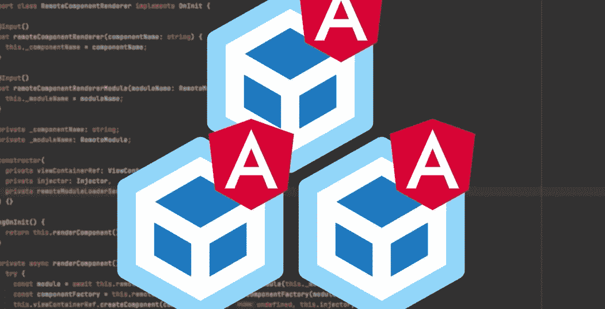
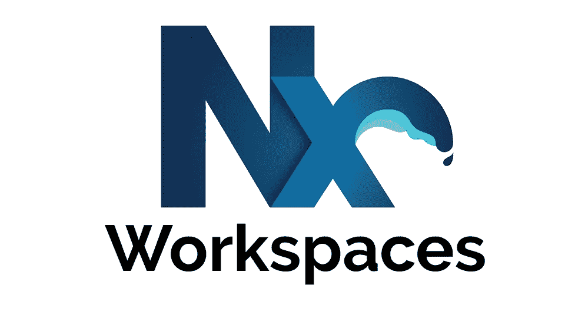
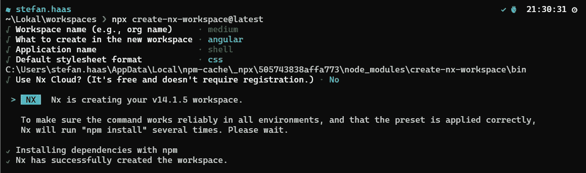
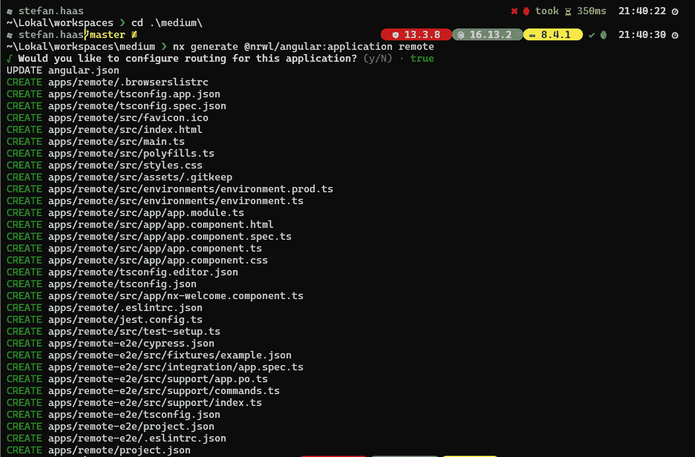
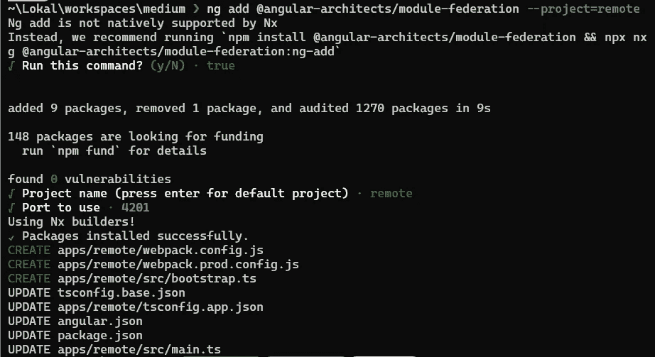
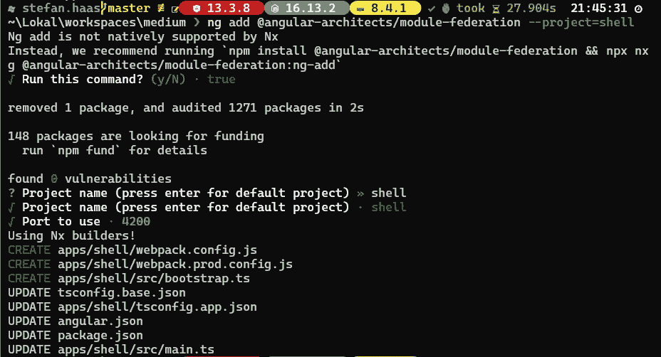
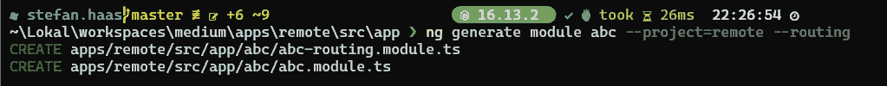
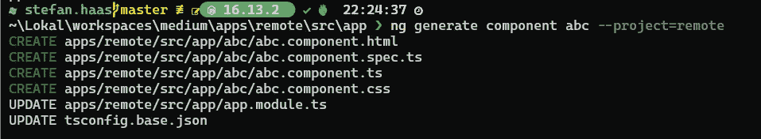
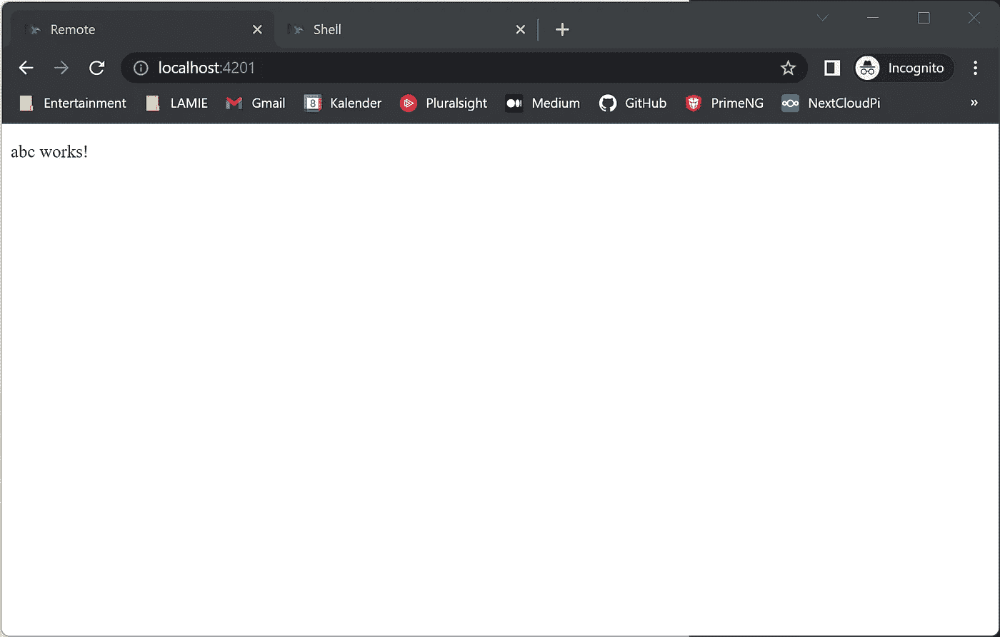
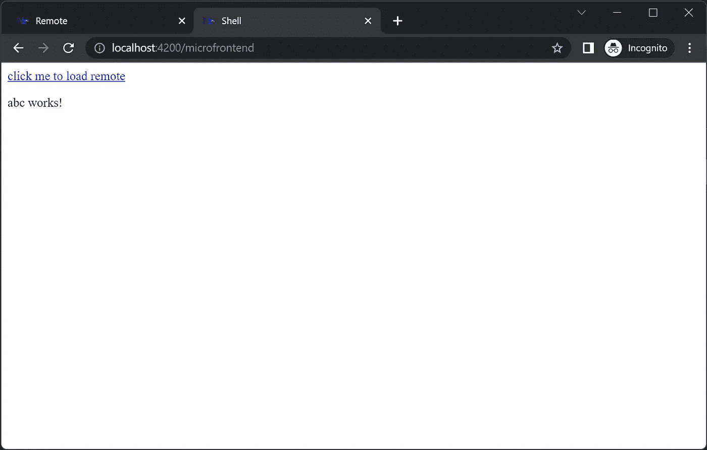

# 你的第一个角形微前端

> 原文：<https://levelup.gitconnected.com/your-first-angular-microfrontend-58950768a465>

## 这是一个关于如何创建一个在运行时使用另一个应用程序模块的简单的 angular 应用程序的逐步指南。但是首先让我们讨论一下微前端和模块联合是怎么回事。



# 介绍

大多数人会告诉你，微前端就像微服务，但这个概念并不仅仅是在后端完成，而是通过将某些模块/组件/页面封装到独立的部分中并动态地使用它们来转移到前端完成。这意味着您可以让一个应用程序运行在端口 5000 上，而在另一个运行在端口 3000 上的应用程序中，您可以使用其他应用程序中的模块，而无需在端口 3000 上的应用程序中实现它们。

这都是真的，但是我认为有更多的事情使微前端变得有趣。

## 为什么应该使用微前端？

简短声明:不是每个人——实际上是大多数人——都不应该使用微前端，因为它们会使事情变得更复杂。过度工程从来都不是好事，但是如果你看到以下原因之一适用于你的情况，微前端可能会很有趣。

1.  你有许多前端团队在开发不同的特性。在这种情况下，微前端架构与其说是技术决策，不如说是商业决策，因为它将允许团队真正独立工作。否则，使用 monolith 有时会很困难，因为你永远不知道你的改变是否会以某种方式影响另一个团队。
2.  你的应用程序太大了。如果您发现自己不知道在哪里放置模型、组件、模块……因为您的项目结构非常庞大，那么 microfrontends 将帮助您创建一个更好的关注点分离。通过使用 Nx monorepository 和创建共享库，你不得不更加仔细地考虑架构，草率行事将更加困难。
3.  如果你想独立部署。您可以只对其中一个微前端进行微小的更改，然后不需要重新部署整个应用程序，而是只部署已经更改的那个微前端。

最后，我甚至会把我提到的微前端的理由简化为一行代码:

> 如果你有一个**大的组织**或者一个**大的应用**，微前端是有趣的。

## 什么是单库？



我提到我们的应用程序将存在于单个存储库中——这意味着它们都在同一个工作空间/存储库中。Monorepositories 有许多不同的吸引力，但我认为最大的吸引力是它们解决了许多版本冲突，因为我们不需要将库发布到 npm 中，而是直接在项目之外使用它们。这也意味着我们只有一个 angular.json 和一个 package.json，这样我们在每个项目中都有相同的包版本。根据这一规则，不可能有不同的角度版本或任何其他变化的包装版本。在本教程中，我们将使用 Nx 来创建一个工作空间，它基本上就是这样一个单存储库，我们可以在其中存储多个应用程序和库。我们甚至可以在这个工作空间中混合不同框架的项目。

# 逐步指南

## 设置

1.  **创建一个 Nx 工作区。**

```
npx create-nx-workspace@latest
```

*   它将提示您指定工作区和第一个应用程序的名称。您已经可以选择 Angular 并为您的应用程序命名——但是如果您从一个空的工作区开始，这不会有问题，因为我们将添加另一个项目。



2 **。安装 Nx**

```
npm install -g nx
```

3.**创建一个角度应用程序(远程)**

```
nx generate [@nrwl/angular](http://twitter.com/nrwl/angular):application remote
```



4.**将模块联合插件添加到两个应用程序中**

```
ng add [@angular](http://twitter.com/angular)-architects/module-federation --project=remote
```



```
ng add [@angular](http://twitter.com/angular)-architects/module-federation --project=shell
```



## 远程应用

所以现在我们将创建一个简单的 *AbcModule* ，它只路由到空白的 Abc 组件。然后我们通过调整 *webpack.config.js* 来公开这个模块。

1.**创建 ABC 模块+路由**

```
ng generate module abc --project=remote --routing
```



创建 Abc 组件

2.**创建 Abc 组件**

```
ng generate component abc --project=remote
```



3.**配置 abc-routing.module.ts**

4.**用路由配置 app . module . ts**

*(这对微前端来说不是必须的，只是为了让微前端也能独立工作)*

**5。暴露 webpack.config.js 中的 ABC module**

*remoteEntry.js* 文件是自动生成的，并且需要向包含 webpackconfig 配置的外部应用程序发出指令。它公开了哪些映射应该共享，以及它公开了哪些内容。如果您运行远程应用程序，您也可以通过将该文件添加到 url 来查看它，如下所示:*https://localhost:4201/remote entry . js*

## 外壳应用程序

现在唯一剩下的就是微前端的实际消耗。基本上有两种方法:静态和动态。

进行静态操作时，我们必须在 webpack.config.json 中定义远程模块，并声明模块以告诉 typescript 不要担心它无法编译的远程模块。这有点乏味，而且动态更好，因为理论上我们甚至可以从后端加载微前端配置。

1.  **在 webpack.config.js 中调整和配置遥控器**

2.**路由激活时延迟加载微前端**

loadRemoteModule 是在 webpack.config.json 中静态定义模块并在路由中引用它们的替代方法。这样，我们只需在路由中指定配置，我们也可以从其他来源动态加载它。

*不要忘记在 AppModule 中导入 AppModule)*

3.**改造 app.component.html，使其拥有一个路由器出口和一个路由器链路**

## 我们走吧！

一切都设置为现在运行，应该工作。让我们启动这两个应用程序，但是记住我们应该在 shell 之前启动微前端。

```
nx serve remote
```



```
nx serve shell
```



这不是很疯狂吗？我们使用的模块甚至不存在于我们的应用程序中，而是运行在它自己的应用程序中。当进行动态加载时，我们可以在后端管理微前端，并决定在某一天引用某些模块，而在第二天引用其他模块。

# 结论

我认为微前端和模块联盟真的很有趣，尽管我也相信不是每个公司都使用它是件好事。它帮助我让我的前端变得更有条理，并迫使我花更多的时间去思考最终导致更好软件的架构。将 monolith 移动到 Nx monorepository 并提供库和微前端花费了很多时间，但最终对我来说还是值得的。

模块联合还有更有趣的场景。一种情况是，如果您试图将一个遗留的 AngularJs 应用程序迁移到 Angular。通过使用微前端，你可以逐渐转移到一个新的框架。谁知道呢，也许将来 Angular 会消亡，我们希望迁移到一个全新的框架——micro frontends 让我们了解了这一点。

我也强烈推荐你去看看 Manfred Steyer 的内容，他是这方面的专家。例如，我没有试图解释为什么需要 webpack.config.js，因为我无法像 Manfred 那样描述它，所以看看他是怎么说的:

[](https://www.angulararchitects.io/) [## 软件建筑| Angular-Schulungen von Insidern

### 安格尔-库兹与曼弗雷德·施泰尔和⭐团队在德国、德国和瑞士⭐和英国⭐发现…

www.angulararchitects.io](https://www.angulararchitects.io/) 

如果你想在 Medium 上阅读无限量的文章并支持我，请使用我的推荐链接:

[https://medium.com/@stefan.haas.privat/membership](https://medium.com/@stefan.haas.privat/membership)