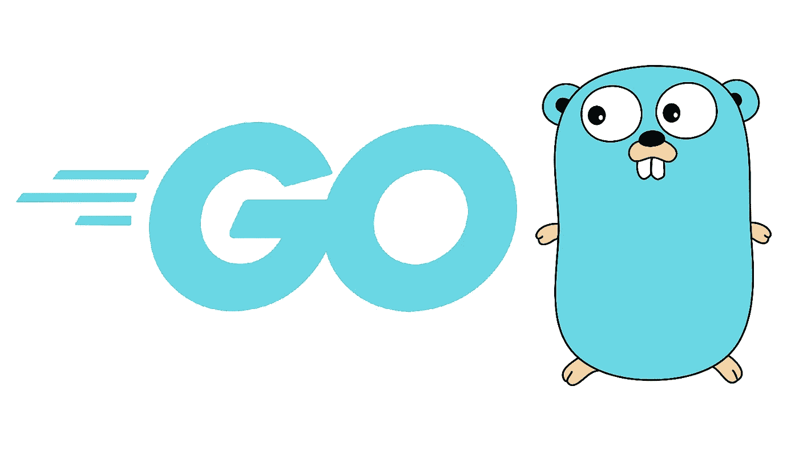

# 你在 Golang 的第一个 REST API

> 原文：<https://levelup.gitconnected.com/your-first-rest-api-in-golang-with-mux-b87a84746d00>

**Go** 由 **2 名谷歌软件工程师**创立。Golang 实现的主要目的是它结合了 Java 和 C++两个世界的精华。



## **先决条件:**

理想情况下，您应该使用代码编辑器或 IDE 来编写这个 API (Visual Studio 代码、Sublime Text、Intellij、Atom 或任何其他)

[](https://code.visualstudio.com/download) [## 下载 Visual Studio 代码- Mac、Linux、Windows

### Visual Studio 代码是免费的，可以在您喜欢的平台上获得——Linux、macOS 和 Windows。下载 Visual Studio…

code.visualstudio.com](https://code.visualstudio.com/download) [](https://golang.org/doc/install) [## 下载并安装

### 按照此处描述的步骤快速下载并安装 Go。关于安装的其他内容，您可能会感兴趣…

golang.org](https://golang.org/doc/install) 

您的系统上必须安装了 Go。以下是 Go 网站上指定的步骤。

1.  去下载吧
2.  去安装
3.  Go 代码

> 让我们直接深入代码！

# **1。初始化 Go 服务器:**

在文件夹的根目录下创建一个`**server.go**`文件。相同的内容在下面给出。

执行`**go get github.com/gorilla/mux**`安装 mux 包。在本教程中，我们将使用 mux 作为 HTTP 路由器。

下面是实现中需要的必要导入。

为服务器导入。go

现在让我们编写我们的主函数，Rest API 的入口点。

server.go 的主要功能

现在通过编写`**go run server.go**` 启动服务器，并点击 postman/browser 上的端点`**http://localhost:8000**`。

哇哦💥💥恭喜您，您的第一台 Go 服务器已经启动！

# **2。设置添加和检索帖子的路线**

出于学习目的，我们将使用一个虚拟数据库(一个数组)。让我们在服务器中设置导入和数据库。

为 routes.go 导入

从假数据库(切片)获得所有职位

获取帖子功能

在假数据库中添加一个帖子(切片)

添加发布功能

现在，您差不多可以测试您的服务器了。但是等等，我们还没有在任何地方使用过`**routes.go**`文件。因此，最后一步是将路由添加到 server.go 文件中，并将它们与路由器链接起来。

在/ route 后面添加这两行

```
router.HandleFunc("/posts", routes.GetPosts).Methods("GET") router.HandleFunc("/posts", routes.AddPost).Methods("POST")
```

最后，您的`**server.go**`文件应该是这样的:

还有我的朋友们，就是这样！让我们通过在终端`**go run main.go**`中键入命令再次运行我们的服务器

现在您可以使用**邮递员** / **失眠测试您的简单 REST API。你可以在即将到来的项目中使用它，同时将它与一个真实的数据库连接起来。**

如果你喜欢 GraphQL，请检查-

[](https://ankithans1947.medium.com/graphql-server-api-in-golang-601e41408d03) [## Golang 中的 GraphQL 服务器/API

### GraphQL 是一种用于 API 的开源查询语言，也是一种用现有数据完成这些查询的运行时语言…

ankithans1947.medium.com](https://ankithans1947.medium.com/graphql-server-api-in-golang-601e41408d03) 

如果你想和我联系，这是我的联系方式。

[https://twitter.com/AnkitHans15](https://twitter.com/AnkitHans15)

[](https://github.com/ankithans) [## ankithans -概述

### const { Node，Golang，Python，React，Flutter，DSA } = @ ankithans 这个项目是在 2021 年 Treehacks 期间建造的…

github.com](https://github.com/ankithans) [](https://linkedin.com/in/ankithans) [## Ankit Hans -开源开发者- LibreHealth | LinkedIn

### 经验丰富的全栈工程师，具有开发领域的工作经历。熟练的 MERN…

linkedin.com](https://linkedin.com/in/ankithans)