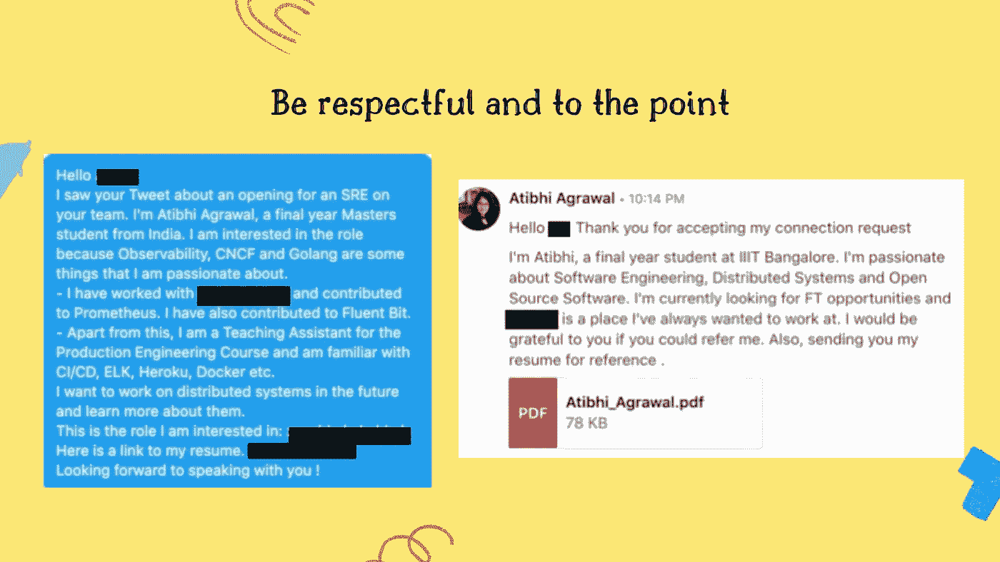
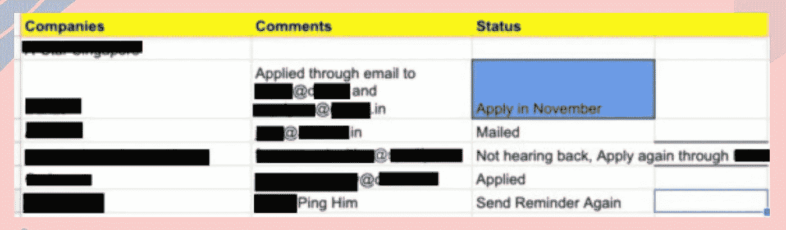

# 你的软件工程实习指南

> 原文：<https://levelup.gitconnected.com/your-guide-to-software-engineering-internships-5f816ba0a468>

通过 Unsplash 上的[窗口](https://unsplash.com/@windows)成像。

## 制作简历，寻找机会，让你的申请脱颖而出

合十礼乡亲🙏我是 Atibhi，来自印度的最后一个学期的学生。我在 5 年内做了 7 次实习。几个月前，我在 T2 做了一个关于 SWE 实习的演讲。这篇博文基于我的演讲。我分享了我在过去几年里学到的东西，以及一些我希望早点知道的事情。在这篇文章中，我将讲述以下内容:

*   如何建立你的技能？
*   一份好的简历应该是什么样的？
*   申请实习。
*   面试。

# 如何培养你的技能

许多学生面临的一个警告是，他们说他们没有什么可写在简历上的。正因为如此，他们的简历没有进入实习候选名单。由于没有实习，他们无法改善自己的简历。这个思考过程会变成一个恶性循环，导致消极情绪。兼职项目、与教授一起实习和参加竞赛都是展示你的激情和建立你的简历的好方法。

## 辅助项目

*   跟随像[自由代码营](http://freecodecamp.org/)、[奥丁项目](https://www.theodinproject.com/)等网站上的教程。
*   加入你大学的编码俱乐部。
*   认真做你的课程项目。你也可以在像 Coursera 这样的网站上完成课程并做项目。

## 免费工作

*   在教授手下工作。
*   为[开源软件](https://github.com/tapaswenipathak/Open-Source-Programs)做贡献。

## 竞争

*   参加[黑客马拉松](https://devpost.com/)。最好的情况是你赢了，最坏的情况是你的简历上有了一个新项目。
*   在 [Hackerrank](https://www.hackerrank.com/) 、 [Codechef](https://www.codechef.com/) 和 [Codeforces](https://codeforces.com/) 等网站上进行比赛。

# 一份好的简历应该是什么样的？

📝**必读** : [如何为软件工程师写一份出色的简历](https://www.freecodecamp.org/news/how-to-write-a-great-resume-for-software-engineers-75d514dd8322/)

🔖我最喜欢的几个**简历模板** : [链接 1](https://www.overleaf.com/latex/templates/jakes-resume/syzfjbzwjncs) ，[链接 2](https://www.overleaf.com/latex/templates/awesome-cv/dfnvtnhzhhbm) ，[链接 3](https://www.overleaf.com/latex/templates/software-engineer-resume/gqxmqsvsbdjf)

我个人的看法是，一份简历要**整洁，单页单栏**。保存一份文件，记下你认为值得一提的每一件事。但是不要在简历上列出所有的东西，只列出与简历相关的信息。做好简历后，**确保让朋友审阅**或在 [r/resumes](https://www.reddit.com/r/resumes/) 上查看。

# 申请实习

对于大公司来说，夏季实习的招聘季节从 7 月/8 月开始。对于初创公司，招聘从 1 月/2 月开始。为了安全起见，我建议尽早申请。如果你打算做一份开源实习，比如谷歌代码之夏或者 Outreachy，在 12 月之前开始为你选择的组织做贡献。

记住，你不会得到所有你申请的公司的回复。为了最大化你的机会，尽可能多地申请公司。大学三年级时，我申请了 200 多家初创公司，获得了 6 次面试机会和 3 份工作机会。

## 通过网站或职业页面申请

[**天使。co**](http://angel.co/) 是一个申请创业的好网站。各种公司的职业页面是另一种选择。如果你申请的是一家初创公司，你很有可能会通过招聘页面得到回复。如果你在 FAANG 公司的招聘页面上申请，这种可能性会更低。推荐将是大公司的出路。

## 请求推荐

请求推荐是在公司获得关注的一个好方法。但是，许多学生不知道正确的提问方式或向谁提问。问正确的人很重要。以下是你应该与人接触的顺序。

1.  在那家公司实习的朋友/同学。
2.  在你想去的公司工作的大学校友。
3.  朋友的朋友。
4.  随机的人。

当有人考虑推荐你时，一个好的 DM 也有很大的作用，可能是一个成败的决定。一些常见的错误是草率的 DMs，[只是一句“你好！”](https://www.nohello.com/)或者请别人推荐一个你不适合的角色。下面显示的是我如何请求陌生人推荐。😅

图。请求推荐。由 Canva 上的 Atibhi Agrawal 创建。

## 跟踪您的应用

跟踪你的申请是非常重要的。这样你就可以给别人发送提醒并跟踪你的进度。使用 excel 表格进行跟踪，并将其固定在书签栏上！

图 3。我如何在 excel 上跟踪应用程序？

# 采访

面试是任何申请中最重要的部分。

## 面试前

*   研究公司和角色。
*   准备一个“说说你自己”的回答。
*   确保你面前有你的简历。
*   最后准备几个问题问面试官。
*   **为面试的技术方面做准备。**

## 面试的时候

*   保持冷静和诚实！

## 面试后

*   等待更新😶

我不打算深究面试的更多细节。这是一个如此广泛而重要的话题，它理应有一篇属于自己的博文。许多优秀的人已经写了博客。我将在最后的的[资源部分列出一些我最喜欢的。](/your-guide-to-software-engineering-internships-5f816ba0a468#a073)

# 结论

获得实习机会很难。你需要极大的耐心和奉献精神。面对拒绝后不要气馁。关键是从每一次拒绝中吸取教训，不断改进。祝你一路顺风！

如果你需要进一步的指导，请随意评论😄

# 面试准备资源

*   [面向初学者的优秀编程面试](https://zhiachong.com/series/acing-programming-interview-for-beginners/)
*   [架构和系统设计访谈](https://jg.gg/2016/07/31/architecture-and-systems-design-interview/)
*   [校园实习指南](https://nitinkgp23.github.io/2020/09/23/A-to-Z-guide-to-your-campus-placements/)
*   [技术面试所需的一切准备](https://github.com/Olshansk/interview)
*   [我在五天内面试了硅谷的五家顶级公司，幸运地获得了五份工作机会](https://medium.com/@XiaohanZeng/i-interviewed-at-five-top-companies-in-silicon-valley-in-five-days-and-luckily-got-five-job-offers-25178cf74e0f)
*   [我是如何准备谷歌实习面试的](/how-i-cracked-the-google-internship-interview-with-no-background-in-competitive-coding-ffb395b4ffbe)
*   [如何准备下一次系统设计面试](https://code.likeagirl.io/how-to-prepare-for-your-next-system-design-interview-f877e5a3d52f)
*   [计算机科学实习面试技巧](https://blog.usejournal.com/part-1-getting-a-call-from-your-dream-company-c82d6f68dbd4#.YJbCSWYza3I)
*   [破解编码面试一年计划](https://towardsdatascience.com/the-one-year-plan-for-competitive-coding-6af53f2f719c)

# 分级编码

感谢您成为我们社区的一员！[订阅我们的 YouTube 频道](https://www.youtube.com/channel/UC3v9kBR_ab4UHXXdknz8Fbg?sub_confirmation=1)或者加入 [**Skilled.dev 编码面试课程**](https://skilled.dev/) 。

 [## 编写面试问题+获得开发工作

### 掌握编码面试的过程

\技能型. dev](https://skilled.dev)