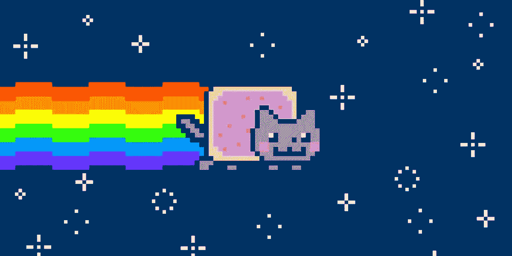
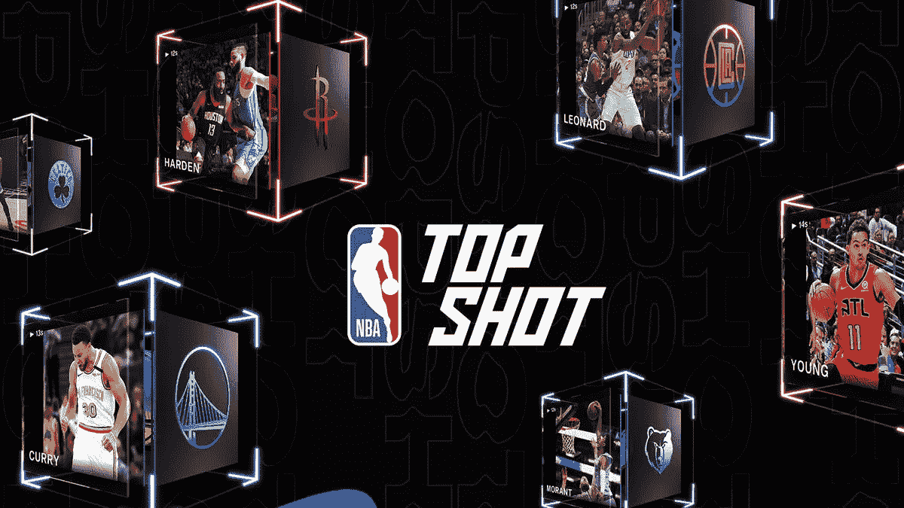
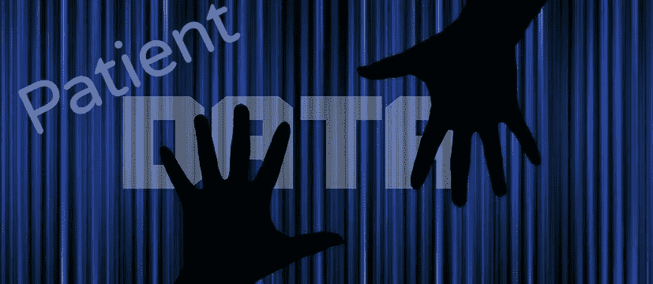

# 您的健康数据可能是 NFT

> 原文：<https://levelup.gitconnected.com/your-health-data-may-be-a-nft-447476a76adc>

我必须承认，在我[上周写了关于数字货币的文章](https://kimbellard.medium.com/wanna-buy-some-bitcoin-fe16c423015f)之后，我并没有想到会很快写关于加密的文章。然后，我听说了“不可替代令牌”(NFT)，并对它们引起的大肆宣传有了一种感觉——我怎么能拒绝呢？

甚至可能与医疗保健有关。

你可能见过 Nyan 猫(如上图)，这并不新鲜；它[在四月](https://www.theverge.com/2021/2/18/22287956/nyan-cat-crypto-art-foundation-nft-sale-chris-torres)年满 10 岁。新鲜的是，上个月它的创造者“出售”了它。你可能会想，等等，GIF 无处不在，任何人都可以下载，那么在什么意义上他可以“出售”它呢？

这就是 NFT 的用武之地。你可能知道，“可替换的”意味着两个事物可以互换；一美元就像任何其他美元，一个比特币就像任何其他比特币，一个电子就像任何其他电子。那么，不可替代性意味着所讨论的项目是独一无二的，这就是“令牌”的由来。基本上，NFT 通过区块链使用数字证书来标记某样东西是独一无二的，这是对数字所有权的声明。

研究公司 L'Atelier [的首席运营官 Nadya Ivanova 向*华尔街日报*](https://www.wsj.com/articles/nfts-explained-whats-driving-prices-for-lebron-james-and-kings-of-leon-digital-collectibles-11615205133?mod=tech_lead_pos11) 解释了 NFTs:

> 你可以把它想象成一个带有资产的数字护照。它们允许这种信任和真实性以一种我们以前无法做到的方式建立起来，无论是使用物理资产还是数字资产。

艺术家们使用 NFTs 已经有几年了，佳士得拍卖行[正在拍卖](https://www.christies.com/about-us/press-archive/details?PressReleaseID=9948&lid=1)由数字艺术家[比普](https://www.beeple-crap.com/)(又名迈克·温克尔曼)主演的“第一件由大型拍卖行提供的纯数字 NFT 艺术品”。克里斯蒂的承诺:

> …买家会收到艺术品文件，其中包含艺术家的数字签名和所有重要细节，包括创作时间、版本大小和任何先前销售的记录。这些细节永久地附着在艺术品上，提供了持久的价值保证。

NFT 已经超越了艺术。NBA 正在全力以赴，NBA Top Shot 出售精彩片段；其中一个勒布朗扣篮[刚刚拍出了 20 万美元](https://ftw.usatoday.com/2021/02/nba-top-shot-lebron-james-dunk-sold-record-price)。马华力的主人马克·库班是一个大支持者。“科技是真实的，”他[告诉*美国消费者新闻与商业频道*](https://www.cnbc.com/2021/03/04/mark-cuban-nft-pricing-will-settle-down-over-time.html) 。“这种影响是真实的、永久的。”

莱昂国王乐队[以 NFT 的身份发行了他们的新专辑](https://variety.com/2021/music/news/kings-of-leon-release-new-album-nft-1234921278/#!)，被认为是第一个这样做的乐队。杰克·多西[正在出售](https://www.theverge.com/2021/3/5/22316320/jack-dorsey-original-tweet-nft-cent-valuables)他作为 NFT 的第一条推特，出价已经超过 250 万美元。歌手 Grimes [以 NFTs 的形式出售她的混合媒体作品，赚了 600 万美元。甚至林赛·罗韩](https://www.theverge.com/2021/3/1/22308075/grimes-nft-6-million-sales-nifty-gateway-warnymph)[也在兑现](https://coinmarketcap.com/alexandria/article/lindsay-lohans-nft-sells-for-59-000-despite-an-unfortunate-blunder)。

如果你很难辨别潜在的主题，加入这个俱乐部。我们还处于早期阶段，什么样的 NFT 最适合我们还有待观察。正如安德森·霍洛维茨律师事务所的合伙人凯特·霍恩向 NPR 承认的那样:“在 iPhone 诞生的时候，没有人会想到其中一个杀手级应用会成为顺风车。”

她接着补充道:

> 还记得那些人们在实体店排队购买最新款耐克运动鞋的日子吗？这是新的数字等价物。是汇聚文化的一切，也是对电商未来的赌注。

迪肯大学教授卢克·希姆斯伯根。[在*的谈话中写道*](https://theconversation.com/nfts-explained-what-they-are-why-rock-stars-are-using-them-and-why-theyre-selling-for-millions-of-dollars-156389) :

> NFT 是对互联网上技术匮乏的文化回答，它们允许新类型的数字商品……(它们)将代码和文化结合在一起，创造一种不依赖法律或破坏现有系统的控制形式。他们在一个本来可以共享的世界里创造了一种独特的“真实性”。

所有这些都意味着 NFT 可能是革命性的。彭博的 Leonid Bershidsky 指出:

> 你也可以把它看作是一个新的财产概念，几个世纪前的共产主义梦想家会喜欢这个概念:在所有实际应用中，它都是公有的，即使它供养创造者并向支持者致敬。
> 
> 任何被高价出售的(相当不起眼的)视频和拼贴画新闻吸引的人都会很快发现，NFT 概念可以应用于世界上一切事物的产权(或者，正如社区所希望的那样，比特币月亮)。

一个新的财产概念，适用于一切财产权利…是的，我称之为革命性的。

让 NFTs 变得更有趣的是，一些内容创作者规定，随着 NFT 被转售，他们可以获得报酬，这给了他们未来的收入流和任何增值的份额。

那么，这和医疗保健有什么关系呢？

毫无疑问，有很多潜在的应用，但我的想法立即转向了健康数据。在医疗保健领域，这是一场长期的苦战:到底是谁的数据？患者认为它是他们的，但他们并不持有它，并不总是能够获得它，无法控制它被共享甚至出售，并且即使它为使用它的公司带来了真正的经济收益，也不会从中产生任何经济价值。

所有这些都令人抓狂，然而在现有的模式下，不会有太多的改变。

如果我们的健康数据是一个 NFT，当它被共享时，我们可以有更多的控制权。我们可以拍卖掉。当其他人使用或转售它时，我们可以确保我们在财务上受益。顺便说一句，使用它的所有各方都可以更加确信数据是真实的。

T2 有很多关于区块链在医疗保健和其他行业的应用的讨论。库班[先生说](https://www.cnbc.com/2021/03/04/mark-cuban-nft-pricing-will-settle-down-over-time.html)，他特别提到了 NFTs，“锁链、智能合约和市场将继续存在。”NFTs 可能成为区块链医疗保健领域的杀手级应用。

与区块链和更普遍的加密货币一样，NFT 的一大缺点是它们需要大量的计算能力。*[指出](https://www.npr.org/2021/03/05/974089381/whats-an-nft-and-why-are-people-paying-millions-to-buy-them):“据[一些估计，](https://spectrum.ieee.org/computing/networks/ethereum-plans-to-cut-its-absurd-energy-consumption-by-99-percent)一次加密交易消耗的能量可能比美国普通家庭一天使用的能量还要多。”*

*但是，正如 Heemsbergen 博士指出的那样:“除了他们的 CO₂排放量之外，NFT 的真实之处在于，他们创造的技术稀缺性如何促成了一种新的文化协议，即什么东西可以是真实的，谁控制着这种真实性。”*

*我们可以使用 NFT 来处理数字艺术和扣篮集锦，或者我们可以通过将它们应用到我们的健康数据中来做一些有意义的事情。如果有什么需要“财产新概念”，那就是健康数据。*