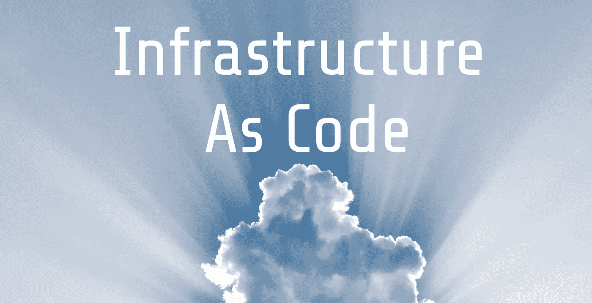

# 作为代码的基础设施🌩CloudFormation vs Terraform？

> 原文：<https://levelup.gitconnected.com/your-infrastructure-as-code-cloudformation-vs-terraform-34ec5fb5f044>

照片由[埃伯哈德·格罗斯加斯泰格](https://unsplash.com/photos/_uAVHAMjGYA?utm_source=unsplash&utm_medium=referral&utm_content=creditCopyText)在 [Unsplash](https://unsplash.com/search/photos/cloud?utm_source=unsplash&utm_medium=referral&utm_content=creditCopyText) 拍摄

想象一下，如果你从 AWS、Azure 或 Google 获得的所有基础设施配置都可以比你点击更快更准确地复制**。这是作为代码的基础设施。**

使用基础设施作为代码的疯狂好处有:

*   **晚上能够入睡**，知道自己可以安全地重新部署到给定的状态。如果上帝禁止你的基础设施消失
*   **遵循编码最佳实践**，签入变更，代码评审，并作为一个团队构建您的基础设施

我将看一看地形和云的形成。我在 Localz 广泛地使用了 Terraform，但是为了学习，我决定尝试一下 CloudFormation。

两个竞争者

Terraform 是社区对基础设施代码的回应。它是开源的，拥有超过 12k 颗恒星，是云不可知的，支持数百家供应商。它通常没有 CloudFormation 那么冗长&有一个很棒的模块系统。

**CloudFormation** 由 AWS 开发维护，集成非常紧密，只支持 AWS。这种紧密的集成有助于拥有一个很棒的 UI，能够查看给定帐户的所有堆栈是很棒的。它使跨栈引用变得容易，这也是模块化和打破这种垄断的一个巨大胜利。

## 命令行界面和工作流程

Terraform 最常用的命令特性`[init](https://www.terraform.io/docs/commands/init.html)`和`[plan](https://www.terraform.io/docs/commands/plan.html)`。由于 Terraform 是云不可知的，你需要明确地说明你将在哪里存储你的状态文件，这是`init`命令的一部分。运行一个 Terraform `plan`用于根据您的状态文件和现有基础设施创建一个执行计划。

一个简单的地形执行计划

CloudFormation 有一个类似的过程，您可以在其中创建和执行变更集。你将使用`[create-change-set](https://docs.aws.amazon.com/cli/latest/reference/cloudformation/create-change-set.html)`、`[execute-change-set](https://docs.aws.amazon.com/cli/latest/reference/cloudformation/execute-change-set.html)`和`[deploy](https://docs.aws.amazon.com/cli/latest/reference/cloudformation/deploy/index.html)`的组合。`create-change-set`类似于 Terraform 的`plan`，而`execute-change-set`是 Terraform 的`apply` & `deploy`将两个命令合二为一。

主要的区别是你将通过 CloudFormation 的 UI 来查看和解决问题，这很容易使用，甚至对我来说也是如此😃。

云形成的变化集

Terraform 的`plan` & CloudFormation 的`create-change-set`都是在您的持续集成管道中进行手动检查的好地方。

使用 [Gitlab](https://gitlab.com/) 等待变更集的手动检查

**我发现 CloudFormations API 有点混乱。我相信`create-change-set`后面跟一个`execute-change-set`曾经是事实上的，但现在`deploy`的存在取代了它们两个。但是在某些情况下，尤其是部署到生产环境时，您可能希望遵循良好的实践，并在执行之前检查执行计划。**

我认为在这种情况下，你应该使用一个`create-change-set`后跟一个`execute-change-set`，但是这很烦人，因为`create-change-set`明确地需要知道你是在创建还是更新栈。因此，这将在您的持续集成管道中引起心痛。但是经过进一步的检查，我相信你运行一个带`--no-execute-change-set`标志的`deploy`，然后重新运行不带标志的`deploy`。我仍然不确定推荐的方法。

## **错位状态**

我运行了一个简单的实验，两个工具都创建了一个简单的 EC2 实例。我删除了这两个实例，并尝试再次运行这两个部署步骤。

隐藏在 Terraform 的`plan`中的是一个`[refresh](https://www.terraform.io/docs/commands/refresh.html)`,用于将您的状态文件与现实世界的基础设施相协调。这意味着 Terraform 能够检测到删除&启动一个新的实例。CloudFormation 没有这样的协调，它依赖于现有的堆栈。因此，它坚称一切都没有改变。解决 CloudFormation 的唯一方法是重命名 EC2 资源。

我不会依赖这个作为和解的银弹，也不会建议手动使用任何工具管理的堆栈。这只会导致心碎💔。

## **功能&插补**

内在功能是**我最喜欢的 cloud formation**部分之一。Terraform 确实有比 CloudFormation 多得多的功能，但我更喜欢 CloudFormation 使用的语法，没有引号，花括号可以让代码更易读。

我也发现了 Terraform 的插值在[某些情况下](https://github.com/hashicorp/terraform/issues/3116)偶尔的缺点。

简单的引用比较

## 有条件部署

条件部署是任何部署的重要组成部分，无论是生产还是开发，您都希望从同一个堆栈进行部署。但有时生产只是需要额外的资源，反之亦然。

只有 CloudFormation 显式支持条件，可以用条件标志标记每个资源。其中 as Terraform 要求你使用它们的(awesome) [计数参数](https://www.terraform.io/intro/examples/count.html)和[三元条件](https://www.terraform.io/docs/configuration/interpolation.html)。

**count 参数是 Terraform** 独有的，因此 CloudFormation 需要更多的重复代码。

条件句示例

## 交叉堆栈引用

CloudFormations 最强大的特性之一是能够轻松地交叉堆栈引用。这使得打破基础设施的垄断变得极其容易！

跨堆栈引用轻而易举

在上面的例子中，网络堆栈将其`DbSubnet1`导出为`${branch}-DbSubnet1`。在我的 EC2 堆栈中，我只是使用`Fn::ImportValue: !Sub ${branch}-DbSubnet1`来引用那个子网。CloudFormation 也足够聪明，知道 EC2 栈依赖于网络栈，并且**将拒绝删除它，直到它的依赖性消失。**

## 模块

Terraform 独有的**模块是分解您的 Terraform 部署的非常强大的**方式。Terraform 模块本质上是定义一组基础设施的 Terraform 文件&资源的集合。它允许输入&输出。要使用该模块，您只需将您的输入作为变量传入，Terraform 会像往常一样拉入该模块并执行 Terraform 代码。

重复使用地形模块

上面是一个例子，我通过简单地使用一个可重用模块在任何区域定义了许多实例。如果没有这个模块，我将需要定义每个实例和相关的 Terraform 代码，以便在一个新的区域中设置一个实例。

这与 CloudFormation 堆栈交叉引用不同的原因是，Terraform 状态文件仍将包含所有状态。与 CloudFormation 一样，状态文件将在每个堆栈之间拆分，使其更易于管理。

**CloudFormation 使用嵌套栈**来完成同样的任务。嵌套堆栈的问题是，如果一个子堆栈失败，整个堆栈都会失败。这使得部署痛苦成为噩梦。使用[分层蛋糕方法](http://awsadvent.tumblr.com/post/38685647817/strategies-reusable-cfn-templates)和交叉堆栈参考来处理云形成是一条可行之路。

具有嵌套堆栈的云形成

CloudFormation 嵌套堆栈 web 用户界面

## **用户数据&云形成初始化**

CloudFormation 还具有 [CloudFormation init](https://docs.aws.amazon.com/AWSCloudFormation/latest/UserGuide/cfn-init.html) ，这是 AWS 获取您的[用户数据脚本](https://docs.aws.amazon.com/AWSEC2/latest/UserGuide/user-data.html)并将其转换为基于状态的配置的方式。它非常强大，不容忽视。它允许您对实例运行堆栈更新并协调状态。而以前使用用户数据时，您必须终止并创建一个新的实例。

一片云开始形成

## 错误处理

也许我从来都不擅长地形，但我更喜欢 CloudFormations 处理错误的方式。CloudFormation 用户界面非常好，可以很好地概述您的堆栈。我发现在 Terraform 错误中，虽然他们给你指出了正确的方向，但仍然很难对发生的事情有一个全面的了解。

CloudFormation Events UI 跟踪您的堆栈部署，因此您可以很容易地看到出现了什么错误。

## **支持**

你可能会认为 CloudFormation 会支持现有的所有 AWS 特性，但是**不幸的是，你错了**。因为开源是最好的，所以 Terraform 似乎有更多的 AWS 特性。

举个例子， [RDS with IAM auth](https://docs.aws.amazon.com/AmazonRDS/latest/UserGuide/UsingWithRDS.IAMDBAuth.html) ，这个特性已经**发布一年多了**，仍然在 CloudFormation backlog 中。因为 Terraform 有一个贡献者[gazo kley](https://github.com/gazoakley),[做一个简单的 PR](https://github.com/hashicorp/terraform/issues/14069) 并且 Terraform 在云形成之前很好地支持 RDS IAM auth。

另一个更重要的例子，没有[Key Secrets Manager](https://aws.amazon.com/secrets-manager/)cloud formation 支持。从四月开始，terraform 拥有自己的[秘密经理](https://www.terraform.io/docs/providers/aws/r/secretsmanager_secret.html) [资源。](https://github.com/terraform-providers/terraform-provider-aws/issues/4060)

开源软件是我的最爱

我们不能忘记，Terraform 是云不可知的，这是一个巨大的胜利。但我不会把它看得太重，因为据我所见，云提供商非常擅长通过功能或特定代码(如 ARNs)来吸引你。

但是因为 Terraform 是云不可知的，它真的可以应用于任何有状态和 API 的东西。例如[孔 API 网关](https://konghq.com/kong-community-edition/)可以[用 Terraform](https://github.com/WeKnowSports/terraform-provider-kong) 管理。因此，您可以在堆栈中的其他地方应用您所学的技能！

## 摘要

我喜欢地形和云层，因为它们都是朝着正确方向迈出的一大步。

我的优点和缺点

CloudFormation 有一个很棒的用户界面，用于调试和概述正在发生的一切。交叉引用是强大的&使得分离堆栈变得容易，同时我个人非常喜欢它的语法。缺乏支持是我真正的抱怨，因为它不是开源的，不得不使用自定义资源或 shell 脚本来获得某些功能的想法让我畏缩。😢

**Terraform** 很棒，因为它充满活力的开源社区，它简单的模块范式&它是云不可知的。Terraform 可能很难通过 cli 进行调试，通常您最终会得到一个包含所有基础架构的大型整体式 repo。你可以把它分解成模块，但是它不像 CloudFormation 那样具有相同的关注点分离。

**感谢阅读！如果你喜欢它，一定要为它鼓掌，并检查一下**[**terra form**](https://www.terraform.io/)**&**[**cloud formation**](https://aws.amazon.com/cloudformation)**！******