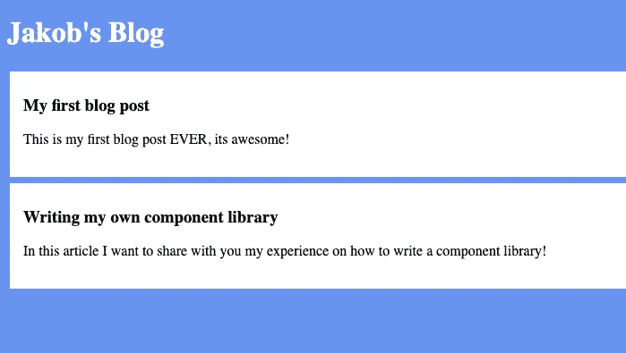

# 您自己的基于组件的库

> 原文：<https://levelup.gitconnected.com/your-own-component-based-jlibrary-fe67cb5cf771>

## 从头开始构建一个基本的 JavaScript 库


苏珊·尹在 [Unsplash](https://unsplash.com/s/photos/library?utm_source=unsplash&utm_medium=referral&utm_content=creditCopyText) 上的照片

React 和 Angular 除了是两个最大的前端 web 开发框架/库之外，还有什么共同之处？

*它们都是基于组件的！*

在本文中，我们将创建一个简单的前端库，它使用了一些组件和优秀的普通 JavaScript。这可以帮助我们更好地理解组件，也提高了我们使用普通 JavaScript 的技能。

## **先决条件**

在深入本文的 JavaScript 部分之前，我们需要设置我们的项目结构。为此，我们创建了一个名为*组件库*的新文件夹以及一些子文件夹和文件:

```
$ mkdir component-library
$ cd ./component-library
$ mkdir lib style components
$ touch index.html index.js ./style/styles.css
```

接下来，我们需要像这样填写我们的 HTML 和 CSS 文件:

index.html

样式. css

现在我们已经设置好了，准备写一些 JavaScript。

## 名为埃斯泽特的图书馆

我喜欢从假装图书馆已经存在开始。因此，我们首先需要关注的是 *index.js.*

在文件的最顶端，我们需要导入我们的库，然后实例化一个新的应用程序:

```
// All our imports are here
import ß from ‘./lib/Eszett.js’;// Initialize app
const app = new ß('app');
```

这段代码将抛出一个错误，因为我们没有从我们的 *Eszett.js* 中导出任何东西。在这个文件中，我们需要一个名为**的类和一个构造函数，该构造函数将一个**选择器**作为字符串接收并导出它。所以首先我们需要创建一个这样的文件:**

```
$ touch ./lib/Eszett.js
```

该文件的内容应该如下所示:

```
class ß {
  constructor(selector) {
    this.eszettElement = document.querySelector(`#${selector}`);
    console.log(‘Eszett initialized!’);
  }
}
export default ß;
```

如果您现在运行您的应用程序，我们将不会再收到错误，文本“Eszett initialized”将出现在您的浏览器控制台中。但到目前为止，我们并没有在代码中做那么多。让我们通过实现在应用程序中注册组件的可能性来改变这一点。

## 成分

为此，我们需要实现两件事:

*   存储所有注册组件的字段
*   一个*注册组件*方法

首先，我们在构造函数中的 *console.log* 的正上方添加下面一行代码:

```
this.components = {};
```

计划是将该字段中的所有组件注册为键值对。为此，我们需要在构造函数下添加以下方法:

```
registerComponent(component {
  this.components[component.name] = component;
}
```

现在我们可以在应用程序中注册组件了。注册将在我们应用程序初始化下面的 *index.js* 中进行。我们的第一个组件将是一个**菜单组件**。这将是一个两步的过程，首先，我们导入组件，然后我们在应用程序初始化后注册它。

这样做之后，我们的 index.js 应该是这样的:

```
// All our imports are here
import ß from ‘./lib/Eszett.js’;
import MenuComponent from ‘./components/MenuComponent.js’;// Initialize app
const app = new ß(‘app’);// Adding our Components to the App
app.registerComponent(MenuComponent)
```

此时，我们的应用程序将抛出一个错误，因为我们还没有 **MenuComponent** ，现在我们继续通过添加一个新文件来创建它，如下所示:

```
$ touch ./components/MenuComponent.js
```

在这个文件中，我们将导入尚不存在的 *Component.js* ，这样我们就可以创建一个新组件。之后，我们需要一个 *HTML 模板*，最后但并非最不重要的是组件本身。它应该是这样的:

菜单组件. js

让我们先仔细看看 *HTML 模板*。它是一个函数，返回一个[模板文字](https://developer.mozilla.org/en-US/docs/Web/JavaScript/Reference/Template_literals)(模板字符串)，并获取作为参数传入的组件状态。在第 8 行中，我们看到这个状态被用来动态呈现博客的名称。

看一下组件本身，我们看到它有三个参数。第一个参数是组件本身的名称，第二个参数是一个只有一个名为 name 的属性的对象。这是我们传递给 *menuTemplate* 的状态对象，也是我们的最后一个参数。

为了让所有这些工作，我们需要实现我们的 *component.js* 。首先，我们需要创建一个这样的文件:

```
$ touch ./lib/Component.js
```

我们组件的实现非常简单。我们需要一个接受三个参数的构造函数，我们需要一个调用我们的 *HTML-Template-Function* 并返回结果的函数。最后应该是这样的:

组件. js

现在我们的页面不会显示任何错误，但也不会显示我们的 **MenuComponent** 。

## 翻译

我们可以创建一个组件，并在我们的应用程序中注册它，但我们不能显示组件的 HTML。在我们处理这个问题之前，我想给我们的应用程序添加一个 **PostsComponent** ，这样我们就可以同时呈现两个组件。

为此，我们需要这样注册它:

索引. js

创建它:

```
$ touch ./components/PostsComponent.js
```

并像这样实现它:

PostsComponent.js

为了进行渲染，我们需要通过调用组件的*视图*方法来更新 [**DOM**](https://en.wikipedia.org/wiki/Document_Object_Model) ，并将返回的 HTML 插入到已经定义的 *eszettElement* 中。所描述的行为应该是我们的*类*类*类*的一个方法，并在我们的 *registerComponent* 方法内部被调用。这是我们类的最终实现:

Eszett.js

*updateView* 方法首先检查是否有任何组件被注册。如果是这种情况，它将遍历所有组件，并调用每个组件的*视图*方法。返回的 HTML 将被合并并设置为 *eszettElement* 的 *innerHTML* 。如果一切顺利，你的最终页面应该是这样的:



最终博客页面

## 下一步会是什么？

我们刚刚创建了名为 **Eszett** 的小型库。我们可以创建包含独立状态和自己的 HTML 模板的组件。这些组件可以在应用程序级别注册和呈现。

我们还可以添加一些功能。例如，路由器显示某些路由上的某些组件，或者将一个组件嵌套在另一个组件中并传递状态的可能性。

只需尝试添加新特性来提高您的 JavaScript 技能，并从中获得乐趣！

像往常一样，你可以在我的 GitHub 上找到这个项目的代码。

# 分级编码

感谢您成为我们社区的一员！ [**订阅我们的 YouTube 频道**](https://www.youtube.com/channel/UC3v9kBR_ab4UHXXdknz8Fbg?sub_confirmation=1) 或者加入 [**Skilled.dev 编码面试课程**](https://skilled.dev/) 。

[](https://skilled.dev) [## 编写面试问题

### 掌握编码面试的过程

技术开发](https://skilled.dev)