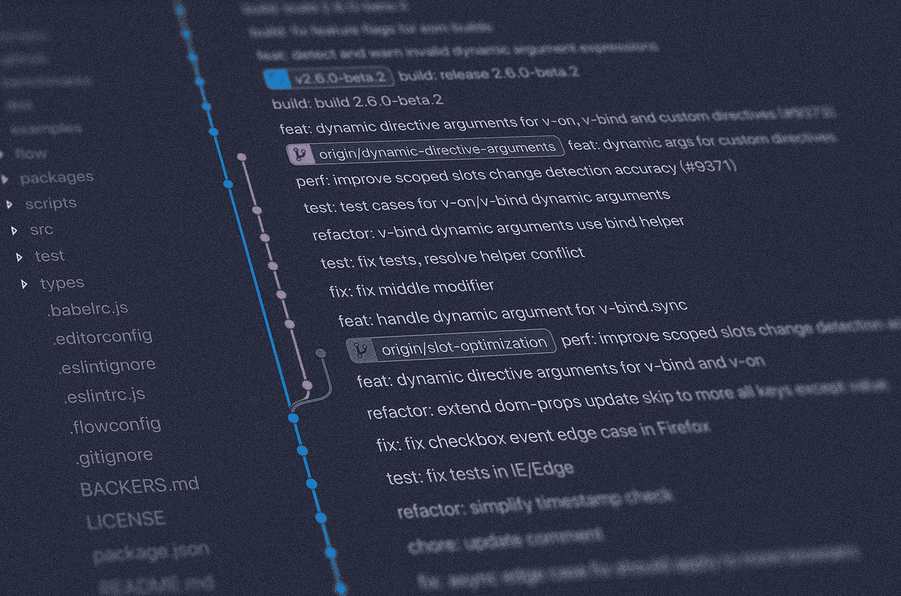
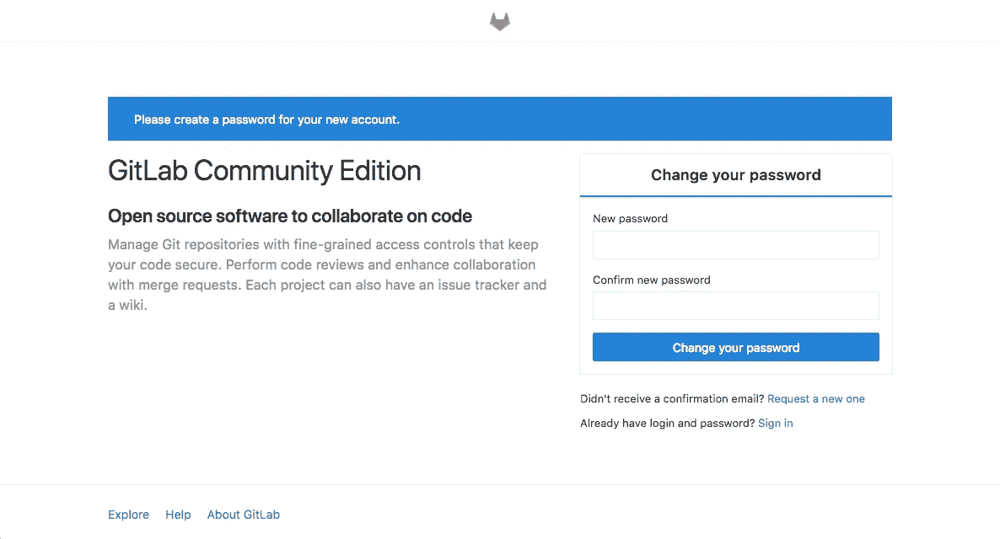
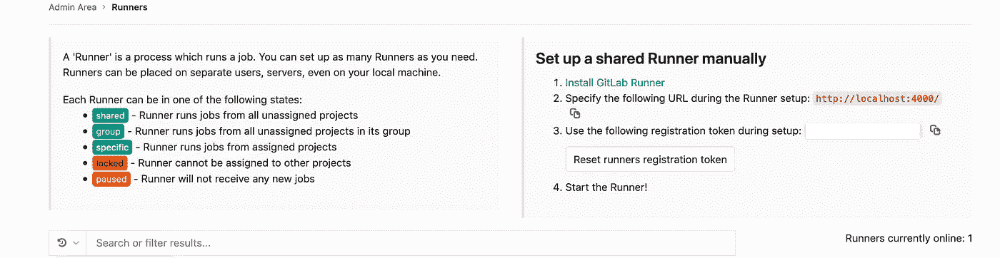
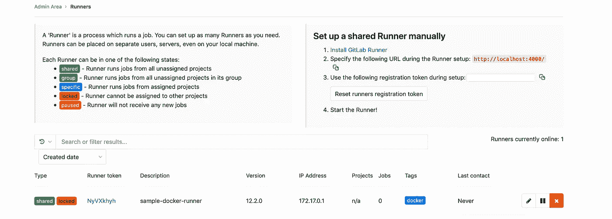
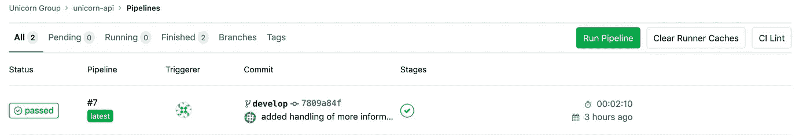

# 使用自托管 GitLab 和 Docker 的私人 CI/CD

> 原文：<https://levelup.gitconnected.com/your-private-ci-cd-using-self-hosted-gitlab-ci-and-docker-ee1aca71b99e>

## 使用 Docker 和 GitLab 建立一个通用的 CI/CD 管道，提高您的工作效率。



[扬西·敏](https://unsplash.com/@yancymin?utm_source=unsplash&utm_medium=referral&utm_content=creditCopyText)在 [Unsplash](https://unsplash.com/s/photos/development?utm_source=unsplash&utm_medium=referral&utm_content=creditCopyText) 上的照片

开发人员在开发个人项目时经常需要一个私有的部署环境。在开发过程中，我尝试了许多替代方法来测试、打包和部署我的解决方案，现在，我在开始一个新项目之前，都会先建立一个 CI 管道。

如果您还没有 CI/CD 环境，您应该考虑自己购买或设置一个。有许多平台即服务(PaaS)形式的解决方案，但我更喜欢 GitLab 的社区版本，以满足我的 Git 和 CI/CD 需求。自托管 GitLab 版本实际上是无限的。我正在开发微服务和单片产品，因此灵活地使用 CI/CD 对我来说至关重要。

在这篇文章中，我们将使用 Docker 引导自己完成 GitLab 的初始设置。我们将在 VPS 中使用 Docker 来托管我们的 GitLab 实例，在构建时随意生成 GitLab runners，并创建 Docker 映像。通过下面的设置，我们将能够使用任何技术栈来执行构建，无论是基于 Go、NodeJS 还是 Java 等等。

# 硬件选择

要选择我们的硬件堆栈，我们需要了解我们将在这台机器上部署什么。以下是执行设置所需的部分清单:

*   码头工人。在 Linux 中，它不基于任何虚拟化，所以它将使用主机系统的资源。
*   运行和使用 Docker——仅这一项我们就需要 4–6GB 的 RAM
*   GitLab 跑步者。每个转轮有 40-100 MB 的额外内存。如果你正在建造的东西很重，你可能需要更多。

就磁盘而言，这是另一个我们需要感到舒适的领域。GitLab 使用了太多的驱动器，这是有原因的——除了您的 CI/CD，这也是我们的 Git repo，并构建缓存。我们只需要磁盘和 RAM —我们可以在 CPU 上妥协，因为在 CI/CD 期间，构建时间不是关键任务。

# 在 Docker 中设置 GitLab

以下步骤描述了以下过程:

*   安装 Docker
*   在 docker 容器中安装 GitLab
*   将 Nginx 安装到主机上
*   使用主机的 Nginx 通过 HTTPS 服务 GitLab，使用`certbot`
*   使用 docker 添加一些 GitLab runners，并将它们与我们的 GitLab 安装连接起来

遵循这篇文章中的步骤的先决条件是要有一个功能齐全的 Docker 安装。数字海洋有一个全面的[演练，适用于任何安装了 Ubuntu LTS 18.xx 的机器。](https://www.digitalocean.com/community/tutorials/how-to-install-and-use-docker-on-ubuntu-18-04)

# 将 GitLab 安装为 Docker 容器

设置 Docker 安装后，设置环境的第一步是运行 GitLab 的映像，使用主机中的持久性存储。因此 GitLab 将在 docker 容器中运行，但它将使用主机的磁盘来保存数据和加载配置。

```
sudo docker run --detach \
  --hostname gitlab.example.com \
  --publish 127.0.0.1:4443:443 --publish 127.0.0.1:4000:80 \
  --name gitlab \
  --restart always \
  --volume /srv/gitlab/config:/etc/gitlab \
  --volume /srv/gitlab/logs:/var/log/gitlab \
  --volume /srv/gitlab/data:/var/opt/gitlab \
  gitlab/gitlab-ce:latest
```

这意味着:

*   将安装的主机名设置为`gitlab.example.com`
*   公开端口 443、80、22，并将它们映射到主机的相同端口。
*   将容器的卷装载到主机上
*   `/srv/gitlab/config`将保存 GitLab 的配置
*   `/srv/gitlab/logs`将持有 GitLab 的日志
*   `/srv/gitlab/data`将保存实际 git 回购的数据。

请注意，这些文件夹被映射到主机，这意味着这些位置在容器重启和 GitLab 升级时保持不变。如果我们使用容器运行 Gitlab 的升级版本，并将相同的文件夹映射到相同的主机位置，我们将能够在新的 GitLab 版本中重用您的旧数据。

这也意味着在阅读 GitLab 的文档时，需要有一个配置位置的心理地图。例如，在当前安装中，我们将`/etc/gitlab`文件夹映射到`srv/gitlab/config`而主机。因此，当 GitLab 配置提到:

> *您也可以只编辑* `*/etc/gitlab/gitlab.rb*` *:*

…它可以解释为:

> *您也可以在您的主机*中编辑 `*/srv/gitlab/config/gitlab.rb*`

*因为文档将 GitLab 安装视为安装在主机上。然而，在这种情况下，它安装在 docker 容器中。*

*你注意到类型`127.0.0.1:4443:443 --publish 127.0.0.1:4000:80`的奇怪的端口绑定了吗？这意味着 i/o 将只绑定到本地主机。容器的端口 4443 和 4000 永远不会暴露给外界。我们将使用安装在同一台机器上的 Nginx 反向代理来访问这些 URL。*

*我们希望只通过 HTTPS，在我们的自定义域名中公开 GitLab。我们把这个域命名为`mydomain.com`。为了完成这一步，我们需要访问我们的域名注册机构的网站，并访问其控制面板，允许设置域名服务器。不同域名注册商的设置方法不同，但设置原则是相同的。在这个控制面板中，让我们将子域名称(在本例中为`git`)设置为我们的服务器的 IP。为了这篇文章，让我们假设你的服务器的 IP 是`55.55.55.55`。*

*我们的名称服务器设置现在应该是这样的(可能存在更多条目，但它们与本场景无关):*

# *通过 Nginx 和 https 提供服务*

*有两种方法来设置 Nginx:使用 docker 容器，安装到主机上，并将 docker 容器暴露的端口映射到外部世界。*

*就我个人而言，我更喜欢后者，因为我喜欢保持整洁。我也喜欢将我的 certbot 证书保存在主机的一个集中位置，以备将来使用，比如测试我的 docker 映像(将主机作为一个临时服务器)。*

*为了遵循这种方法，我们首先需要安装 Nginx*

```
*apt install nginx*
```

*然后，安装 certbot。*

```
*sudo apt-get update
sudo apt-get install software-properties-common
sudo add-apt-repository universe
sudo add-apt-repository ppa:certbot/certbot
sudo apt-get update*
```

*然后运行 certbot。*

```
*sudo certbot --nginx*
```

*如果你成功了，当你访问 https://mydomain.com 时，你会看到一个网页。这不是试驾*

*然后，在 Nginx 配置中设置您的服务器。Certbot 已经在“/etc/nginx/sites-enabled”中为您创建了一个配置。更改主机及其指向的端口的配置，如下所示:*

```
*server {
 server_name git.domain.com;
 client_max_body_size 256M;location / {
  proxy_pass [http://localhost:4000](http://localhost:4000);proxy_read_timeout 3600s;
  proxy_http_version 1.1;
  # Websocket connection
  proxy_set_header Upgrade $http_upgrade;
  proxy_set_header Connection $connection_upgrade;
 }listen [::]:443;listen 443 ssl; # managed by Certbot
    ssl_certificate /etc/letsencrypt/live/git.domain.com/fullchain.pem; # managed by Certbot
    ssl_certificate_key /etc/letsencrypt/live/git.domain.com/privkey.pem; # managed by Certbot
 include /etc/letsencrypt/options-ssl-nginx.conf; # managed by Certbot
 ssl_dhparam /etc/letsencrypt/ssl-dhparams.pem; # managed by Certbot}*
```

*首先，您需要设置子域并将其映射到一个端口。当域是“git.example.com”时，Nginx 会将流量转向这台机器上的端口 4000——在本例中，它对应于 docker 中的 GitLab 安装。*

*当我们使用`service nginx restart`重启 Nginx 安装时，我们就可以访问我们在`https://git.mydomain.com/`的域名了。如果一切都做得正确，我们将会看到下面的结果——一个允许您为用户`root`设置新密码的页面:*

**

*完成初始设置后，我们创建一个 git repo，其中包含一个 NodeJS 应用程序(这里不讨论)。*

***示例应用***

*下一节假设我们已经用一个可构建的 NodeJS 应用程序和一个有效的 Dockerfile 建立了一个 git repo。*

*作为示例，我们将采用一个稍微高级一些的 Dockerfile 来构建一个 NodeJS 应用程序。你的 Dockerfile 可能不一样，但是流程应该是一样的。下面的 docker 文件存储在我们的 git 存储库的根目录中。*

```
*FROM node:10.16
EXPOSE 8080WORKDIR /app/COPY . .
COPY package*.json ./RUN npm install
RUN npm run build
RUN echo "finished building"
RUN ls -afl distFROM node:10.16-alpine
WORKDIR /app/COPY --from=0 /app/dist ./dist
COPY package*.json ./
COPY --from=0 /app/node_modules ./node_modulesENTRYPOINT NODE_ENV=production npm run start:prod*
```

*上面的 Dockerfile 使用`node:10.16`来传输我们的应用程序。当构建完成时，它生成一个准备好执行的映像，使用`10.16-alpine`作为基础映像。通过这种方式，我们可以在构建时安装所有需要的组件(webpack、node-sass、typescript 编译工具)，但在运行时只安装少数几个，这导致了一个非常瘦的映像。当将它存储到 docker 容器注册中心时，这将节省很多空间(每个构建超过 1GB)(如果使用付费的 docker 注册中心，这尤其重要)。*

# *使用 docker 添加跑步者和设置构件*

*现在我们已经准备好了一个安装，我们需要添加“gitlab-runners”并将它们连接到我们的 gitlab 安装。当 GitLab 管道运行时，它会搜索可用的已配置运行程序，并使用它来执行构建。GitLab runner 有许多模式可以操作，这些模式代表了构建将如何执行。在其他模式中，支持生成 Kubernetes pods 或 Docker 容器来执行构建。*

*为了简单起见，我们将使用普通 docker 模式，这将生成一个新的容器，其中包含您选择的图像(由您的 docker 文件决定)*

*在您的终端上运行以下命令:*

```
*docker run -d --name gitlab-runner --restart always \ -v /srv/gitlab-runner/config:/etc/gitlab-runner \ -v /var/run/docker.sock:/var/run/docker.sock \ gitlab/gitlab-runner:latest*
```

*上面的命令将把`gitlab-runner`作为一个容器运行。它还会将主机的`/srv/gitlab-runner/config`文件夹挂载到容器的`/etc/gitlab-runner`位置。正如我们的主 GitLab 安装一样，容器的配置将持久保存在我们主机的文件夹中，这意味着通过更改`/srv/gitlab-runner/config`文件夹中的配置，您也可以配置`gitlab-runner`容器。该配置也将在容器的任何重新启动后继续存在。*

*如果一切顺利，一个简单的`docker ps`将显示以下信息。*

```
*8c3322fea7d4        gitlab/gitlab-ce:latest                        "/assets/wrapper"        42 hours ago        Up 42 hours (healthy)   0.0.0.0:23->22/tcp, 127.0.0.1:4000->80/tcp, 0.0.0.0:4443->443/tcp   gitlab
48aea5eded7e        gitlab/gitlab-runner:latest                    "/usr/bin/dumb-init …"   5 months ago        Up 5 days                                                                                   gitlab-runner*
```

*我们现在需要使用这个容器为 GitLab 安装创建一个新的运行器配置*

*转到“[https://mydomain.com/admin/runners](https://git.oramind.net/admin/runners)*

**

*我们看到 GitLab 正在说“`Use the following registration token during setup`”，并为 is 提供了一个注册令牌。这将被`gitlab runner`用来注册一个新的流道配置。复制完这个令牌后，让我们使用刚刚创建的`gitlab-runner`配置来设置我们的 runner 配置。让我们通过`bash`进入新创建的`gitlab-runner`容器。*

```
*$ docker exec -ti gitlab-runner bash*
```

*让我们通过`gitlab-runner register`设置一个新的流道配置。命令行会问你几个关于如何设置跑步者的问题。我们将按如下方式填写所需信息:*

```
*root@48aea5eded7e:/# gitlab-runner registerRuntime platform                                    arch=amd64 os=linux pid=249 revision=a987417a version=12.2.0
Running in system-mode.Please enter the gitlab-ci coordinator URL (e.g. [https://gitlab.com/](https://gitlab.com/)):
[https://mydomain.com](https://mydomain.com)Please enter the gitlab-ci token for this runner:
<<your gitlab ci token here>>Please enter the gitlab-ci description for this runner:
[48aea5eded7e]: sample-docker-runnerPlease enter the gitlab-ci tags for this runner (comma separated):
docker (whatever you need)
Registering runner... succeeded                     runner=4usxjjv2Please enter the executor: custom, docker-ssh, parallels, shell, docker+machine, docker, ssh, virtualbox, docker-ssh+machine, kubernetes:
dockerPlease enter the default Docker image (e.g. ruby:2.6):
alpine:latest
Runner registered successfully. Feel free to start it, but if it's running already the config should be automatically reloaded!root@48aea5eded7e:/#*
```

*我们现在可以重新访问“[https://mydomain.com/admin/runners](https://git.oramind.net/admin/runners)”，我们将能够在跑步者列表中看到我们的新跑步者！*

**

# *编写构建步骤并触发构建*

*下面的`.gitlab-ci.yml`放在我们 git repo 的根中。*

```
*image: docker:latestbuild_job:
  stage: build
  script:
    - ls
    - echo "starting job..."
    - docker build -t "${CI_PROJECT_NAME}:${CI_COMMIT_REF_NAME}-0.1.${CI_JOB_ID}" .
    - echo job finished
  only:
    - develop
    - master*
```

*访问[https://mydomain.com/<my project>/<my repo>/pipelines](https://git.oramind.net/unicorn/unicorn-api/pipelines)并运行管道:*

**

*当构建完成时，我们的主机 docker 机器将创建一个新的映像，这个映像是由这个管道构建的。*

# *高级主题*

## *将 gitlab-runner 和 gitlab 容器连接到同一个网络*

*如果你没有注意到，我们向 gitlab-runner 提供了我们域名的完整 URL，尽管我们的 gitlab 安装建议使用`http://localhost:4000`。我们这样做是因为`gitlab-runner`和`gitlab`容器不在同一个逻辑网络中——因此当从`gitlab-runner`容器内部调用 localhost 时，会导致一个“连接被拒绝”的消息。*

*要解决这个问题，我们应该告诉 Docker 这两个容器存在于同一个逻辑网络上。*

*在我们的例子中，我们可以这样做*

```
*$ docker network create gitlabnet $ docker network connect gitlabnet gitlab $ docker network connect gitlabnet gitlab-runner*
```

*其中“gitlab”和“gitlab runner”是容器在创建时的名称(使用`--name=...`)。*

*现在，我们可以给`http://gitlab`Docker 的内部 DNS 给定的地址，而不是给`https://git.mydomain.com`作为`gitlab-runner register`命令的根检验 url。*

# *避免码头工人在码头*

*在我们的例子中，我们使用了`image: docker:latest`作为基础图像，如我们的`.gitlab-ci.yml`文件所示。我们的 Dockerfile 也使用了 NodeJS 映像。这意味着您使用 Docker-In-Docker (dind)。这给你的构建带来了很大的开销。在某些情况下这可能无关紧要，但是如果资源有限，那么在构建时会很快耗尽内存。这个问题有两种解决方案:*

*第一个相当简单，涉及重写您的`gitlab-ci.yml`文件，以便您使用您选择的图像作为基本图像，并在那里执行所有步骤，而不是在嵌入式 docker 中。这将从您的`Dockerfile`中移除完整构建的负担，因为您可能只在任何构建的最后阶段需要它(只需复制构建的文件，并创建映像)。*

*如果你绝对想给你的 Dockerfile 完全的控制权，还有另外一个选择。当执行 Dockerfile 命令时，您可以配置您的 runner 使用主机的 docker。您可以通过配置`gitlab-runner`配置来使用主机 docker。在我们的例子中，配置位于`/srv/gitlab-runner/config/config.toml`。编辑文件，如下所示:*

```
*[[runners]]
  name = "sample-docker-runner"
  url = "[https://git.mydomain.com](https://git.mydomain.com)"
  token = "NyVXkhyh1atSm5x_werQ"
  executor = "docker"
  [runners.custom_build_dir]
  [runners.docker]
    tls_verify = false
    image = "alpine:latest"
    privileged = false
    disable_entrypoint_overwrite = false
    oom_kill_disable = false
    disable_cache = false
    volumes = ["/var/run/docker.sock:/var/run/docker.sock", "/cache"]
    shm_size = 0
  [runners.cache]
    [runners.cache.s3]
    [runners.cache.gcs]*
```

*注意，我们将`/var/run/docker.sock:/var/run/docker.sock`卷挂载添加到了将由`gitlab-runner`生成的容器中。*

*但是，请注意，这将把主机的 docker 暴露给容器。[这带来了安全风险](https://stackoverflow.com/questions/40844197/what-is-the-docker-security-risk-of-var-run-docker-sock)，如果不采取额外的预防措施，在大规模 GitLab 部署中应该可以避免。*

# *从这里去哪里*

*事实证明，使用 Docker 设置 GitLab 比我最初想象的更加灵活。我以此为基础为我的个人项目建立了一个跨越多个服务器的开发环境。*

*以下是我鼓励任何人在完成这篇文章中的步骤后要做的事情。*

*   *配置 SSH 签出。有了这个配置，你应该能够使用 HTTPS 拉和推。如果您想要启用 SSL，您将需要从 GitLab 容器中公开端口 22，并执行一些更高级的配置，以避免将 GitLab 的 SSL 与您的主机的 SSL(默认情况下将在同一个端口中运行)混合。*
*   *使用外部 Docker 容器注册表。你可以使用像 [canister.io](https://git.oramind.net/unicorn/unicorn-api/pipelines) 这样的免费服务来保存你的 docker 图片。*
*   *使用像[https://www.portainer.io/](https://www.portainer.io/)这样的映像/容器管理工具来管理你主机上的容器/映像。这包括您的 GitLab 安装和 GitLab 运行程序。*
*   *你可以通过谷歌搜索找到一些非常便宜的服务器，但是我建议你考虑一个按小时收费的主机。如果您需要一个用于宠物项目的 CI/CD 环境，这可以证明是特别有用的，因为您可以在一天中的大部分时间关闭机器，并避免为您不使用的东西付费。*

# *结论*

*我们只是触及了使用这种配置作为基础的可能性的表面。就我个人而言，我曾多次惊讶于只安装一个小的 VPS Docker/GitLab 就能完成的工作。*

*我真的希望这篇文章对你有用。我渴望在评论里看到你的想法！*

**原贴于* [*Oramind*](https://oramind.com/private-cicd-using-gitlab-docker/)*