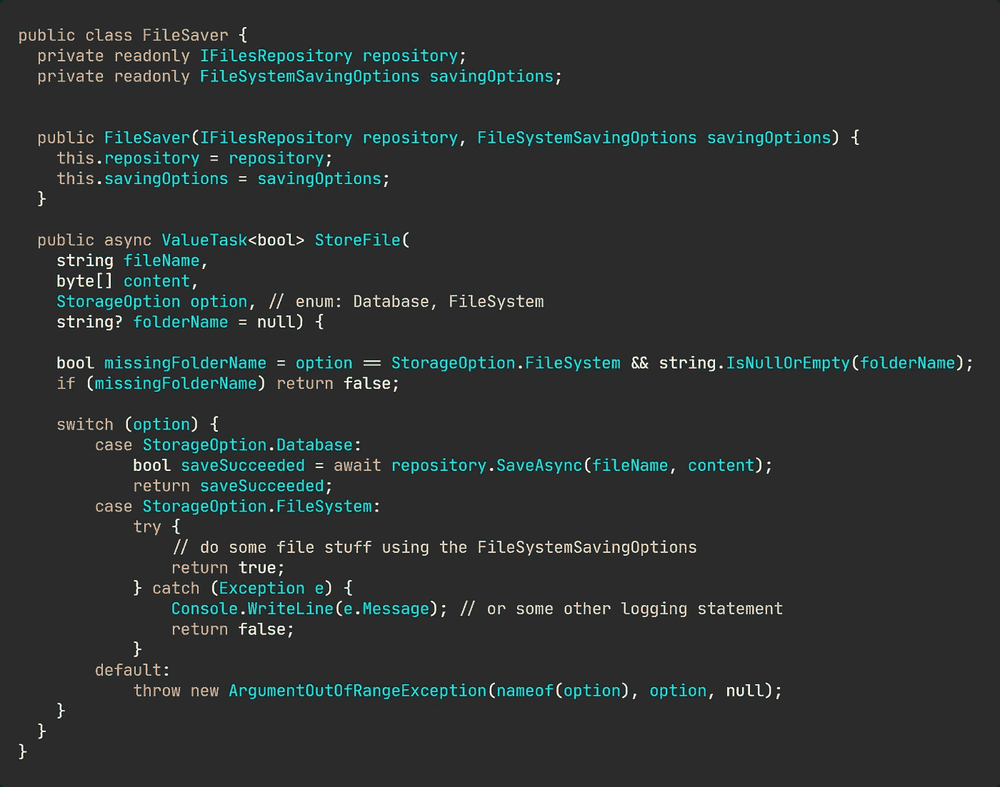
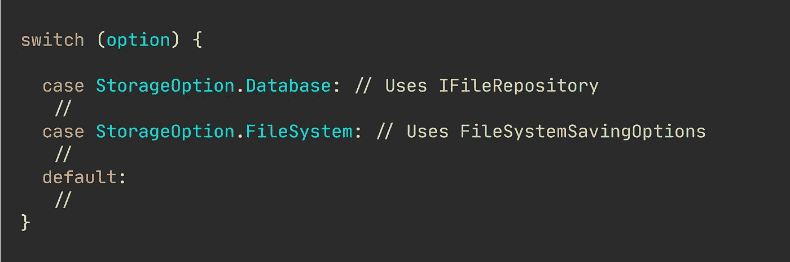
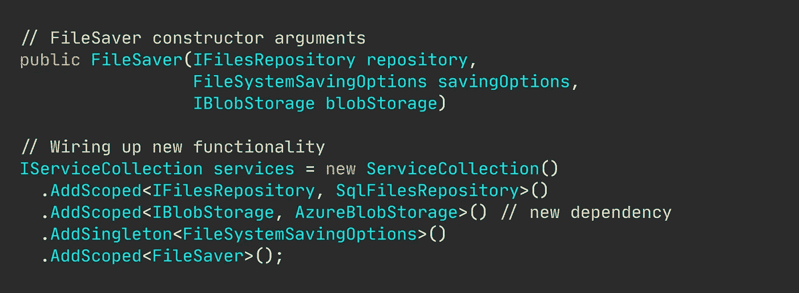
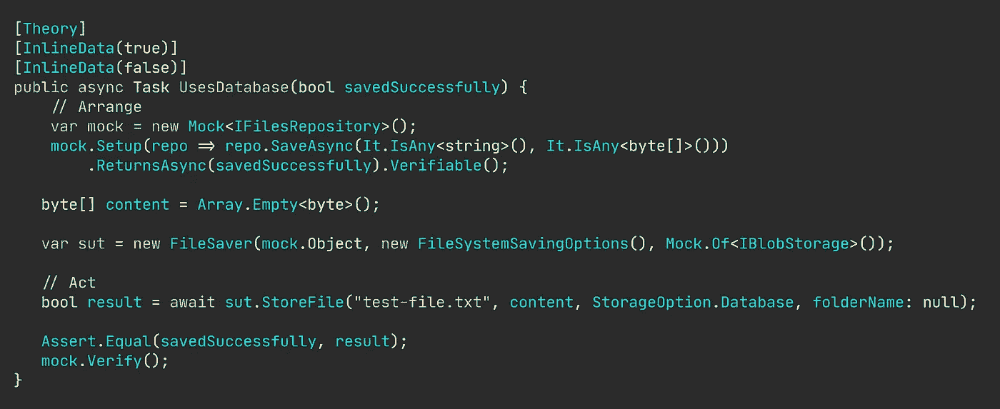
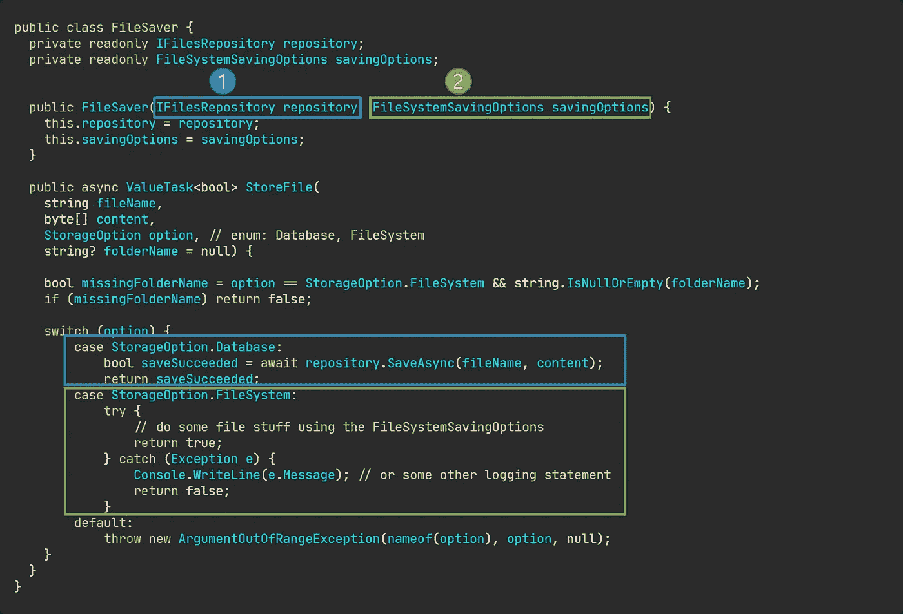
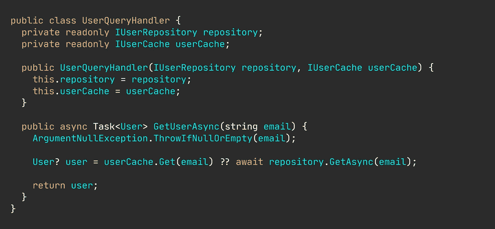
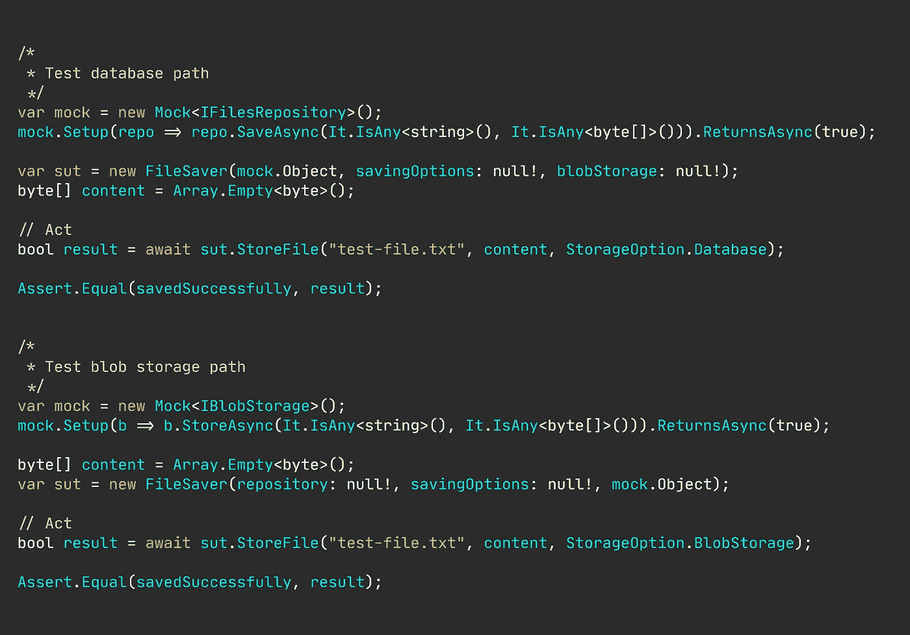

# 分支耦合依赖如何破坏你的软件质量

> 原文：<https://levelup.gitconnected.com/your-software-quality-is-ruined-by-branch-coupled-dependencies-d55833e17e74>

## 固执己见的观点

## 有经验的开发人员也会为糟糕的设计感到内疚。

[樱花](https://unsplash.com/@sakura0v0?utm_source=medium&utm_medium=referral)在 [Unsplash](https://unsplash.com?utm_source=medium&utm_medium=referral) 拍摄的照片

你可能看过无数的教程和软件设计书籍，它们都告诉你基于接口的、显式的依赖是如何让你创建松散耦合的类的。

“新的是胶水”，对吗？教条是让你的类将显式依赖作为构造函数或方法参数，而不是自己创建一个对象。听起来很明智。

我相信您会发现如下代码非常简洁。它很简单，只有几个构造函数参数，使用显式依赖关系将操作委托给其他类，并且只有一个目的:保存文件。(剧透一下，这个代码要尽量避免)。

简单的文件保护程序实现。

尽管`switch`的使用令人恐惧，但这并不太糟糕，对吗？

将这与依赖注入容器框架结合起来，你现在可以吹嘘你是如何遵守诸如控制反转、依赖注入等原则的。

遵循这些原则可以为您提供灵活性，并且您的同事会称赞您是一个掌握了抽象和控制反转的有成就的开发人员。

然而，如果你不小心的话，你会很快陷入困境。

🔔想要更多这样的文章？在这里签名。

## “为什么上面的代码这么差？”

紧密耦合不仅仅适用于类，例如，让一个类产生另一个类的实例，或者将具体类型作为参数。

耦合代码的概念也适用于与执行路径紧密耦合的依赖，或者我称之为:分支耦合依赖。

你看，file saver 类有一个用于保存文件的方法，但是在实例化时需要两个参数。`IFilesRepository`和`FileSystemSavingOptions`。文件保护程序检查文件的存储位置，可以是数据库，也可以是文件系统。

实现被剥离。

在一个分支中，只有一个被注入的对象被使用过，这就是我的术语“分支耦合依赖”。

您可能还在想，“嗯，这还不算太糟，这只是一个紧密切换中的两个分支和几个依赖项。我真的看不出这有什么问题……”，这是一个合理的观察。

就像任何糟糕的设计或糟糕的选择一样，它很少会立即显现出来。

使用依赖注入容器和控制反转具有潜在的不良设计发现的不幸副作用。连接我们当前的实现非常简单，如下图所示。

连接当前的文件保护程序。

假设我们需要添加另一个分支(开关情况)来支持例如保存到 blob 存储。由于有了 DI 框架，连接新功能变得非常简单。

添加新功能。

连接 blob 存储功能不需要太多工作。但是请记住，连接新功能的容易程度并不是衡量软件设计好坏的好标准。

当您开始编写单元测试或者需要用多个分支扩展功能时，分支耦合依赖问题就会暴露出来。

## 编写单元测试的过程可以表明你的设计有多好。

编写测试的过程可能会暴露出笨拙而麻烦的设计。

如果你总是依赖依赖容器来连接你所有的服务，你可能会错过重要的学习。

看看这个简单的测试暴露出来的尴尬。

尴尬的单元测试。

我希望你已经发现了尴尬。

我希望文件保存程序在用`StorageOption.Database`调用`StoreFile(params)`时执行数据库分支，但是，由于某种原因，我仍然需要将文件系统保存选项和 blob 存储对象传递到构造函数中，尽管我知道它们永远不会被使用。

“但是您可以改为传递 null！，“当然，我可以。但是我已经确信你知道为什么这是一个坏主意，以及构造函数中的空值如何表明设计有多糟糕。

即使在单元测试中，依赖依赖容器也是一件事。

单元测试依赖精神错乱。

我目睹了许多高级开发人员如上所述那样做，因为构建 SUT(被测系统)单元是一项过于艰巨的任务。我曾经处理过需要多达 21 个(！idspnonenote)的服务类。)构造函数参数。

现实点吧，这太疯狂了。没有人能跟踪超过 5 个参数，任何超过 3 个的都是重构的候选对象。

负责的高级开发人员甚至开发了自制的自动模拟注射器。

再读一遍。“自动模拟注射器”。只是…不。那是把“解决错误的事情”带到了一个完全不同的层次。

## 清理开关也不会有(多大)帮助。

任何使用 OOP 语言的开发人员都会立刻大叫“多态性”，并希望摆脱可怕的 switch 语句。

[消除传统的分支技术](https://nmillard.medium.com/list/bashing-traditional-branching-ifelseswitch-327d4a671e5a)，比如 switch case，也不会对我们有太大帮助，尽管它会大大提高我们内部代码的质量。

另外，展示我们如何将基于开关的分支转变为多态行为是另一篇文章的主题。

# 如何发现分支耦合依赖问题？

我有一些在分析依赖性问题时应用的经验法则——我在下面列出了其中的一些。

## 论点和分支之间是一对一的关系。

试着想象一下依赖关系在你的类中是如何使用的。你可能会得到一个清晰的图片，如下图所示。

可视化的依赖使用。

现在，对于依赖项与特定分支的紧密耦合程度，它变得更加清晰可见，并且您可以轻松地对其进行重构。

## 新功能需要新的依赖关系。

一个紧密的分支依赖不需要像我目前给出的例子那样明确。

如果新功能要求您添加另一个构造函数或方法参数，那么很有可能存在分支依赖。一个不连续但太常见的场景是当您想要通过引入分布式缓存来优化查询性能时。

逻辑大致是这样的。

检查用户的缓存—如果存在，则返回它，否则查询数据库并返回用户。通过应用装饰模式，可以很容易地去除不必要的依赖。

## 写单元测试很别扭。

你有没有注意到你有时会把空值传递给参数，因为你知道你测试的方法不会用到它们，或者，在没有任何设置的情况下嘲笑依赖关系？

好吧，这是一个糟糕的设计的可靠标志，因为向依赖容器注册服务很容易。

## 单元测试要求您模拟同一方法中不同分支的不同依赖关系。

单元测试再一次为我们提供了不仅仅是某些功能工作的确定性。

如果您曾经对单个方法进行了一系列测试，但是每个测试都要求您模拟不同的依赖关系，那么毫无疑问，一个设计不良的类存在分支依赖问题。

花一点时间来检查这些几乎相同的测试，看是否使用了完全相同的方法。

相同方法的几乎相同的测试。

# 总之…

不管你是完全的初学者还是有经验的开发人员，所有的开发人员迟早都会遇到分支耦合依赖问题。

仅仅几个构造函数参数加上特定的分支或方法看起来还不错，但是很快就会失控。此外，要注意依赖注入框架是如何促成分支耦合依赖的。很容易偷懒，让 DI 容器弄清楚对象是如何构造的。

分支耦合依赖通常隐藏了潜在的设计问题、过期的重构会话或者仍然应用的设计模式。

# 让我们保持联系！

[点击这里](https://nmillard.medium.com/subscribe)订阅时事通讯，获取类似文章的通知，并查看 YouTube 新频道[*(@尼可拉斯·米勒德)*](https://www.youtube.com/channel/UCaUy83EAkVdXsZjF3xGSvMw)

*连接上* [*LinkedIn*](https://www.linkedin.com/in/nicklasmillard/)