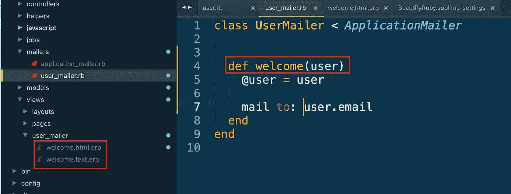

# 在 Rails 7 中发送电子邮件的终极指南

> 原文：<https://levelup.gitconnected.com/your-ultimate-guide-to-sending-email-in-rails-7-d743cdad88b>

## ActionMailer 基础、Gmail、邮件拦截器等等


照片由[达里娅·内布里亚希娜·🇺🇦](https://unsplash.com/@epicantus?utm_source=medium&utm_medium=referral)在 [Unsplash](https://unsplash.com?utm_source=medium&utm_medium=referral) 上拍摄

每个人都讨厌电子邮件。

我就从这个开始，只是为了回避我明白这个事实。接收电子邮件糟透了。发送营销邮件似乎毫无用处。但是电子邮件仍然是一个必要的祸害。即使在 2022 年，发送促销邮件仍然是接触受众的最佳方式之一。

此外，你还需要电子邮件，以防用户忘记密码并需要重置链接(这样他们下次登录时就可以忘记密码)。

**Rails 中的电子邮件很简单，因为像 Rails 中的许多东西一样，它是内置的，非常直观。**像大多数 Rails 自带的东西一样，有一个 ActionMailer(活动记录、活动存储，当你看到‘动作’或‘活动’时，你就知道你是 Rails 家族的一员)。在这篇文章中，我将介绍在 Rails 中发送交易和营销邮件所需要知道的一切。

1.  Rails 邮件基础
2.  在开发/生产中设置电子邮件
3.  从你的应用程序发送电子邮件。

# 我们开始吧！

## 设置您的应用程序

让我们从设置您的应用程序开始吧。确保您的 Ruby 版本是最新的，并且您运行的是 Rails 7，以便从本教程中获得最大收益。我不会设置任何特定的数据库或设置一个前端应用程序的 API，因为大多数工作与控制器端的邮件程序一起进行。

```
#terminalrails new mailer_demo
cd mailer_demo
rails s
```

让我们建立一个静态页面，我们可以用它来发送电子邮件。

```
#terminal
rails g controller pages home #config/routes.rb
root "pages#home"
```

现在有了一个可用的主页，我们可以开始摇滚了。


## 设置邮件程序基础

既然应用程序已经设置好了，让我们来设置邮件程序。由于 ActionMailer 是一个开箱即用的解决方案，所有的配置都已经写入 Rails 应用程序。您所需要做的就是访问正确的页面，并取消注释正确的代码行。

在开发中，您希望确保从本地主机发送邮件。在大多数情况下，这是 localhost:3000。

```
#config/environments/development.rb:config.action_mailer.default_url_options = {host:'localhost', port: 3000}
```

在生产/测试中，您将希望从您的实际域发送电子邮件(例如，对于我的个人网站，我的地址是 *hello@mariacodes.io* ，因此主机名将是 *mariacodes.io* )

```
#config/environments/production.rb:
config.action_mailer.default_url_options = {host:'mydomain.com'}
```

如果您将主机名放入一个环境变量中，那么您不需要在每个配置文件中更改它，这是一个额外的好处。😉

现在，让我们设置默认的 mailer 类。注意邮件惯例是*单数*，而不是*复数*。

```
#terminal 
rails g mailer User welcome
```

这将在 App 文件夹中创建一个名为… mailer 的新子文件夹。看到了吗？在 Rails 的世界里，这些事情是有意义的。

首先，更新应用程序邮件程序中的信息，以配置默认设置。

*   **默认的“发件人”**是发送所有电子邮件的电子邮件地址，除非另有说明。将此作为基本的电子邮件地址，比如“contact@yourdomain.com”。从理论上讲，是的，你可以把它变成任何电子邮件，比如 zuck@facebook.com 的*，但这是被标记为垃圾邮件发送者的单程票。*
*   *这里的**布局是电子邮件的基本外观和感觉。因为电子邮件存在于应用程序之外，所以它不会从应用程序继承任何 CSS。我推荐使用你的基本布局的精简版本。你的公司品牌应该仍然存在，但是你的电子邮件看起来越像是朋友发的，它们的内容就越有可能被阅读。***

```
*class ApplicationMailer < ActionMailer::Base
  default from: "[from@example.com](mailto:from@example.com)"
  layout "mailer"
end*
```

*用户邮件包含一个将用于发送电子邮件的欢迎方法。*

```
*#app/mailers/user_mailer.rbclass UserMailer < ApplicationMailer def welcome
    [@greeting](http://twitter.com/greeting) = "Hi"
    mail to: "[to@example.org](mailto:to@example.org)"
  endend*
```

## *发送测试电子邮件*

*为了确保代码正常工作，请通过控制台发送一封测试电子邮件。这是解决代码中任何 Ruby 错误的最好方法，因为您可以将它隔离为代码问题，而不是 SMTP 发送问题。*

```
*#terminal 
rails c>UserMailer.welcome.deliver_now*
```

*就这样，一封电子邮件诞生了！您应该在控制台中看到一条消息，提示您成功(或者如果有语法错误，提示您失败)。*

**

*TaDa！一封实用的(尽管难看)电子邮件*

*`deliver_now`是同步电子邮件发送的最佳方法，但是，您也可以将`deliver_later`与 sidekiq 或其他异步服务一起使用。*

# *设置您的电子邮件环境*

*下一步是确保你可以在开发或生产中发送电子邮件，以测试你的时髦的新邮件应用程序工作得有多好。*

***开发**:您实际上并不想在您的开发环境中发送电子邮件，原因如下:*

*   *你(希望)用的是假邮件，所以很多会被退回。*
*   *如果您使用的是生产数据库(您不应该这样做，但是会发生这种情况)，您不希望意外地向您的整个用户群发送垃圾邮件。*
*   *大规模发送电子邮件要么花费 100 美元，要么耗费服务器资源，你不需要在开发中浪费这两者。*

*那么在开发中，你实际上是如何发送电子邮件的呢？这是 Rails，所以你的解决方案是..一块宝石！*

## *用开信刀发送开发电子邮件*

*这是我最喜欢的在 Rails 中发送电子邮件的方式，因为它不是发送电子邮件，而是打开一个新标签。您可以获得即时反馈，无需设置 SMTP 即可开始。*

*首先，将[开信刀](https://github.com/ryanb/letter_opener)添加到您的应用程序中:*

```
*#Gemfile 
gem "letter_opener", group: :development#terminal
bundle* 
```

*然后，设置开发环境，用开信器 gem 拦截所有邮件。*注意:每次当你修改一个配置文件时，重启你的服务器以确保修改已经被处理。**

```
*#config/environments/development.rb
config.action_mailer.delivery_method = :letter_opener
config.action_mailer.perform_deliveries = true*
```

## *使用电子邮件拦截器发送开发电子邮件*

*另一种发送电子邮件的方法是，如果你想确保你的 SMTP 配置工作正常，并想看看一封电子邮件在收件箱里是什么样子，那就设置邮件拦截器 gem。在我的第一份 Rails 工作中，我在前几个月专门做电子邮件测试，并编写自己的代码，基本上做 gem 做的事情。但现在是 2022 年——万事皆有宝*

*首先，将[邮件拦截器](https://github.com/bigbinary/mail_interceptor)宝石添加到你的 gem 文件中(注意这个宝石和上面那个不能一起工作，所以选一个吧！)*

```
*#Gemfile
gem 'mail_interceptor', group: [:development, :staging]#terminal
bundle*
```

*然后，设置 gem 配置。这个 gem 使用它自己的初始化文件。在每次服务器启动时,`config/initializers`文件夹中的所有内容都会运行，因此可以将它用于特定的 gem 配置或任何其他 ruby 脚本。*

*   ***forward_emails_to** 选项会将所有发送的电子邮件转发到特定地址，以避免在试运行或开发环境中不正确的发送。*
*   ***deliver_emails_to** 是可选的。它允许电子邮件发送到特定域的所有电子邮件。因此，举例来说，正在开发该产品的其他开发人员可以接收他们发送给自己的电子邮件。*

```
*#terminal
touch config/initializers/mail_interceptor.rb#config/initializers/mail_interceptor.rb
options = { forward_emails_to: 'intercepted_emails@domain.com',
            deliver_emails_to: ["@wheel.com"] }

unless (Rails.env.test? || Rails.env.production?)
  interceptor = MailInterceptor::Interceptor.new(options)
  ActionMailer::Base.register_interceptor(interceptor)
end*
```

*这里有一个警告。因为您发送的是真正的邮件，所以您还需要配置 SMTP 端口，以确保电子邮件发送成功。要做到这一点，请继续下面的教程！*

## *在生产中设置 ActionMailer*

*在生产中，您需要向您的用户发送电子邮件。Rails 中的电子邮件使用 SMTP(简单邮件传输协议)发送，所有电子邮件服务(gmail、outlook 等)都使用相同的协议。*

*设置 SMTP 需要连接到服务器，有几种方法可以在 Rails 应用程序中实现这一点。*

*   ***使用 Gmail 服务器**通过盗用你的 Gmail 地址，每天发送多达 500 封电子邮件。对于实际的应用程序，不建议这样做，但是对于快速演示或黑客马拉松来说，这样做是可行的。凭良心说，我不能写它，但如果你坚持，这里有一个[快速教程](https://dev.to/morinoko/sending-emails-in-rails-with-action-mailer-and-gmail-35g4)。*
*   *使用自己的服务器转发邮件。更多的手工工作，但不需要额外的凭证。*
*   ***使用第三方应用程序，如 SendGrid。**这是扩展应用电子邮件功能的最佳解决方案。大多数服务将每月提供大约 10，000 封免费邮件，然后开始收取浮动费用。他们还会提供仪表盘，洞察打开率、点击率、交付率等，这对于衡量你的沟通效率非常有帮助。*

## *使用 SendGrid 设置 SMTP 电子邮件*

*在这个例子中，我使用了 [SendGrid](https://docs.sendgrid.com/for-developers/sending-email/rubyonrails) ，因为他们有一个专用的 gem 和相当不错的支持，但实际上任何服务如 MailChimp、ConstantContact 等都可以工作。设置实际上是相同的，只是这里和那里少了一个 API 键。*

*首先，注册一个 SendGrid 帐户并设置您的 API 密匙:*

*   *点击左侧菜单中的**设置**，然后点击 **API 键**。*
*   *接下来，点击右上角的**创建 API 键**。*
*   *输入 API 键的名称，然后点击**创建和查看**。*
*   *将显示的 API 密匙复制到 SendGrid API 密匙字段中，就可以开始了！*

*然后，将密钥添加到您的生产配置中(或者如果您使用 mail interceptor，则添加到您的通用`environment.rb`文件中，因为您在开发和试运行中也会需要它)。*

```
*#config/environments/production.rb
ActionMailer::Base.smtp_settings = {
  :user_name => 'apikey', # This is the string literal 'apikey', NOT the ID of your API key
  :password => '<SENDGRID_API_KEY>', # This is the secret sendgrid API key which was issued during API key creation
  :domain => 'yourdomain.com',
  :address => 'smtp.sendgrid.net',
  :port => 587,
  :authentication => :plain,
  :enable_starttls_auto => true
}*
```

*请记住，不要暴露您的 API 密匙，而要将它存储在环境变量中，否则您会将它直接发送到 GitHub，落入被鄙视的前同事、黑客和机器人的手中。*

*Rails 5.2+提供了一个内部的凭证解决方案，我将在这里演示，但是您可以随意使用任何您感兴趣的 gem 或解决方案。*

*首先，编辑您的加密密钥。我在这个例子中使用了 Sublime Text，但是替换为您选择的编辑器。或者勇敢点用 vim。*

```
*#terminal
EDITOR=sublime rails credentials:edit#credentials.yml
sendgrid_api_key: 1928328329381920382938120938*
```

*然后，将 SMTP 配置中的实际密钥更改为凭据的链接:*

```
*#config/environments/production.rb[...]
:password => '<SENDGRID_API_KEY>', 
#change this line to the one below 
:password => 'Rails.application.credentials.sendgrid_api_key',
[...]*
```

*不要忘记，因为密钥没有保存到 GitHub，**您还必须将它发送到您的托管环境，以便在生产中可以使用密钥。***

# *我们发邮件吧！*

*唷，我们终于到了。*

**

*由[新美乐股份公司·塞尔吉](https://unsplash.com/@i_am_simoesse?utm_source=medium&utm_medium=referral)在 [Unsplash](https://unsplash.com?utm_source=medium&utm_medium=referral) 上拍摄的照片*

*在 Rails 中发送电子邮件遵循与大多数 Rails-y 事物相同的逻辑。也就是说，我们从模型到控制器再到视图。就电子邮件而言，这意味着:*

1.  ***用正确的变量和方法设置邮件程序**(基本上是一个模型)来定义电子邮件类。*
2.  ***通过现有控制器中的动作**触发邮件发送(甚至在模型中通过前的*或*后的*方法)**
3.  ***配置视图**显示你想在邮件中展示的所有好东西，包括链接、图片和数据。*

*还有 tada！你有一个有效的邮件系统。现在让我们把它们放在一起。*

## *步骤 1:设置邮件程序*

*我们之前已经完成了这一部分，但是现在让我们更深入一点。运行 generate 命令创建邮件程序及其操作。让我们来分解一下:*

*   *rails g = rails 生成*
*   *邮件=你正在生成的东西*
*   *User =邮件程序类名，通常是单数*
*   *welcome = User 类中名为“welcome”的操作。用空格添加多个动作。*

```
*#terminal 
rails g mailer User welcome*
```

*这将生成如下所示的邮件:*

```
*class UserMailer < ApplicationMailer
  def welcome
    [@greeting](http://twitter.com/greeting) = "Hi"
    mail to: "[to@example.org](mailto:to@example.org)"
  end
end*
```

*UserMailer 类继承自 ApplicationMailer，它具有本文开头提到的信息，比如默认布局和来自地址的*。**

*个人行动有两个主要组成部分*

*   ***将传递给视图的实例变量***
*   ***邮件*方法*将处理电子邮件的配置，如`to: , from: , cc: , bcc: , subject:`等。***

*既然 mailer 类已经设置好了，下一步就是弄清楚如何调用它。*

## *步骤 2:将邮件程序链接到触发器*

*一般来说，有两种方法调用邮件程序动作——通过控制器或通过模型。让我们从模型开始，做一个当用户注册网站时触发的欢迎电子邮件的例子。*

*但是首先，我们需要用户，所以我将使用 Devise 建立一个快速用户模型。要了解更多关于 Devise 的背景知识，请阅读我的文章[这里](/devise-authentication-with-rails-5-815b5a9d6daf)！*

```
*#Gemfile 
gem 'devise'#terminal 
bundle
rails g devise:install
rails g devise User 
rails db:migrate*
```

*现在应该有一个用户可以使用电子邮件和密码登录到您的网站。另外，****关于 design 最令人惊奇的是它已经被设置为使用 ActionMailer** 。如果您想启用设计方法，如密码恢复和电子邮件确认，他们已经在那里，并准备定制。不需要 ActionMailer 配置。令人震惊，我知道。***

## ***通过模型发送电子邮件。***

***我们有发送电子邮件的动作，现在我们需要触发它。谢天谢地，Rails(嗯，真的是活动记录)附带了许多有用的方法。其中一个是方法后可以调用的触发器，比如 `before_save, after_create, before_destroy`等。***

***在本例中，我们将在成功创建用户后发送一封电子邮件。我正在写一个叫做`send_welcome_email`的方法，由:***

*   ***`UserMailer`级。***
*   ***以自我为属性的`welcome`法。***
*   ***并调用`deliver_now`在用户创建后同步发送邮件。***

```
***after_create :send_welcome_emaildef send_welcome_email
    UserMailer.welcome(self).deliver_now  
end***
```

***如果我想测试这个方法是否有效，我可以在控制台中创建一个用户。***

```
***#terminal 
rails c
User.create(email: "[123@examples.com](mailto:123@examples.com)", password: "123123")***
```

***如果一切顺利，一旦创建了我的用户，我应该会收到一个电子邮件已发送的通知。***

******

***我们在摇滚！！***

## ***第三步:让我们写一封电子邮件！***

***电子邮件被设置，动作被触发。下一步是让邮件有意义，因为，嗯，这封邮件看起来很粗糙。***

******

***让我们设定一些目标:***

1.  ***将用户信息传递到电子邮件***
2.  ***将链接添加回网站***
3.  ***添加样式，使电子邮件看起来像是在 1995 年之后创建的。***

## ***将用户信息传递到电子邮件***

***上面的`send_welcome_email`方法将`self`作为参数，这意味着我可以访问用户创建的实例。***

***我可以修改我的 UserMailer 方法来反映这一点。可以将`user`作为实例变量`@user`传递给电子邮件前端，也可以将`to:`地址字段更改为新用户的地址。***

```
***#app/mailers/user_mailer.rbclass UserMailer < ApplicationMailer
  def welcome(user)
    user = [@user](http://twitter.com/user)
    mail to: user.email
  end
end***
```

***现在，终于到了处理视图的时候了。ActionMailer 视图位于`app/views`的专用文件夹中。类似于控制器，每个动作对应一个`html.erb`文件。邮件文件既有 html 版本，也有文本后备版本(虽然 2022 年并不真的需要这个)。***

******

***编辑电子邮件视图与 Rails 项目中的任何 html 页面是一样的。使用`<%= %>`符号嵌入 Ruby 并从邮件程序调用变量。***

```
***#app/views/user_mailer.welcome.html.erb<h1>Hi</h1><p>
  <%= [@user](http://twitter.com/user).email %> welcome to the site!
</p>***
```

***现在，测试电子邮件既有一个真正的`to:`字段，又有一个嵌入在正文中的名称。***

******

***天啊。几乎是真正的邮件！***

## ***将链接添加回站点。***

***通常，Rails 使用一个`link_to`助手来动态链接页面。邮件版本几乎是一样的，只有一个小的不同。***

***您必须用`url`替换`path`以确保完整的链接通过电子邮件传回。***

```
***#regular link
<%= link_to "Home", root_path %>#mail link
<%= link_to "Home", root_url %>***
```

***在邮件视图中，它看起来像这样。***

```
***#app/views/user_mailer/welcome.html.erb
<h1>Hi</h1><p>
  <%= [@user](http://twitter.com/user).email %> welcome to this awesome site!
</p><p>
  Visit us <%= link_to "here", root_url%>
</p>***
```

***最后，为生产和开发设置默认 url。***

```
***#config/environments/production.rb
config.action_mailer.default_url_options = {host: 'mydomain.com'}#config/environments/production.rb
config.action_mailer.default_url_options =  { host: 'localhost', port: 3000 }***
```

***而且链接是直播！***

******

## ***为电子邮件添加样式***

***最后，让我们让电子邮件看起来既现代又干净。因为电子邮件有自己的布局，它不会像其他视图一样从`application.html.erb`继承。添加像 Bootstrap 这样的库必须单独进行。现在，有很多方法可以手动完成这项工作，但这是 Rails，所以当然有一个好办法— [引导电子邮件](https://bootstrapemail.com/docs/usage)。***

***首先，安装创业板。***

```
***#Gemfile
gem 'bootstrap-email'#terminal
bundle***
```

***然后将正确的文件添加到邮件布局中。***

```
***#app/views/layouts/mailer.html.erb
<!DOCTYPE html>
<html>
  <head>
    <meta http-equiv="Content-Type" content="text/html; charset=utf-8" />
    <meta http-equiv="Content-Type" content="text/html; charset=utf-8">
    <meta name="x-apple-disable-message-reformatting">
    <meta http-equiv="x-ua-compatible" content="ie=edge">
    <meta name="viewport" content="width=device-width, initial-scale=1">
    <meta name="format-detection" content="telephone=no, date=no, address=no, email=no">
    <style>
    </style>
  </head>
  <body>
    <%= yield %>
  </body>
</html>***
```

***最后，将您的邮件方法从`mail`更新到`bootstrap_mail`***

```
***#app/mailers/user_mailer.rb
class UserMailer < ApplicationMailerdef welcome(user)
    [@user](http://twitter.com/user) = user
    bootstrap_mail to: user.email
  end
end***
```

***瞧啊。你有(半华丽的)电子邮件:***

******

***还有一些工作要做，但我们已经走上正轨。***

# ***关于预览电子邮件的最后一点说明***

***发送电子邮件是一个反复试验的过程。而且不得不从控制台甚至前端创建一个新用户来触发发送电子邮件，这很糟糕。***

***这就是电子邮件预览的用武之地。***

***这是一种测试变量和布局而不触发电子邮件操作的简便方法。每个邮件生成器命令都会创建一个可用于预览电子邮件的测试文件。你可以在`test/mailers/previews/`文件夹中找到这个文件。测试文件将有一个测试方法和到预览 url 的链接。通常，我和一个现有用户一起使用它——或者只插入`User.first`或`User.last`。***

```
***#test/mailers/previews/user_mailer_preview.rbdef welcome
  UserMailer.welcome(User.first)
end***
```

***现在，我可以通过访问页面上的 url 来确切地看到电子邮件的样子:[http://localhost:3000/rails/mailers/user _ mailer/welcome](http://localhost:3000/rails/mailers/user_mailer/welcome)。要查看新的更改，只需刷新页面，任何 HTML 格式都将反映在预览器中。***

******

***就是这样！恭喜你，你已经用 Ruby on Rails 掌握了电子邮件的基本知识。***

***完整的演示，请访问我在 GitHub 上的知识库:[https://github.com/maltyeva/mailer_demo](https://github.com/maltyeva/mailer_demo)***

****感谢您阅读本文！如果您有任何问题或任何其他电子邮件主题希望我回答，请在下面留下评论。****

# ***分级编码***

***感谢您成为我们社区的一员！在你离开之前:***

*   ***👏为故事鼓掌，跟着作者走👉***
*   ***📰查看[升级编码出版物](https://levelup.gitconnected.com/?utm_source=pub&utm_medium=post)中的更多内容***
*   ***🔔关注我们:[Twitter](https://twitter.com/gitconnected)|[LinkedIn](https://www.linkedin.com/company/gitconnected)|[时事通讯](https://newsletter.levelup.dev)***

***🚀👉 [**软件工程师的顶级工作**](https://jobs.levelup.dev/jobs?utm_source=pub&utm_medium=post)***