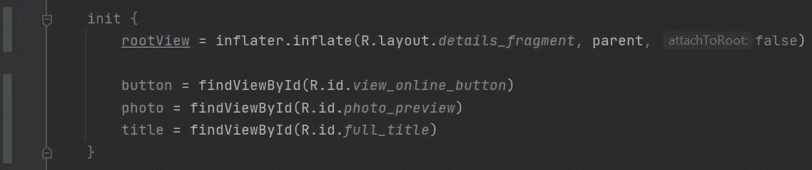
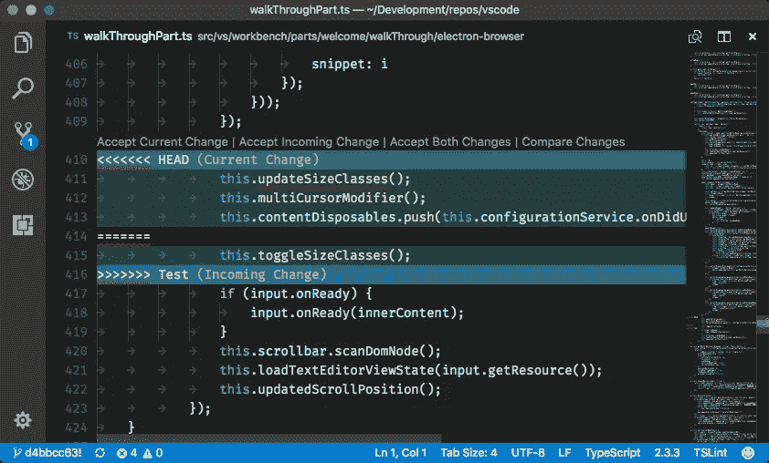
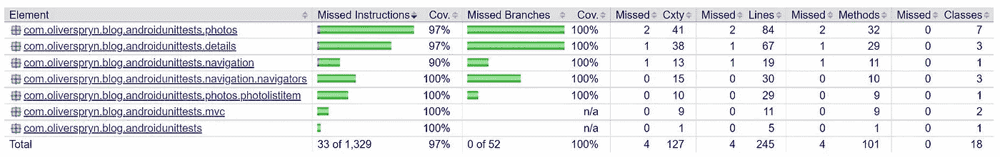
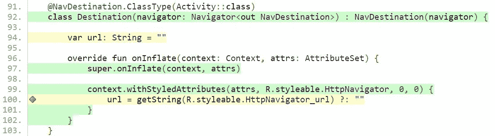

# 你的单元测试覆盖度量是错误的

> 原文：<https://levelup.gitconnected.com/your-unit-test-coverage-metrics-lie-7c81bdece5eb>

## 如何揭开真相

作为开发人员，我们非常信任我们的 ide。这些应用程序在我们的工作流程中赢得了特殊的位置，这是有原因的。他们就像一匹可靠的骏马，带着我们走过作为工程师的各种旅程。

然而，有时我们对这些工具过于自信，会把我们引入歧途。对于那些编写单元测试的人来说，你可能已经不知不觉地掉进了这个坑。尽管你的马尽了最大努力告诉你，但它能做的也就这么多了。

当谈到提供关于你的单元测试覆盖的见解时，有时我们需要下马，独自踏上这段旅程。本文将重点讨论这个陷阱，以及我们如何能够并且应该保持警惕，以避免其潜在的危险后果。

# 暴露的陷阱

说实话，在我们的 IDE 中，太容易相信覆盖率度量报告了。出现在编辑栏中的红绿条对它所呈现的信息的假设往往过于简单和天真。

让我们用一个代码示例来支持这种说法。考虑这个用 Kotlin 编写的构造函数:

一个简单的 MVC 实现，演示单元测试的脆弱性

一个好的单元测试套件将确保所有的输出(或者，在这种情况下，副作用)都被评估。然而，由于我们的 IDE 和覆盖率报告工具不是人类的，它们很容易被愚弄。考虑这个测试:

一个错误的单元测试，只测试了一个副作用，给了我完整功能覆盖的荣誉

如您所见，我只验证第一个属性是否已设置。然而，在 IDE 的阴沟里寻找给了我测试整个功能的信任。

Android Studio 中的覆盖率报告错误地显示了具有完全覆盖率的构造函数

除了显示命中和未命中的信息，槽中的颜色实际上没有什么附加价值。它测量一行代码在执行过程中是否被触及，而不是测试是否令人满意。

也许我们被训练成知道这是真的，但是在平凡的 unite 测试中很容易忘记这一点。对此能做些什么呢？

# 为你的报道创建一个心理地图

编写代码时，有必要改变您对工具的期望。这是我们从众所周知的骏马上下来把事情掌握在自己手中的时刻。

当你为一个新的函数、类或者代码段编写测试时，通过在你的头脑中从上到下的迭代来创建一个你已经覆盖的内容的思维地图是有帮助的。当你编写一个新的测试来覆盖一个特定的场景时，在你的头脑中检查这些行，然后向下移动到下一个分支。

即使你在 IDE gutter 的覆盖报告中得到了警报解除，也要忍住放松警惕的冲动，直到你的心理地图完成。让这一点为你所用的一些技巧:

*   更小的、特别关注的函数更容易在你的头脑中测试和维护这种映射。
*   在构建你的思维地图时，记录下所有的返回值和副作用。这个事实是金钥匙。输入和返回值/副作用之间的一切都只是你需要模仿的噪音。
*   不要忘记测试视觉上紧凑的代码周围的边界情况，例如零合并操作符(也称为 Elvis 操作符`?:`)和三元操作符。

# 利用你的优势

每个使用 Git 的人都见过一个 diff，所以我不需要详细说明它提供的好处。虽然思维导图对新代码很有帮助，但 Git 可以帮助您清理旧代码中的变化。

当您向现有结构中插入新代码并准备单元测试时，请考虑保持 Git diff 打开，这样您就可以快速消除不需要新测试或思维导图的代码部分。我的偏好是使用 [Visual Studio 代码](https://go.oliverspryn.com/vscode)。

Visual Studio 代码中的 Git diff，来自 GitHub 上的[项目库](https://go.oliverspryn.com/vs-code-git-diff)

这种方法将使关注您需要覆盖什么代码以及您应该如何最有效地完成它变得更加简单。这是一个可靠的方法，给了我丰厚的回报。

# 定期生成详细的覆盖率报告

如前所述，我对 IDE 生成的覆盖率报告的经验很少。当我真的需要更好地了解我的覆盖率时，我首先求助于分析代码的工具。

我指的是工具本身生成的详细的覆盖报告。对于我的日常开发，这将是 JaCoCo 对我的 Kotlin 应用程序的报告。虽然所有工具生成的指标都有相同的局限性，但是红绿条和详细指标之间的差异是惊人的。

对于这个例子，我有一个用 Kotlin 编写的 Android 应用程序，并由 JaCoCo 进行分析。这是我的应用程序覆盖健康状况的 5000 英尺视图:

JaCoCo 为我的整个 Android 应用程序生成的全面覆盖报告

这种方法的真正优势是显而易见的，只要您深入到测试中的单元，并可视化每一个可能的覆盖度量。例如，在我的测试中，我遗漏了零合并操作符。JaCoCo 指出这一行只有部分覆盖，而 IDE 将它标记为绿色。避免陷阱！

详细的覆盖报告在第 100 行显示了一个遗漏的分支

# 结论

每当我们工程师承担单元测试的责任时，我们都致力于更高的标准，并摒弃无忧无虑的编码实践。这项工作有时很有挑战性，我们会发现自己只能靠自己的手段来确保每个细节都得到正确处理。

我们必须保持在游戏的顶端，以实现单元测试的全部意图。虽然我们可以依靠可用的工具来帮助我们填补测试覆盖中的明显空白，但最终还是要靠我们对细节和记忆的关注来确保不遗漏任何一行或分支。

我们的工具尽了最大努力来帮助我们，但它们仍然倾向于在数字中加入一些善意的谎言。作为聪明的工程师，我们必须监管这些工具及其数量，以确保准确性。这样做，我们的应用程序将会从更好的测试中获益，并且我们可以对我们声称达到的覆盖率感到更好。

# 喜欢你读的东西吗？

媒体上还有成千上万篇类似的文章。我是这个网站的付费会员，我完全认为这项投资是值得的。[点击这里加入](https://go.oliverspryn.com/medium-membership)，你将会用你的一部分会员资格来支持我的工作。

本文原载于 https://oliverspryn.com/[。](https://go.oliverspryn.com/your-unit-test-coverage-metrics-lie)[加入我的邮件列表。](https://go.oliverspryn.com/medium-subscribe)