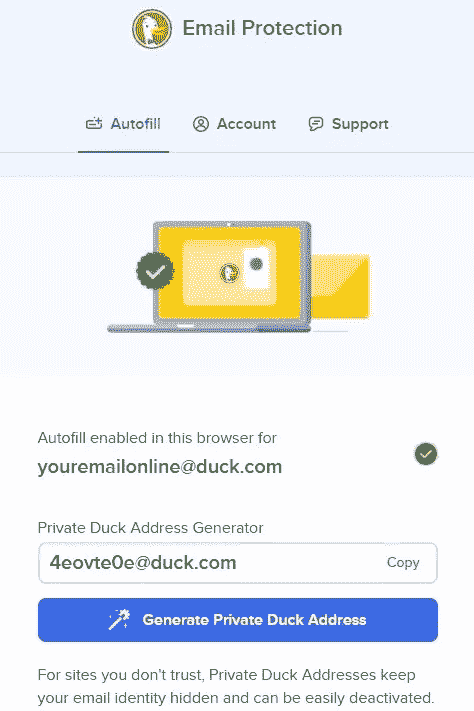

# 你的电子邮件被跟踪了，但是很容易阻止

> 原文：<https://levelup.gitconnected.com/youre-being-tracked-through-your-email-but-it-s-easy-to-stop-it-5cbc06806d1d>

## 为什么要妥协隐私？

斯蒂芬·菲利普斯-Hostreviews.co.uk 在 [Unsplash](https://unsplash.com?utm_source=medium&utm_medium=referral) 上的照片

你知道电子邮件发送者可以检测到你的脚步吗？他们可以跟踪你读了什么，什么时候，读了多少次，用什么设备读的，甚至你在哪里读的。

这在营销邮件和时事通讯中更常见。当你知道自己被跟踪时，这听起来很恐怖。你的电子邮件地址是你最好的标识符之一，数据经纪人和营销人员很清楚你的选择和信念。

然后，他们可以使用这些信息来创建一个更加全面的在线和离线活动档案。后来，他们把这些信息卖给其他公司。因此，你会收到很多来自你不熟悉的公司的电子邮件。

还有一个安全因素。如果你使用真实的电子邮件 id 登录一家公司的网站，该公司遭到黑客攻击，一个坚定的黑客可以对你的电子邮件地址做很多事情。

好消息是，你可以采取一些措施来确保你的电子邮件的隐私。最近出现了一个全新的服务:经过一年的测试，隐私优先搜索引擎的提供商 DuckDuckGo 推出了电子邮件保护服务。

这里有一些方法来保护你的电子邮件的隐私，以及为什么你应该考虑使用它们。虽然也有其他公司提供这些服务，但每个公司在保护客户隐私方面都有良好的声誉。

# 伪装你的电子邮件地址

保护你的电子邮件隐私的最好方法是不要泄露出去。无论如何，如果你想订购任何东西或得到一个不错的折扣，你需要使用你的电子邮件地址。

所以，这是有解决办法的。您可以使用为您提供别名电子邮件地址的服务。该电子邮件会将邮件重定向到原始电子邮件的收件箱。因此，发件人不知道你的真实地址，但你可以在你真实的收件箱里收到所有的邮件和报价。

苹果还提供了一种叫做“隐藏我的电子邮件”的功能，这可能是这种情况下最著名的例子。它也像承诺的那样工作。但问题是，它在苹果设备上的表现要比在其他设备上好得多。此外，非苹果设备的服务费用为每月 99 美分。

另一方面，DuckDuckGo 的邮件保护是完全免费的。它也适用于几乎所有的网络浏览器。你只需要安装一个 DuckDuckGo 扩展。它的工作原理就像隐藏我的邮件。设置很简单，您想要多少 alias 就有多少。

如果您不想使用别名服务，您可以向任何电子邮件提供商创建替代帐户。如果您不想使用真实的电子邮件地址，可以使用备用电子邮件地址。

这肯定会减少你真正收件箱里收到的垃圾邮件数量。我认为它远比使用您原来的电子邮件地址要好，但您不应该在许多地方多次使用一个电子邮件地址。

截图由作者拍摄

# 挡住那些追踪器

正如我前面提到的，邮件发送者知道你何时阅读他们的邮件。知道这一点你可能会感到不舒服，因为他们可以从中了解你很多。

追踪是通过一个像素来实现的——电子邮件中嵌入的图片非常少。当您打开电子邮件时，它会调用托管图像的服务器。因此，您的所有信息，包括您的 IP 地址，都存储在跟踪服务器中。

一些公司提供跟踪拦截服务。其中，苹果的邮件隐私保护免费且易于使用。但该服务仅面向苹果用户。

质子也有追踪器保护其用户。你将能够窥探跟踪你的公司，因为它将揭示哪些追踪器被禁用，他们是谁。但只有宝腾的网站提供跟踪保护。质子表示，它将很快在移动应用程序上可用。

DuckDuckGo 的电子邮件保护解决方案不特定于任何组织或操作系统。它能在追踪者到达你真正的收件箱之前找到并清除他们。

此外，它会让你知道一封电子邮件是否包含追踪器，以及是谁发送的。根据 DuckDuckGo 的说法，在电子邮件保护的 beta 测试中，新服务处理的大约 85%的电子邮件中发现了跟踪器。

> 最后，你可以通过进入你的电子邮件设置来停止被跟踪。确定您已选择不自动下载图像。您可以按照此操作，前往设置>通用>图像>显示外部图像前询问。这种方法的缺点是你会在邮件中看到破碎的图像图标。不过，它们完全无害。

## **最后一个提示**

这些服务和技术肯定会保护你的隐私，但请记住，没有什么是完美的。虽然跟踪拦截器工作良好，但跟踪服务和营销人员总是有机会开发新的方法来跟踪你。然后，我们将再次开始找出如何阻止这些追踪者。