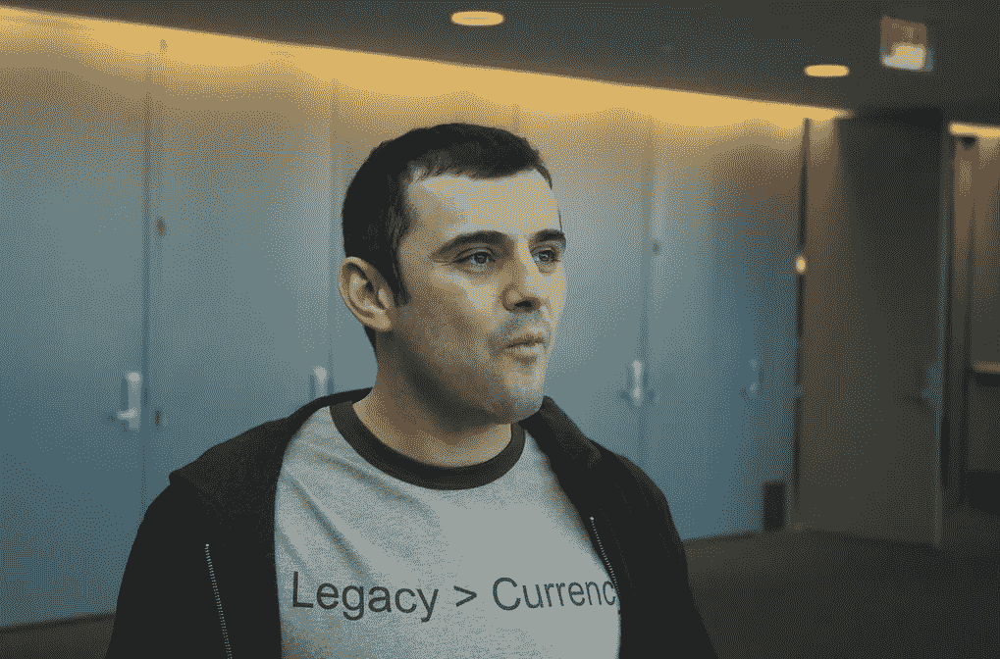

# 你在争论比特币是否是一种货币，而它已经是了

> 原文：<https://levelup.gitconnected.com/youre-debating-if-bitcoin-is-a-currency-when-it-already-is-gary-vaynerchuck-44ab7c922af0>

如果你考虑区块链如何发挥作用，那是最好的。

约翰·阿泰德在 Flikr 上的照片

加里·维纳查克是俄罗斯移民，有着根深蒂固的企业家基因。

他对复杂主题的简单解释，包括非常聪明的历史参考，使他具有吸引力。

小时候，当下雪时，Vaynerchuck 回忆起所有其他孩子跑出去玩雪橇，而他会抓起一把铲子，为人们清理车道，收取几美元。

Vaynerchuck 经常将商业与体育联系起来，并表示成为一名企业家就像成为一名运动员。

你要么是要么不是。

你要么有天赋，要么没有。

Vaynerchuk 的企业家精神从 7 岁时成功经营一个柠檬水摊位到十几岁时销售棒球卡，每周在床下藏 4000 美元。

作为一名连续创业者，他的成功是不可否认的，他创办了多家价值数亿美元的公司。

不过，他最被认可的技能是理解人类行为，并在趋势发生之前识别出它们。

*   1995 年，他利用电子邮件营销，将他的家族企业变成了一个价值 6000 万美元的帝国。
*   谷歌广告发布的当天，他就在上面做了广告。
*   他是 Twitter、脸书、优步和比特币基地的早期投资者。

他早期的见解之一是区块链技术，Vaynerchuck 认为这比人们意识到的要大得多。

他认为，你必须明白，鉴于点对点交易的无信任性质，区块链技术可以推翻美国、中国和俄罗斯。

当一群相对敌对的比特币最大化主义者问他是否投资了区块链技术或比特币时，他回应道。

> 加里·维纳查克:
> 
> “我在 2014 年买了比特币。
> 
> 我需要你们都吃一分钟。
> 
> 我喜欢向人们展示我的比特币基地；他们就像他妈的。
> 
> 我投了 25000 美元(估计价格是 300 美元)。
> 
> 区块链作为一种技术是完全没有定论的。然而，建立在此基础上的货币对每个赚了一百万美元的人来说都有巨大的波动性。有些人被毁了”。

Vaynerchuk 说，他每天都会收到那些购买了比特币、刷爆了信用卡、深陷抑郁和悲伤之中的人的电子邮件。

因此，他希望人们明白，当我们身处这些领域时，会有巨大的波动性，而且“还为时过早”。

> 加里·维纳查克:
> 
> “缺乏耐心，证明你是对的，或者你需要赚 1000 万美元，或者你脑子里在想什么，这些都是你的弱点。
> 
> 我们缺乏耐心是我们共同的弱点。你必须改变你的道路，从快速得分中摆脱这种淘金心态，真正喜欢区块链技术，相信去中心化。"

Vaynerchuck 说，就像他在 2006 年相信社交媒体一样，许多人来了又走。

即使是有很多追随者的人。

> 加里·维纳查克:
> 
> “我可以一直看到社交媒体，并呆在这个地方，因为我的行为没有慌张，我的裤子也没有着火，因为我认为社交媒体明天就会消失。
> 
> 我相信人们相信比特币是一种快速得分的游戏——他们需要更多的意识和教育来知道这一切是如何进行的。这就是你的机会。"

Vaynerchuck 认为，已经在区块链和比特币 echo 系统中的人走在了前面，因为他们明白区块链甚至正在发生。

他说不要低估早到，但是要记录正在发生的事情。

# Gary Vaynerchuck:你在争论比特币是否是一种货币，而它已经是了。

Vaynerchuck 表示，公民已经接受比特币作为货币，而政府反应缓慢，或者尚未公开其意图。

他相信政府不会坐视一种资产类别在他们眼皮底下增长，这就是为什么他认为比特币没有中间地带。

比特币要么一飞冲天，成为 S&P500 的第 12 部分，要么被政府重税打压。

他认为比特币已经出现，并且已经被越来越多的人接受为一种货币，这主要是因为人们创造了有价值的回声系统。

> 加里·维纳查克:
> 
> “作为一种公认的货币，比特币比在它之前出现的大多数东西都走得更远。
> 
> 我不能说，大多数人也不能说，什么应该和不应该被接受为价值。
> 
> 如果有足够多的人相信它，那么它就变成了。
> 
> 我总是提醒人们，在黄金没有任何意义之前，有些人生活在这个世界上。黄金是一个人造的回声系统。
> 
> 那样的话，f*ck 黄金，F*ck 比特币，郁金香呢？"

Vaynerchuck 认为这不是一个关于我们是否应该将比特币视为一种货币的游戏。

这是一个回顾历史的游戏，看看我们如何采用事物来表明我们对未来的期望。

他还说，人们崇拜过去，但否认今天或未来。

> 加里·维纳查克:
> 
> “我嘲笑人们天真地认为今天发生的事情或者我们从小到大所经历的事情就是一切的结束。这很可笑
> 
> 人类创造了回声系统。
> 
> 人们出售毛皮来购买被奴役的人，用高档葡萄酒来换取工人来建造东西。
> 
> 我们卖浆果给羊。
> 
> 人类将继续进化。随着我们变得越来越数字化，比特币之类的东西成为一种货币更有意义。"

# 最后的想法

围绕比特币是一种货币还是人们投机的一种价值形式的辩论让我想起了在它之前发生的许多事情。

下面是一些人们会说的话:

*   为什么我会在网上买东西，而商店就在路的尽头？
*   为什么我要带着手机，这样当我出去的时候人们就可以联系我了？
*   我为什么要在社交媒体上推广我的业务，因为它只面向儿童？
*   加密货币——我为什么要买我不能碰的东西？

人们在事物被接受之前就对其进行推测。而且大家对什么都会有看法，包括我。

比特币被 3000 多万人用作价值储存手段和交易媒介，其增长速度超过互联网，即使在这个低迷的市场中也是如此。

这最终将归结于政府如何监管比特币。他们可以完全禁止它，就像他们在 9 个国家所做的那样。或者征收重税并对其进行监管。

时间会证明一切。

> *如果你想在 Web3 上读到更多我的观点，请考虑成为会员。你的会员费直接支持你读的作家。如果你用我的链接* [*注册，我会赚一小笔佣金。点击这里*](https://medium.com/@jayden_levitt/membership) *。*

*本文仅供参考；不应将其视为财务、税务或法律建议。在做出任何重大的财务决定之前，你可以咨询财务专家。*