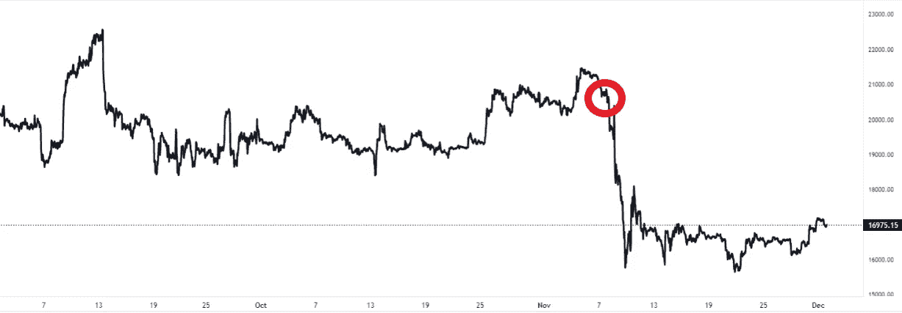

# 当比特币是唯一有意义的东西时，你却在追逐狗币(乔·罗根)

> 原文：<https://levelup.gitconnected.com/youre-going-after-dog-coins-when-bitcoin-is-the-only-thing-making-sense-joe-rogan-585de6d1fd3>

你会明白为什么你不需要成为专家就能对比特币有看法。

Josh Lindsay 在 Flikr 上的照片

乔·罗根是世界上最著名也可能是最有争议的播客。

当他谈论任何事情时，通常会产生分歧，令人捧腹大笑。

即使他对一个主题不确定或者不能用证据支持他的主张，他也会说出来，而且是从他嘴里说出来的。

他很乐意以后再处理后果。

罗根从不骑墙。他批评取消文化，并直言不讳地批评跨性别女性在所有形式的运动中与男性竞争。

他说变性游泳运动员[莉亚·托马斯](https://en.wikipedia.org/wiki/Lia_Thomas)“可能是压垮社会的最后一根稻草”。

看，他很搞笑。

他公开承认对加拿大的政治体系一无所知，但讨厌加拿大总理贾斯廷·特鲁多，称他为“一个该死的独裁者”

他很可能没有错。

尽管他游手好闲，这位美国 UFC 评论员、播客、喜剧演员、演员和前电视节目主持人却有着惊人的娱乐天赋。

他非常擅长自己的工作，以至于他的播客“乔·罗根的经历”平均每集有 1100 万人观看，这使他比大多数主流媒体更具影响力。

罗根对成功有着巨大的渴望，从小就对武术产生了兴趣，用他的话说，因为他“害怕成为失败者”。

> 乔·罗根:
> 
> “武术是第一个给我希望，让我不要成为失败者的东西。所以我被它吸引了。”

# 当人们失败时，比特币是唯一有意义的东西。

由于整个市场的崩溃，比特币最近一直占据媒体头条。

这主要是由于 FTX 的破产。

FTX 经历了 crypto 版的银行挤兑，当时客户在听说该公司流动性不足后，纷纷从 FTX 交易所取出资金。

AKA 没有钱，尽管他们的账面价值是 320 亿美元。

他们的创始人萨姆·班克曼-弗里德(Sam Bankman-Fried)在 Twitter 上撒谎说，他们有充分的担保，可以覆盖所有客户的提款。

事实并非如此，客户无法提取他们的资金，整个市场开始崩溃，抹去了比特币五年的增长，更令人不安的是，毁掉了人们一生的积蓄。

下面是一个用红色圈出的比特币图表，下面是 FTX 崩溃的日期。

来源— [交易视图](https://www.tradingview.com/symbols/XBT/)

罗根不是比特币专家。

但他表示，他看好这种数字货币，并盲目购买了一些，看起来像是一种彩票投资心态。

> 乔·罗根:
> 
> “我对加密货币抱有很大希望，真的。
> 
> 我不太了解它们，但比特币是其中之一，以太坊也是知情人谈论的话题。
> 
> 我的观点是，我们现在所看到的，要么是这样，要么是那样，要么是完全分崩离析，要么是我们将利用这个机会来调整这艘船，找到更好的生活方式。"

如果你在等待一个技术分析细目，你不会在这里找到它。

罗根是一个比特币理想主义者，他认为技术的潜力是积极变革的驱动力，也是个人保护自己免受专制政府侵害的一种方式。

罗根对山姆·班克曼-弗里德和 FTX 的崩溃也有自己的看法。

> 乔·罗根:
> 
> “他认为他会逃脱他正在做的事情。
> 
> 他可能认为自己做得很好。
> 
> 萨姆可能认为他比实际上要聪明得多。他是一个亿万富翁，不到 30 岁，假装慈善。
> 
> 他可能认为他是个混蛋，在一个房子里和九个人乱搞，还承诺把他的钱给别人。"

罗根指的是萨姆·班克曼-弗里德和其他九名 FTX 雇员的一夫多妻关系。

虽然不全是 9 个，但她们都睡在巴哈马一个价值 4000 万美元的豪宅里，用的是 FTX 客户的存款。

他们可能永远也拿不回来的存款。

罗根认为，比特币是加密之王，问题源于人。他甚至说，就连央行也有他不信任的数字货币。

> 乔·罗根:
> 
> “如果我们有一个集中的数字货币，我们会被骗，因为政府会像中国一样引入一个社会信用评分系统，所以当你想买东西时，他们会找上你。”

需要澄清的是，政府是否会为此目的使用央行数字货币。

我会坚定地把这归入阴谋论的范畴。

# 你在找狗币、海豚币和笑话币。为什么？

罗根说，对他来说，比特币比购买狗币更有意义。我推测他指的是 Dogecoin，一种作为笑话创造的加密货币，但最终获得了关注，现在市值为 140 亿美元。

> 乔·罗根:
> 
> “一度，这些硬币中的一些是以动物命名的。
> 
> 狗硬币，狗硬币，海豚硬币。笑话币。(讽刺)
> 
> 对我来说，比特币至少是半有形的，而且数量有限，创造比特币的人是这个神秘的家伙中本聪。
> 
> 比特币是加密之王。最受欢迎的，对我来说很有意义，尤其是联邦政府控制着一切。
> 
> 比特币是人们最依赖的东西。但即便如此，也有起有落。"

# 最后的想法。

乔·罗根谈论比特币只是再次提醒我们，数字货币正在渗入我们的回声系统。

他不是专家，也不需要成为专家。

你也不知道。

罗根还强调了比特币创造者对有影响力的人说任何关于比特币的负面言论的本能感受。

> 乔·罗根:
> 
> “关于比特币，我确实知道一件事。如果你说比特币很愚蠢，人们会想干掉你。”
> 
> 如果你谈论比特币，那些比特币制造者就会来找你。就像是一种宗教，一次触摸，一次喷洒。"

我从罗根的话中得到的潜在信息是，他在很大程度上是一个投机投资者。

他在玩他输不起的钱。

更有趣的是，他看到了比特币正在发生的一些事情，虽然他不能给你一个迈克尔·塞勒的崩溃，但有时参与进来并在以后解决其余的问题是好的。

> 如果你想在 Web3 上阅读更多我的观点，请考虑成为会员。你的会员费直接支持你读的作家。如果你用我的链接 [*注册，我会赚一小笔佣金。点击这里*](https://medium.com/@jayden_levitt/membership) *。*

*本文仅供参考；不应将其视为财务、税务或法律建议。在做出任何重大的财务决定之前，你可以咨询财务专家。*