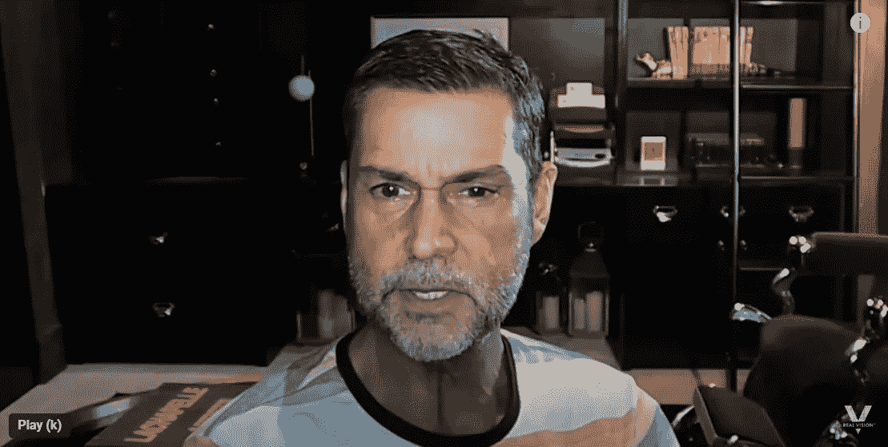

# 你在 2023 年 4 月前购买 Crypto 是一个巨大的错误(劳尔·帕尔)

> 原文：<https://levelup.gitconnected.com/youre-making-a-huge-mistake-buying-crypto-before-march-2023-raoul-pal-6192ea112695>

加密货币沙滩球只能在水下保存这么久。

来源——拉乌尔·帕尔——YouTube

我写过几次关于宏观经济投资者拉乌尔·帕尔的文章，因为他的预测，或者他称之为前瞻性指标，准确得惊人。

如果你从未听说过他，我之前的博客会在这里更深入地介绍他的背景——[劳尔·帕尔](https://medium.com/datadriveninvestor/world-renowned-analyst-says-metcalfs-law-shows-you-why-bitcoin-isn-t-going-away-589394762c81)。

拉乌尔·帕尔是前对冲基金经理和经济史学家，他运用巧妙的类比和历史参考来简化金融话题。

他通常对未来可能发生的事情打个赌。当他出错时，互联网会抓狂并大发雷霆。

当他是对的，人们继续他们的生活。

帕尔现在说，我们正在接近流动性周期的底部，但我们还没有到那一步，所以如果你打算涉足其中，你应该再坚持一段时间。

流动性周期有助于你确定何时投资和投资什么，因为资金流向你展示了哪些行业在变动。

当通胀高企、时局不确定时，人们倾向于投资大宗商品，这就是为什么我们看到科技股和加密货币遭到抛售。

帕尔认为，我们正在接近加密货币抛售的底部。他分析了三个方面来得出他的结论。

1.  利率变化率
2.  美元的变化率
3.  商品价格变化率

拉乌尔·帕尔表示，上述三个领域让你了解资金有多紧张，它们需要下降，以便我们看到加密货币市场的底部。

他说，如果这些下降，将减轻市场的压力，这是一个转折点的指标，他认为这将在未来六个月发生。

> 劳尔·帕尔:
> 
> “这些事情给我们带来了相当尖锐和严重的增长冲击。
> 
> 你将看到的叙述是，马可即将变得可怕，因此所有资产必须下跌。
> 
> 寻找转弯处。央行会说，在接下来的六个月里，失业率会上升。通货膨胀正在下降。
> 
> 如果变化速度停止，你就停止了对市场的压力。"

# 杠杆在把人吹大。

拉乌尔·帕尔说，由于借贷成本增加，过度举债的企业和个人将会破产。

> 劳尔·帕尔:
> 
> “找到流动性周期的底部就像一群人在街上说，
> 
> "嘿，伙计，你能借我一块钱吗，而你只有五块钱."
> 
> 如果十个人在问，那么，五个人不会明白。
> 
> 这就是流动性周期底部的情况。真正需要钱的人得不到，就炸了。"

帕尔说，人们会突然意识到，在加密货币中使用杠杆不是一个好主意，因为你总是会被发现。

你会看到谁在裸泳。

杠杆利用借入的资金购买资产，希望新投资的增长将超过你借入的金额。

根据 Pal 的说法，在加密货币中，这是赌博。

# 你将在 2023 年 3 月看到市场底部——你该买入了。

拉乌尔·帕尔表示，他的前瞻性指标显示，我们应该预计市场将在 2023 年 4 月触底，然后开始看到复苏缓慢回升。

他认为，当支点发生时，它将像一个在水下举行的沙滩球，因为加密货币的采用率和速度是前所未有的。

> 劳尔·帕尔:
> 
> “我们现在处于宏观周期的底部，沙滩球被放在水下。
> 
> 请记住，每天都有新人加入生态系统，并且有新的采用。
> 
> 像票务大师这样的人已经发行了 10，000 张 NFTS，却没有人意识到整个加密领域正在发生的规模。
> 
> 太可笑了。
> 
> 所以沙滩球目前在水下举行。
> 
> 当量化紧缩或加息停止时，沙滩球将浮出水面。
> 
> 你压不住它。"

劳尔表示，他对这一时刻很感兴趣，因为我们已经非常接近增长崩溃的临界点。

他说，美国已经经历了两次 GDP 负增长，房价和商品价格都在下跌。

拉乌尔·帕尔表示，市场的转折非常接近，加密货币的回报风险在 20 到 50 倍之间。

他确实表示，他选择了具有网络采用效应的加密货币，并且仍处于发现阶段，这就是他不全押比特币的原因。

> 劳尔·帕尔:
> 
> “比特币是主要资产中最没有吸引力的，因为它更稳定，网络效应更远；因此，当你得到进一步的网络效应时，你的增长会随着时间而减少。
> 
> 比特币在接下来的周期中会走向何方？谁知道呢，假设是 20 万美元。
> 
> 但是接下来我们看看以太坊的网络采用效果，以及有多少人在以太坊网络上建设。
> 
> 那里的增长可能是指数级的。"

# 最后的想法。

拉乌尔·帕尔的投资论文基于梅特卡夫定律。

这个想法表明网络的价值在于使用它的人，而不仅仅是技术的优点。

就像社交媒体或电话的使用一样，每个新用户都为其他网络用户增加了效用和价值。

拉乌尔·帕尔选择了加密货币，因为网络的采用，加密货币的应用程序建立在上面。

比特币没有这个效用。它被用作价值储存手段和数字商品。

虽然还不清楚拉乌尔·帕尔把他的钱投资在什么地方，但据说他对“下面的区块链”很感兴趣，因为他们有可能被网络采用。

*   以太坊
*   索拉纳
*   雪崩
*   阿尔格兰德

值得一提的是，劳尔·帕尔 36 岁退休，免税居住在开曼群岛，净资产为 4500 万美元。

他的现金盈余使他能够在未经证实的资产上冒险，而对他来说，把握市场时机有很大的不同。

他的工作还包括研究这些资产，并找到正确的投资时机。

我坚持比特币和以太坊，在索拉纳和美元平均成本进入这些资产的对冲较小。

我们可能会在 2023 年 3 月触底，也可能不会。

> 如果你想在 Web3 上阅读更多我的观点，可以考虑成为会员。你的会员费直接支持你读的作家。如果你用我的链接 [*注册，我会赚一小笔佣金。点击这里*](https://medium.com/@jayden_levitt/membership) *。*

*本文仅供参考；不应将其视为财务、税务或法律建议。在做出任何重大的财务决定之前，你可以咨询财务专家。*