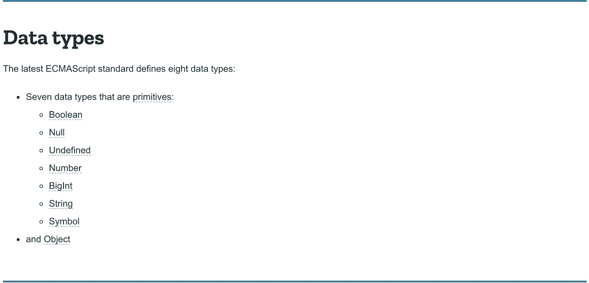
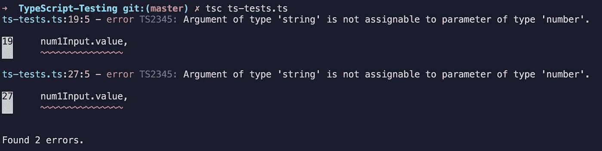
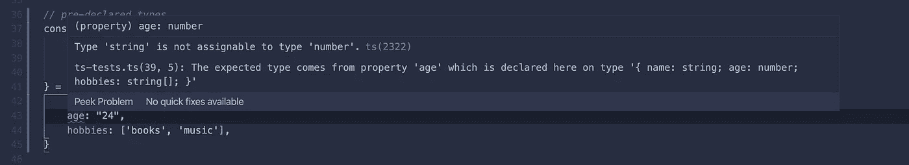
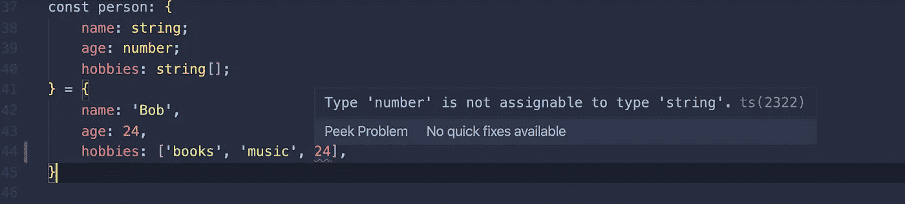
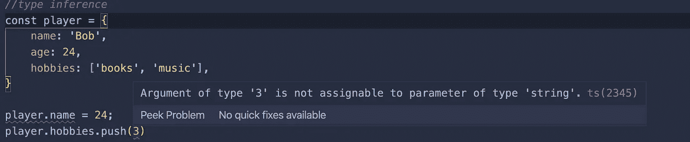
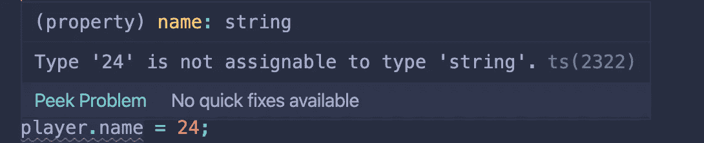
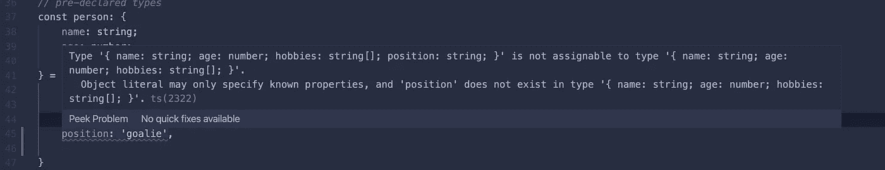
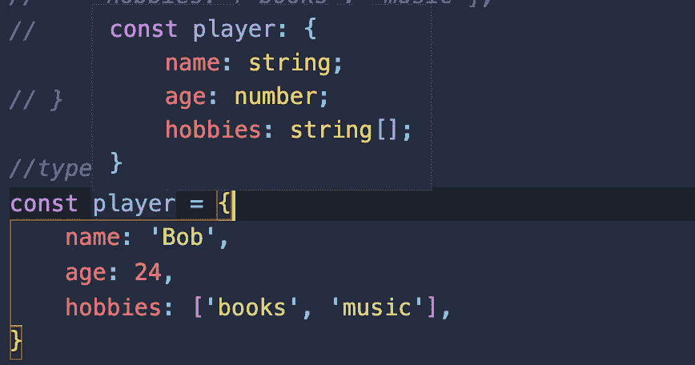

# 你不是我的(数据)类型:TypeScript 介绍—第 1 部分

> 原文：<https://levelup.gitconnected.com/youre-not-my-data-type-an-intro-to-typescript-38dab9cdc90a>


TypeScript 是 JavaScript 的超集

如果您以前曾经使用或编写过 API，您会知道正确使用它的一个重要部分是理解响应中的数据。为了处理数据，您需要理解它进入的**形状**，以及该形状内的**数据类型**。TypeScript 允许我们预先确定数据的形状和类型，以便**避免错误**并让**组织代码**。

TypeScript 是 JavaScript 的超集，所以任何有效的 JavaScript 也是有效的 TypeScript。这也意味着它**必须被编译**成常规的 JavaScript，浏览器或节点才能运行它。由于 TypeScript 在运行之前告诉我们的代码我们期望什么数据类型，它通过更早地捕捉错误来节省时间。这使得我们的代码**更加可预测和可读**。

这听起来可能令人困惑，但我们可以简单地将 TypeScript 视为帮助我们编写更好代码的工具。我们的类型脚本与编译后的 JavaScript 不会有太大的不同。

## JavaScript 中的类型

JavaScript 是 ***动态类型化*** ，也就是说可以声明变量，而不需要将变量限制在特定的数据类型。如果您忘记了，JavaScript 有 8 种不同的原始数据类型，由 [MDN](https://developer.mozilla.org/en-US/docs/Web/JavaScript/Data_structures) 指定:



原始数据类型

在这篇文章中，我们将使用一些原始数据类型和一些数据结构。

## 编译成 JavaScript

为了使用 TypeScript，我们所要做的就是安装 npm 包。如果你想在你的机器上全局安装它，你可以使用`-g`标志。否则，在您选择的启用 npm 的回购中运行它，而不使用`-g`。

```
npm install -g typescript
```

为了编译我们的 TypeScript，我们需要运行一个命令— `tsc`或 TypeScript 编译器。

```
tsc your-typescript-file.ts 
```

TypeScript 可以集成到您的构建工具中，并与框架一起使用，但是最简单的入门方法是在命令行中自己编译它。*注意:我将使用 VSCode 来演示，因为它与 TypeScript 有很好的集成——我强烈推荐使用它！*

# 建立原始类型

我们将从一个简单的 web 页面开始，它接受两个数字，一个可选的字符串，并返回这两个数字相加后的结果，不管有没有字符串。尝试下面代码笔中的功能。

非工作网页。

看起来我们在从输入中提取值时忘记了解析整数，所以我们得到的只是字符串连接。我们没有得到任何错误，因为我们的代码在语义上是正确的——我们不得不等到运行代码时才发现有问题。让我们看看在这种情况下 TypeScript 将如何帮助我们。

正确键入的代码

我们先分解一下 add 函数。我们现在告诉我们的 add 函数，希望我们传递给它的所有变量都是特定的类型——它希望`thing1`和`thing2`是数字，`phrase`是字符串，`showString`应该是布尔值。现在，当我们试图编译这段代码时，TypeScript 会给出以下错误:



看看这些精彩的错误！

TypeScript 告诉我们错误所在的确切行，以及错误是什么。太神奇了！我们需要做的就是在传递给我们的 add 函数时添加`parseInt`。

上面代码笔的工作版本。

## HTML 元素类型

当我们为上面的 HTML 元素声明变量时，我们在声明的末尾包含了`! as HTMLXElement`。TypeScript 还内置了 HTML 元素的类型，以确保您不会对这些元素进行任何非法操作。例如，如果我们试图在上面的代码中调用`answer.value`，TypeScript 会给我们一个错误，因为`value`从未在`span`元素上使用过。DOM 类型化是一个更高级的主题，所以我在这里不深入讨论，但是查看页面底部的参考资料可以获得更多信息。

# 对象和数据结构类型

既然我们已经讨论了一些基本类型，让我们继续讨论结构类型。TypeScript 允许我们提前定义对象和数组的外观。请记住，在 JavaScript 中，调用对象的未知属性只会导致`undefined`，而不会抛出错误。

在上面代码的顶部，我们定义了一个对象，并将其保存到变量`Person`。在定义对象之前，我们使用 TypeScript 来定义对象将具有哪些键，以及这些键值需要的类型。现在，如果我们试图将字符串“24”赋给年龄值，我们会得到一个错误。*注意:VSCode 的另一个好处是，通过代码突出显示，我们甚至可以在编译之前立即得到错误。甚至更快的错误检查！*



突出显示对象的错误类型分配错误

我们还必须定义我们的`hobbies`数组可以容纳的类型。



用数组突出显示错误的类型赋值错误

如果您试图在对象定义后不正确地对其进行变异，也会发生这些错误:



突出显示对象的错误类型分配错误



突出显示对象的错误类型分配错误

如果我们试图添加另一个没有预定义的键值对，我们也会得到一个错误。



突出显示对象的额外键值错误

当您知道对象或数组需要的形状时，预定义您的结构会很方便，但是如果您需要向它们中的任何一个添加一些东西呢？每样东西都要更新两次，似乎有点繁琐；那不是很干。TypeScript 可以通过**类型推理来解决这个问题。**

# 类型推理

如果您没有为您的数据结构预定义类型，TypeScript 可以从赋值中**推断出**类型。让我们看看 VSCode 中强调的要点的第二部分中的代码。



突出显示类型推断的对象

哇哦。TypeScript 通过推理为我们完成了键入对象所有工作。现在我们可以添加另一个键-值对，而不用担心改变我们的定义。当您知道您的类型将相当简单时，这尤其有用。

# 还有更多…

TypeScript 是一种深度语言，具有许多改进 JavaScript 的特性。我已经在这篇博客中介绍了一些关于原始数据类型的基础知识。在[的下一期](https://medium.com/@gianfranconuschese/youre-not-my-data-type-an-intro-to-typescript-part-2-b2001f9e2225)中，我将介绍类型脚本、函数类型和接口特有的类型。

# 资源

[](https://medium.com/@gianfranconuschese/youre-not-my-data-type-an-intro-to-typescript-part-2-b2001f9e2225) [## 你不是我的(数据)类型:TypeScript 介绍—第 2 部分

### 注意:这是我之前在这里写的博客的延续。如果你是打字新手，我高度…

medium.com](https://medium.com/@gianfranconuschese/youre-not-my-data-type-an-intro-to-typescript-part-2-b2001f9e2225) [](https://medium.com/javascript-in-plain-english/typescript-61097f3b0dc4) [## TypeScript:认识 JavaScript 的父代

### 什么是 TypeScript 以及为什么应该使用它。

medium.com](https://medium.com/javascript-in-plain-english/typescript-61097f3b0dc4)  [## 已经熟悉 TypeScript 了？

### 编辑描述

www.typescriptlang.org](http://www.typescriptlang.org/docs/home.html) [](https://medium.com/@tomsu/typescript-tips-tricks-c8fdef998d50) [## 打字稿—提示和技巧

### 改进您的类型脚本代码的更多和更少为人所知的方法

medium.com](https://medium.com/@tomsu/typescript-tips-tricks-c8fdef998d50)