# 你不是我的(数据)类型:TypeScript 介绍—第 2 部分

> 原文：<https://levelup.gitconnected.com/youre-not-my-data-type-an-intro-to-typescript-part-2-b2001f9e2225>

*注意:这是我之前写的* [*的延续。如果你是 TypeScript 的新手，我强烈建议你从第一篇博客开始，然后再看下面的内容。*](/youre-not-my-data-type-an-intro-to-typescript-38dab9cdc90a)

TypeScript 是 JavaScript 的超集。

既然我们已经讨论了基本数据类型和数据结构的基本赋值，我们可以继续讨论 TypeScript 提供的一些更非传统的特性。

# TypeScript 中的新类型

由于 TypeScript 是 JavaScript 的超集，它可以访问 JavaScript 中所有可用的数据类型。然而，我们还必须记住，因为 TypeScript 是一个编译成 JavaScript 的工具，所以 TypeScript 可以访问新类型。

预定义和类型推断的 TypeScript 对象。

## 元组和联合类型

我们要看的第一种类型是一个**元组**。元组是一个固定长度的数组，在每个槽中都有预先确定的类型。在上面的对象中，我们已经定义了`player`对象的`team`属性是一个 tuple——一个包含一个字符串和一个数字**的数组。**下面是一个错误的例子，如果元组被错误地赋值，我们会得到这个错误。

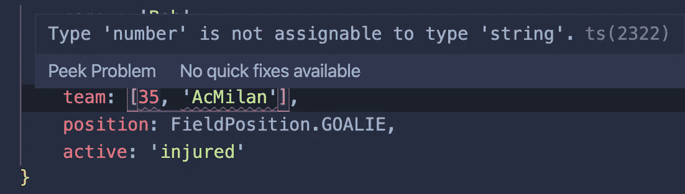

元组的类型分配不正确

我们遇到了 TypeScript 的类型推断问题——记住 TypeScript 可以为您推断类型。这是在上面的类型推断对象上的 VSCode 突出显示中弹出的内容。

联合类型的类型推理

注意，在编写元组时，我们声明了数组`team:[string, number]`中的类型，但是 TypeScript 以不同的方式进行了推断。这就是所谓的**联合**型。当一个变量可以有多种类型时，我们列出可以用“|”分隔的类型。在这种情况下，TypeScript 推断我们的元组实际上是一个数组，其中可以有字符串**或**数字。请记住，在使用元组时，您必须声明元组，而不是依赖类型推断。

## 枚举类型

枚举类型是给一组数值命名的一种方式。在上面的例子中，我们创建了一个名为`FieldPosition`的枚举，并为玩家可用的四种位置类型分配了名称。我们通过调用`FieldPosition.GOALIE`将`“GOALIE”`值赋给鲍勃。

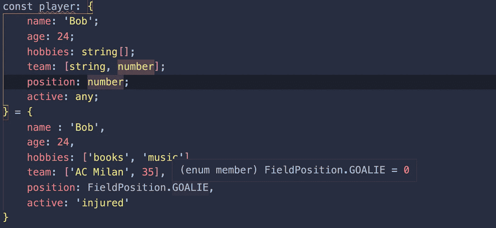

枚举类型的赋值

因为`"GOALIE"`是数组中的第一项，所以它是数值 0 的名称，这也解释了为什么我们将类型预定义为`Number`。枚举从 0 开始，很像数组，但是如果我们定义起始数字，后面的每个数值将按顺序排列。

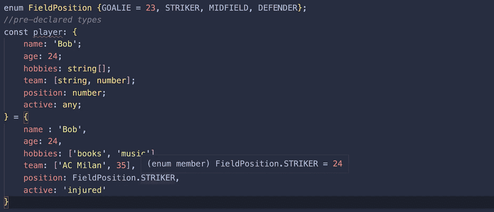

为第一个枚举类型分配一个新数字。

## 任何类型

`any`类型是不言自明的——当我们不知道我们的变量应该或将要是什么类型时，就使用它。应该尽可能少地使用`any`类型，因为它计划不周，而且与 TypeScript 的目的有些背道而驰。一个好的替代方法是依靠类型推断。

在上面的例子中，我们在`player`上的`active`属性被赋予了一个 any 类型，所以我们放了一个字符串来表示他是`‘injured’`。然而，在我们的类型推断版本中，我们放了一个布尔值`false`，它看起来更直观，并且通过锁定类型可以更好地计划。

## 文字类型和类型别名

在 TypeScript 中，我们还可以将我们的类型限制为特定的值。**文字**类型有点像 JavaScript 中的`const`关键字，锁定了变量的值。然而，使用 **Union** 类型，我们可以将我们的类型限制为几个选择，而不是只有一个值。让我们用它来替换上面例子中的枚举类型。

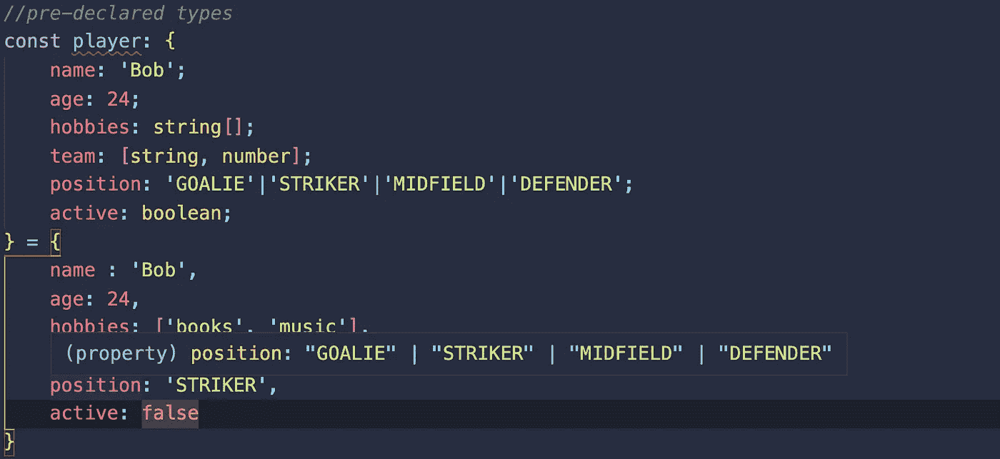

对 position 属性使用文本类型

现在我们的 position 属性只能是字符串`‘GOALIE’|’STRIKER’|’MIDFIELD’|’DEFENDER’`中的一个。因为我们明确声明了类型的值，所以我们不能利用类型推断。然而，我们可以将我们的文字类型存储在类型别名中，这样如果需要的话，我们可以在其他地方重用它。

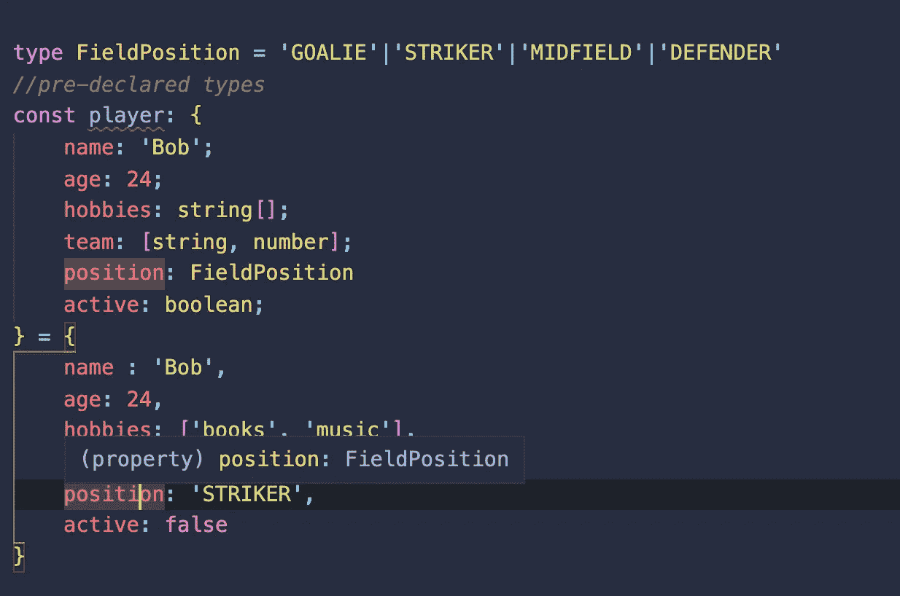

使用类型别名定义文本类型。

在这种情况下，我们使用别名`FieldPosition`来存储使用关键字`type`的类型。现在，无论我们在哪里赋值`FieldPosition`，我们都被限制在四个字符串值。

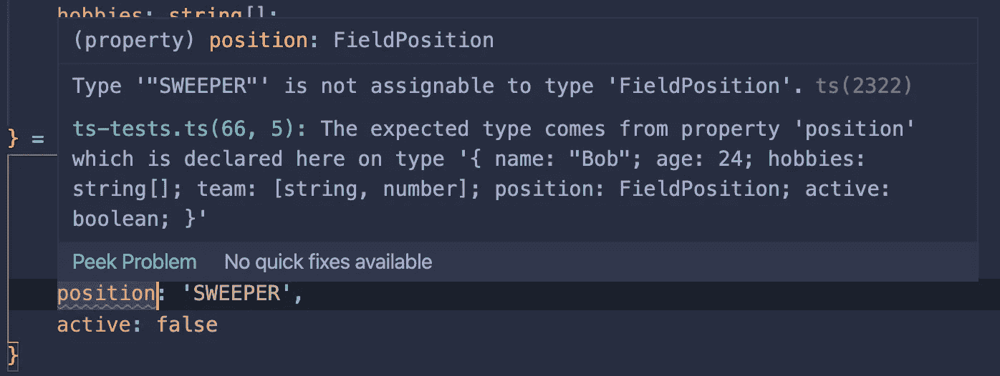

FieldPosition 别名的类型分配错误

这里要注意两件重要的事情:你可以使用任何带有类型别名或文字类型的类型或值。我只是在这里使用了字符串。例如，我们可以创建一个带有`type JerseyNumber = number`或`typeJerseyNumber = number | string`的球衣号码类型，这取决于我们想要的类型。类型别名最常用于联合或元组类型。

类型别名对于建立变量非常有用，但是它们不应该用于对象。记住类型别名就是别名。如果我们想对对象做任何改变，我们也必须[改变类型](https://blog.fullstacktraining.com/typescript-interfaces-vs-types/)。为了使我们的对象更加灵活，我们使用接口。

# 接口

除了一些例外，接口就像一个预先声明的对象。接口可以通过添加“？”来获取可选参数。使用接口的类不限于接口参数，只要所有必需的参数都存在。接口也可以像类一样互相扩展。

用类实现接口

上面，我已经将我们的 player 对象重构为一个接口。我用我们的界面创建了一个新的播放器，但是 TypeScript 抛出了一个错误。

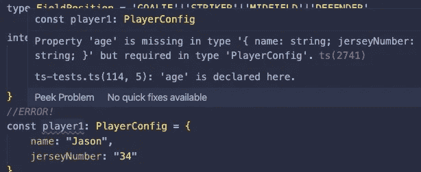

对象缺少接口中所需的值

`Player1`有一个`name`和`jerseyNumber`，但是它没有一个`age`。由于`age`是**而不是**可选参数，TypeScript 抛出一个错误。

现在我们来看看`Player`的类声明。在构造函数中，我们在所有变量参数之前调用`public`,使它们可以在类外访问，所有的参数都带有“？”是可选的。注意，我们没有得到任何关于`active`的错误，但是我们得到了一个关于`jerseyNumber`的错误。

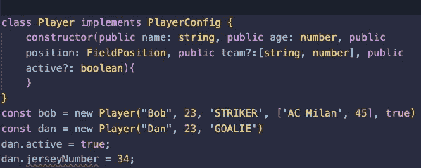

用 PlayerConfig 实现类播放器

这是因为我们**需要在我们的类构造函数中声明参数。**我们的类总是可以添加更多的属性，只要每个类实例**都有接口中定义的名称和年龄。Bob 没有错误，因为我们已经考虑了我们的类构造函数中的附加内容。Dan 也是有效的，因为它满足了我们原始接口的需求。**

然而，这是一个糟糕的计划。我们应该改变或扩展我们的接口来考虑所有这些属性。

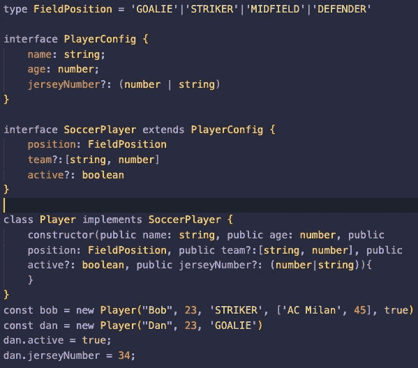

具有接口的类的最终实现

# 功能类型

最后要看的是函数类型。我们可以通过将类型放在参数后面的冒号后面来为函数的返回值分配类型。如果我们看看上面的第一个`add`函数，我们知道它是不正确的，因为该函数应该总是返回一个数字。 **TypeScript 也知道，因为它可以对函数使用类型推断。**

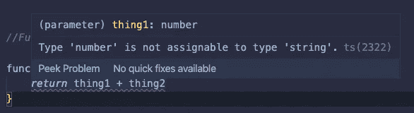

推断返回类型错误的 TypeScript

因为我们已经声明返回值需要是一个字符串，所以它在函数的返回部分显示了一个错误。但是，最好是简单地声明一个数字类型，或者让 Typescript 推断类型。

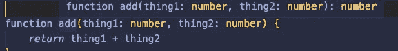

add 函数上的类型推理

最后一个函数有一个`void`类型。因为函数**不返回任何东西，**的返回值不存在。然而，为了避免错误和更好地理解我们的代码，我们标记 void，因为 Javascript 中的函数如果没有指定，将总是返回 undefined。

# 资源

 [## 你不是我的(数据)类型:TypeScript 简介

### 如果您以前曾经使用或编写过 API，您会知道正确使用它的一个重要部分是理解…

levelup.gitconnected.com](/youre-not-my-data-type-an-intro-to-typescript-38dab9cdc90a)  [## 已经熟悉 TypeScript 了？

### 编辑描述

www.typescriptlang.org](https://www.typescriptlang.org/docs/home.html)  [## 如何(以及为什么)将 Typescript 用于 Node 和 Express。

### 为什么要在大型项目中使用 Typescript。

medium.com](https://medium.com/javascript-in-plain-english/typescript-with-node-and-express-js-why-when-and-how-eb6bc73edd5d)  [## 过载#

### 函数是 JavaScript 中任何应用程序的基本构件。它们是你建立一层层…

www.typescriptlang.org](https://www.typescriptlang.org/docs/handbook/functions.html)