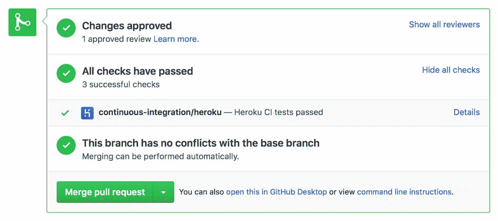
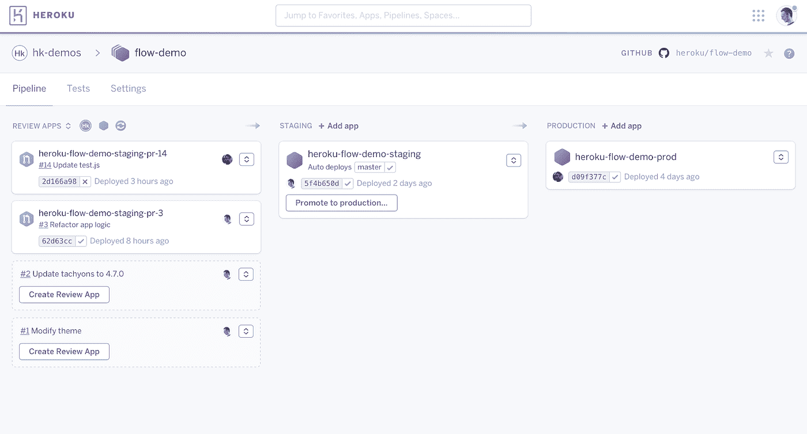
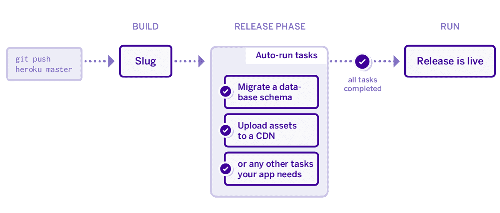

# 零停机部署:Heroku 上 CI/CD 的最佳实践

> 原文：<https://levelup.gitconnected.com/zero-downtime-deployments-best-practices-for-ci-cd-on-heroku-1bb4ac1f6928>

当你的应用关闭时是什么感觉

我遇到了一家初创公司的首席财务官，他告诉我，他们依赖一家供应商来执行一个关键的后端流程。令他沮丧的是，由于供应商过时的部署流程、手动测试程序以及每次新版本发布时半天的例行停机时间，他的客户和业务都被中断了。他需要一个可靠的服务，随后结束了关系。

避免停机，同时降低用户在部署应用程序时面临重大变更的风险是一项重大挑战。作为一名软件工程讲师和 Heroku 的活跃用户，我将向您展示如何最小化部署风险，并实现零停机部署。我们将使用 Node.js 应用程序作为例子，但是这些实践和过程可以转移到从 PHP 到 Elixir 的所有应用程序中。

# 最大限度地降低部署风险，以及为什么这是一项挑战

在已部署的应用程序中，向用户暴露破坏性更改的风险不能被夸大。最多是用户对你的非功能性 app 有负面体验(还是很不好)；在最坏的情况下，该错误可能具有重大的安全隐患，并破坏用户信任和客户关系。

不幸的是，没有任何过程可以完全防止部署 bug。你将发布破解代码。重要的是您能够以多快的速度识别问题并修复它们，或者更好的是，使用持续集成和持续交付(CI/CD)管道在问题部署到生产之前识别和诊断问题。

您可以保护您的应用及其用户免受代码损坏、可用性问题和部署流程问题的困扰，同时实现零停机部署。通过自动化您的部署过程，您还将拥有更快的部署过程和更短的从代码签入到生产的交付时间的优势。这里有几个在 Heroku 上部署应用时可以遵循的最佳实践。

# 最佳实践

## CI/CD 和自动化测试

支持敏捷开发团队的现代开发操作需要 CI/CD 和自动化测试。不管你用的是什么(Circle CI，Travis，Heroku CI，AWS CodePipeline 等等。)，运行自动化测试套件作为您的部署过程的一部分是现代的需要，也是简化开发的最佳实践。

如果您正在部署到 Heroku 并使用 [GitHub 集成](https://devcenter.heroku.com/articles/github-integration)，那么 Heroku CI 可以在每次部署时运行您的应用程序的测试套件，使您能够在合并或部署应用程序的重大更改之前轻松查看测试结果。Heroku CI 也很容易配置——只需查看[如何使用 Heroku CI](https://devcenter.heroku.com/articles/heroku-ci) 或 [Heroku CI 特性和功能](https://devcenter.heroku.com/articles/heroku-ci)了解更多信息。

Heroku CI 还支持在多达 32 个 dynos 上分布测试运行，以大大减少执行时间。

## 多重动态

仅仅有好的 CI 工具是不够的，您应该横向扩展您的 dynos，以获得足够的冗余来帮助确保正常运行时间、应用可用性和良好的用户体验。因为 dynos 每天循环维护应用程序的稳定性，有时会停机维护，所以您必须在生产中使用至少两个或更多 dynos 来实现零停机时间。

根据您的服务或应用程序的吞吐量要求，您可能还希望垂直扩展以确保足够的预留容量。Heroku 在这里提供了出色的开发人员体验，并通过简单易用的命令行界面实现了垂直和水平扩展。

## 查看应用程序

有什么比在安全的测试环境中运行应用程序更好的方法来识别 bug 和重大变更呢？在成功的 GitHub pull 请求后，在一个新的、一次性的 Heroku 应用程序中运行你的代码。每个 Review 应用程序都有一个你可以分享的独特的 URL，这使它们成为一种在整个开发团队中零风险地建议、测试和组合变更和修改的极好方式。对于每个拉取请求，您可以配置自动创建的审阅应用程序，也可以手动构建它们。

为了让你的 review 应用程序工作，在你的应用程序的 GitHub repo 的根目录下创建一个 [app.json](https://devcenter.heroku.com/articles/github-integration-review-apps#the-app-json-file) 文件。app.json 文件用于配置创建拉请求时创建的新应用程序。app.json 文件是一个强大的工具，允许您在使用附加组件提供者的默认计划提供附加组件时指定值继承。

## Heroku 管道公司

Heroku Pipeline 是共享相同代码库的 Heroku 应用的集合。管道中的每个应用程序都代表了[连续交付](http://en.wikipedia.org/wiki/Continuous_delivery)传送带中的以下阶段之一:开发、评审、筹备和生产。

显然，在软件工程行业中，维护一个与产品并行的阶段化环境几乎无处不在**；**管道有助于控制这种多阶段部署流程。一个[示例流水线工作流程](https://devcenter.heroku.com/articles/pipelines)具有以下步骤:

1.  开发人员创建一个 pull 请求来添加一个新特性或修复一个 bug。
2.  Heroku 随后自动为拉取请求创建一个[审查应用](https://devcenter.heroku.com/articles/github-integration-review-apps)，允许开发人员在准备或生产之前测试应用。
3.  如果变更通过了所有的手动和自动测试，它将被合并到主分支。
4.  主分支[被自动部署](https://devcenter.heroku.com/articles/github-integration)到管道的分级应用，以进行进一步测试。
5.  准备就绪后，开发人员[会将](https://devcenter.heroku.com/articles/pipelines#promoting)分期应用程序推向生产。

以下是文档中的管道图示例:

管道只管理代码段的流动。您的应用程序的 [Git repo](https://devcenter.heroku.com/articles/git) 、 [config vars](https://devcenter.heroku.com/articles/config-vars) 、 [add-ons](https://devcenter.heroku.com/articles/managing-add-ons) 和其他环境变量必须分开管理。或者，评论应用程序可以继承配置变量(T21)，这是一个有用的生活质量功能。

## 促进生产

在提升到生产之前的最终手动审查是一个重要的质量控制检查，否则大部分是自动化的过程。即使是最强大的自动化测试过程，人类也可能发现一些漏网之鱼，所以不要为了追求自动化效率而完全脱离人类的监督是很重要的。此外，当事情出错时，有人专门负责会更有趣(开玩笑——看看 [Nickolas 的意思是“关于复杂自动化系统中的系统故障以及如何在团队中建立心理安全的同时避免这些故障的精彩演讲](https://www.youtube.com/watch?v=1xQeXOz0Ncs)”。

在 CLI 中，您可以使用以下命令升级 slug(该命令必须指定源应用程序的名称(使用(-a)标志或 Git remote 使用(-r)标志):

> $: heroku 管道:promote -r 登台

带有用法详细信息的管道命令的完整列表可从以下网址获得:

> $: heroku 帮助管道

## 发布任务(迁移)

Heroku 的[发布阶段特性](https://devcenter.heroku.com/articles/how-heroku-works#releases)允许您在部署应用程序之前执行某些任务。如果一个发布阶段的任务失败了，新的发布就不会被部署，使您当前的发布不受影响，从而降低了部署重大变更的风险。发布阶段对于将 CSS、JS 和其他资产从应用程序的 slug 发送到 CDN 或 S3 存储桶、启动缓存存储或使其失效，或者运行数据库模式迁移等任务非常有用。

需要注意的是，在 Heroku 的架构中，发布、slug 和评论应用都是不同的概念(为了清晰起见，请参考[这篇关于 Heroku 如何工作的高级技术描述](https://devcenter.heroku.com/articles/how-heroku-works#releases))。每当创建一个新的[版本](https://devcenter.heroku.com/articles/releases)时，release 命令就会在一个一次性的 dyno 中运行，除非该版本是由一个附加组件的配置变量的变化引起的。

以下事件会创建新版本:

1.  成功的应用构建
2.  配置变量的值的变化(除非配置变量与附加组件相关联)
3.  一次[管道](https://devcenter.heroku.com/articles/pipelines)推广

在 Procfile 中定义发布任务:

> 发布:。/release-tasks.sh

## 预启动

救命啊！我的应用程序启动时间很慢，并且在 dyno 重启期间应用程序不可用。预启动是解决方案。 [preboot](https://devcenter.heroku.com/articles/preboot) 不是在启动新的 web dyno 之前停止现有的 web dyno，而是在现有的 web dyno 停止之前启动新的 web dyno(并允许它们接收流量)。

要启用运行:

> $: heroku 特性:enable -a myapp 预引导

使用这个功能有很多潜在的陷阱，所以在使用它之前一定要阅读预引导的[警告。例如，当您使用预启动进行发布时，您将同时运行两个版本的代码(重叠时间长达 3 分钟)，尽管只有一个版本将服务于用户请求。这可能会导致外部服务和一些 Heroku 附加组件出现问题。](https://devcenter.heroku.com/articles/preboot#caveats)

## 生产监控和 APM

伟大的 DevOps 不仅仅停留在部署阶段。Heroku 在其市场上提供[内置的应用指标](https://devcenter.heroku.com/articles/metrics)和[数百个插件](https://elements.heroku.com/addons/)，使得在生产中设置应用监控变得容易。使用 New Relic 和 AppOptics 等应用性能管理(APM)服务来快速识别和修复问题。

DevOps 团队(或开发团队)可以监控错误率，记录特定于组件的延迟和吞吐量，以及表面错误/故障和导致它们的条件。Heroku 生态系统中的其他监控、日志和错误诊断工具，如 Pingdom、Papertrail、Rollbar 和 StillAlive 也是可用的插件。这些工具有利于任何生产应用程序和团队改进他们的产品，或者在出现问题时快速解决问题。

# 结论

通过平稳、轻松的 CI/CD 流程实现零停机部署应该是大多数复杂生产应用程序的目标。应用这些最佳实践来帮助您的团队创造出色的用户(和开发人员)体验。