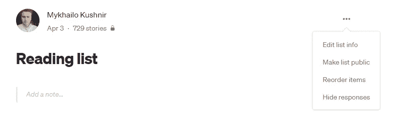
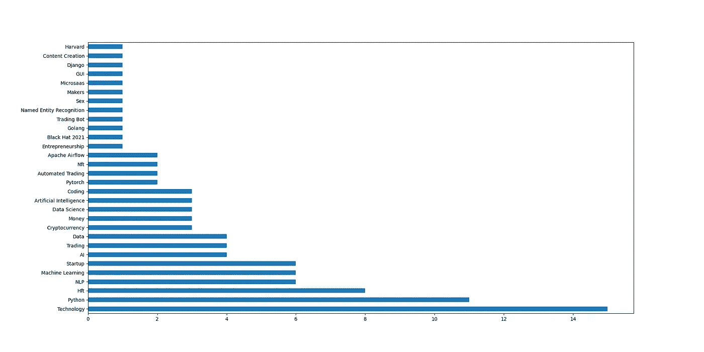

# 你的中等阅读清单的零次分类

> 原文：<https://levelup.gitconnected.com/zero-shot-classification-of-your-medium-reading-list-f9e7473de600>

从你乱七八糟的书签中整理出顺序

克里斯汀娜·戈塔迪在 [Unsplash](https://unsplash.com/s/photos/pile-of-books?utm_source=unsplash&utm_medium=referral&utm_content=creditCopyText) 上的照片

刮擦应该是实用的——根据这句格言，我花了周日大部分时间试图为我臃肿的阅读清单编制一个解决方案。当我写这篇文章的时候，有 700 多页，如果你是一个长期的媒体订阅者，我相信你能理解。

手动遍历它们将是一项艰巨的任务，所以我试图建立一个自动化的工具来帮助我。如果你对编码的复杂性不感兴趣，只想得到一个工作原型，请点击这个链接进入 [GitHub 库](https://github.com/destilabs/promedium)。

# 任务描述

我的目标是使用 ML 和 Python 工具自动组织现有的书签。以下是实现这一目标的步骤:

1.  创建一个工具来抓取书签列表
2.  将他们分成不同的兴趣类别
3.  以更通用的方式了解它们
4.  删除我不再感兴趣的文章
5.  将剩余的文章放入更具描述性的阅读清单中

在这篇文章中，我将向你展示我是如何处理前两个问题的。

# 准备

在你开始使用代码之前，你需要在你的个人资料页面上通过媒体界面进行一次更新(应该是这样的:[https://username.medium.com/list/reading-list](https://username.medium.com/list/reading-list)；点按“公开此列表”作为您的阅读列表。

我看起来是这样的

之后，通过 pip 安装所有需要的包:

 [## GitHub - destilabs/promedium:改善媒体用户体验的工具库

### 改善媒体用户体验的工具库

github.com](https://github.com/destilabs/promedium#installation) 

你还需要一个可以在你的操作系统上访问的 chromewebdriver。

# 擦

我从上一篇文章中提取了主要的代码概念:[技巧案例#5。刮中等阅读列表](/trickycases-5-scrape-medium-reading-list-47b7ec354616)有一些改进。首先，为了跳过所有的日志记录，我决定用一个匿名的 Selenium 会话来公开我的读数，以便更容易地解析它。第二，代码本身有一些小的改进。

 [## 主 destilab/promedium 上的 promedium/spider.py

### 此文件包含双向 Unicode 文本，其解释或编译可能与下面显示的不同…

github.com](https://github.com/destilabs/promedium/blob/main/spider.py) 

# 零射击学习

最近我开始使用 HuggingFace 的 0-shot 学习管道作为文本探索性数据分析的默认工具。它允许您在不快速训练模型的情况下评估基础段。但是，当然，它有它的局限性，你不能把它的结果当作地面真理。

在前一个模块帮助我解析阅读列表中的标题之后，只需要调用一些框架方法:

 [## promedium/classifier.py 位于主 destilab/promedium

### 此文件包含双向 Unicode 文本，其解释或编译可能与下面显示的不同…

github.com](https://github.com/destilabs/promedium/blob/main/classifier.py) 

我在 Medium 的兴趣是这样分配的:

一次很好的自我反省练习

**免责声明:**除非你有一个带 CUDA 的 GPU，否则即使是 100 个样本，你也需要一段时间来运行这个代码，所以要有耐心。我正在努力使它在接下来的版本中更加自由。

# 未来计划

首先，我很想听听大家的反馈。Promedium(我用过的花哨的回购名称)仍处于早期开发阶段，只能由开发伙伴使用，所以不要对它进行苛刻的评判。在已经明显的改进中，我可以强调:

*   需要对接，因为现在安装需要一点时间
*   更好的可视化可能是有用的
*   也许，它甚至可以是一个 SaaS 解决方案，但必须有一个机制来控制媒体本身的流量请求频率。这也是一个很好的用例，向中型开发人员展示，诱导他们使用阅读列表数据创建一个新的 API。

*如果你喜欢这个想法，并希望看到它的发展，请关注这个博客。*