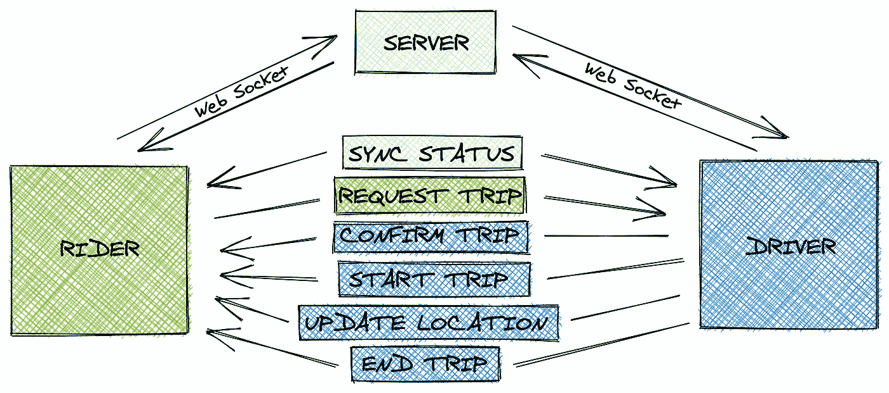
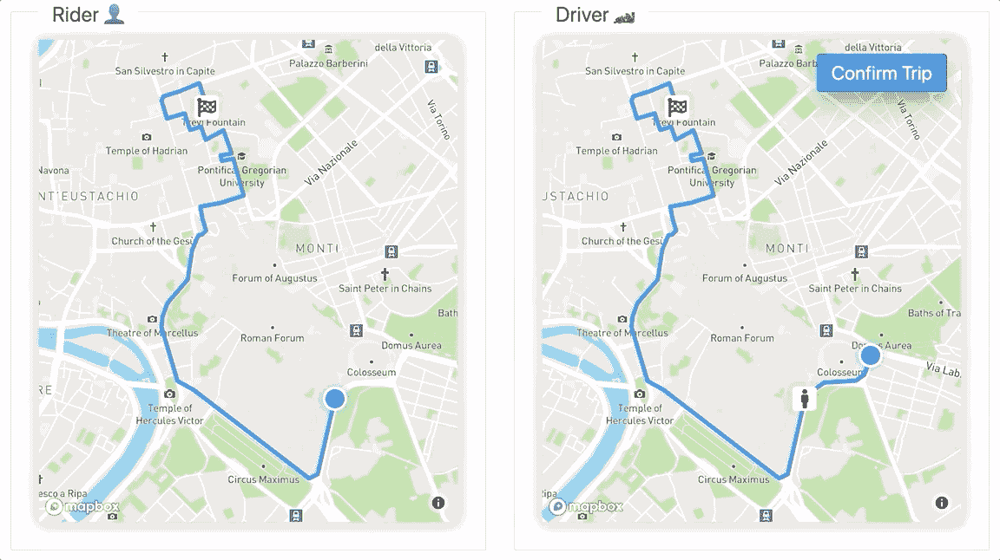
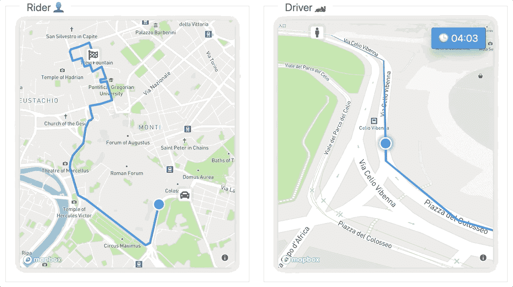
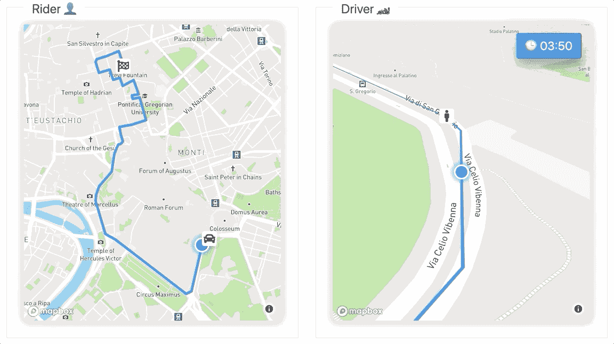
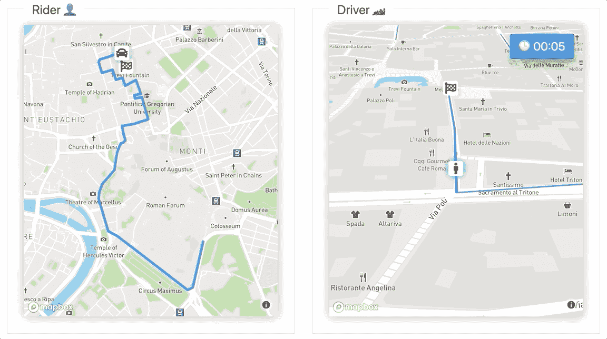

# 零到流应用—前端

> 原文：<https://levelup.gitconnected.com/zero-to-demo-streaming-application-frontend-ec6cb95ee7d2>


[阿德里安·勒杜](https://unsplash.com/@adrienl?utm_source=medium&utm_medium=referral)在 [Unsplash](https://unsplash.com?utm_source=medium&utm_medium=referral) 拍摄的照片

> ***注:*** *这是“*零到流媒体应用*”的一部分，了解流媒体应用构建 POC。完整代码* [此处](https://github.com/FeliceGeracitano/kafka-uber)。
> 
> [*>下一部分(后端)*](https://medium.com/@felice.geracitano/zero-to-streaming-application-backend-bf18fd1207ae)

# 动机

学习新的东西是一种积极的方式来度过我们在 2020 年被迫隔离的时间。我在 youtube 上登陆了这个视频，并决定学习更多关于流媒体应用的知识。

《阿帕奇卡夫卡导论》中的詹姆斯·沃德:[https://www.youtube.com/watch?v=UEg40Te8pnE](https://www.youtube.com/watch?v=UEg40Te8pnE)

我决定自己建立一个汽车共享 POC，客户实时共享信息，消息由 Kafka topics 处理。我也通过挑选我不是每天都用的技术来挑战自己。本文致力于 POC 的前端。

# 图书馆/技术

*   [苗条的](https://svelte.dev/)
*   [Rxjs](https://rxjs-dev.firebaseapp.com/)
*   [地图框](https://docs.mapbox.com/mapbox-gl-js/api/)
*   [地盘](https://turfjs.org/)

# 体系结构

将有一个`**rider**`客户端和一个`**driver**`客户端都通过 WebSocket 连接到后端服务，目标是在两者之间产生和消费多个事件。

下面是两个应用程序将交换的消息类型列表。

描述由客户端管理的操作的 Js 对象

为了简化开发和调试，两个客户端可以位于同一个页面上。观察一个更新如何影响另一个会容易得多。

同一个窗口中的`**rider**`和`**driver**`将被一个小黑客捆绑在一起，它们将共享相同的 ID，只是前缀不同

```
*id =* xxxxxxxx-xxxx-xxxx-xxxx-xxxxxxxxxxxx ***const*** riderId = `**R**${id}**`**
***const*** driverId = `**D**${id}**`**
```



行动在骑手和车手之间流动。感谢[https://excalidraw.com/](https://excalidraw.com/)提供的图解工具

# 项目结构

```
── frontend
    ├── package.json
    ├── public
    ├── rollup.config.js
    └── src
        ├── components
        │   ├── App.svelte
        │   ├── Driver.svelte
        │   ├── Rider.svelte
        │   └── common
        │       ├── BackCamera.svelte
        │       ├── Button.svelte
        │       ├── CenterView.svelte
        │       ├── CountDown.svelte
        │       ├── LineString.svelte
        │       ├── Map.svelte
        │       ├── Marker.svelte
        │       └── MovingMarker.svelte
        ├── main.js
        └── utils
            ├── actions.js
            ├── constants.js
            ├── mapbox.js
            └── utils.js
```

`Driver.svelte`和`Rider.svelte`是在`App.svelte`中调用的两个客户端应用程序。

通用组件将在`Rider.svelte`和`Driver.svelte`之间共享，这些大部分是插件，消耗地图上下文并在必要时更新地图。

# 处理 WebSocket 消息

我们开始从 WebSocket 流创建一个可观察对象，并将消息过滤到正确的处理程序。下面的要点将显示客户端-服务器的连接。

细长的***on mount***life cycle:连接到服务器并将消息分派给正确的处理器

引用 RxJS 文档:

> `*multiplex*` *用来模拟打开几个套接字连接，而实际上只维持一个。*

很简单，`multiplex`作为第一个参数接受一个在连接事件时调用的函数，作为第二个参数接受一个在断开事件时调用的函数，它们对我们来说是空的。

骑手消息处理程序:

骑手服务器消息处理程序

让我们以`SYNC_STATUS`为例:

*   它由服务器发送给`rider`和`driver`客户机，并告知旅行的当前状态
*   在`rider`的情况下，如果 trip 不存在，我们请求向服务器发送一个`REQUEST_TRIP`动作。
*   我们想在地图上画出从`origin`到`destination`的旅程，所以我们调用函数(mapbox 服务代理)来获得要画成线的方向。注意:`origin`和`destination`是带有`latitude`和`longitude`的两个任意位置对象

调用地图框 api:

获取行驶方向的 Mapbox api 调用

你可以在 gist 响应示例中看到，对象`geometry`是我们希望在地图上画线的有效载荷。

# 处理地图框移动

我们将支持两种类型的地图移动，第一种是将地图居中以适应`rider`的旅行方向，第二种是复制典型 GPS 导航器的相机视图或*f1 视频游戏中的*远追🏎对于`driver`。

我们可以使用上下文 api 构建`Map.svelte`组件，并向任何内部组件提供地图对象。然后，每个子组件可以操作内容或更改相机设置。

Map.svelte 组件仅在 Mapbox 对象被实例化后才安全地呈现子级

fitBounds 完成了所有的工作，你只需要通过一个`LngLatBound object`[https://docs.mapbox.com/mapbox-gl-js/api/#lnglatboundslike](https://docs.mapbox.com/mapbox-gl-js/api/#lnglatboundslike)

Rider.svelte 调用地图组件并用 CenterView 装饰

*远追*相机需要更多代码行，但并不复杂:

`FarChaseCameraView.svelte and how to calculate bearing with turf`

`FarChaseCameraView.svelte`接受一个`location`参数，该参数与来自草皮的[恒向](http://turfjs.org/docs/#rhumbBearing)实用程序的`previousLocation`进行比较。一旦我们有了方位值，我们可以调用`easeTo`或`rotate` Mapbox API，它也将处理标记在地图空间中的 x & y 移动。

为了管理汽车运动，我们可以使用 tripDuration 和 turf 来计算汽车何时应该在路线上。然后，我们可以发送一个更新位置(每秒节流)，并检查与用户的距离，并结束行程。

驱动函数动画

> **注意**循环使用`setInterval`而不是`requestAnimationFrame`来触发逻辑，即使选项卡不在焦点上。(模拟打开多个选项卡以模拟多个客户端)。

# 结果

你可以看到一系列演示旅行生命周期的 gif，从`request`到`updates`和`end.`



骑手已通过**请求 _ 行程**动作发送其行程请求，驾驶员点击“确认行程”将确认行程发送**确认 _ 行程**动作。



驱动程序不断通过 **UPDATE_LOCATION 向服务器发送更新。**车友展示最新更新。



当司机足够近的时候，它就可以接骑手，发送 **START_TRIP。**



**END_TRIP** 动作由司机调用。

# 结论和我学到的东西

**苗条**:从开发者体验的角度来看，我期待更多的东西，我会用它来进行快速演示和原型制作，但在日常工作中感觉会引起一些头痛。一个大红色标记是网站中记录的默认配置:

```
npx degit [sveltejs/template](https://github.com/sveltejs/template) my-svelte-project
cd my-svelte-project
npm install
npm run dev
```

不会失败，如果你滥用依赖迫使你在运行时检查错误。但是最大的缺点是…🥁(drum 卷)…。缺少 Typescript 支持。一旦你迷失了所有的输入，我尝试了一些非官方的解决方案，但是对于其他的库/框架来说太复杂了，仅仅是 works™️.

*VS 代码集成呢？*

官方的[插件做了一个基本的工作，但是如果你在日常编码中使用其他闪亮的助手，它们可能需要重新配置来与`.svelte`扩展一起工作。](https://marketplace.visualstudio.com/items?itemName=svelte.svelte-vscode)

**Mapbox:** I 过去用过几次，简单有效，强烈推荐。

**Rxjs** :这个演示过度杀戮，不需要取消机制或者复杂的事件聚合。我应该只使用`Websocket`，出于同样的原因，我没有进口`axios`而选择`fetch`。

完整的演示代码[在这里](https://github.com/FeliceGeracitano/kafka-uber)

> [*>下一部分(后端)*](https://medium.com/@felice.geracitano/zero-to-streaming-application-backend-bf18fd1207ae)

[](https://skilled.dev) [## 编写面试问题

### 一个完整的平台，在这里我会教你找到下一份工作所需的一切，以及…

技术开发](https://skilled.dev)