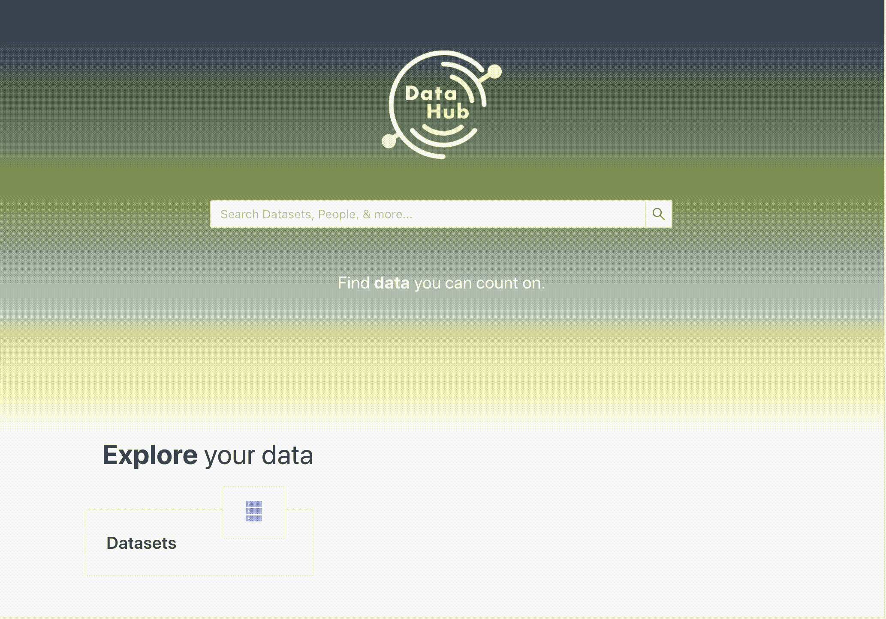
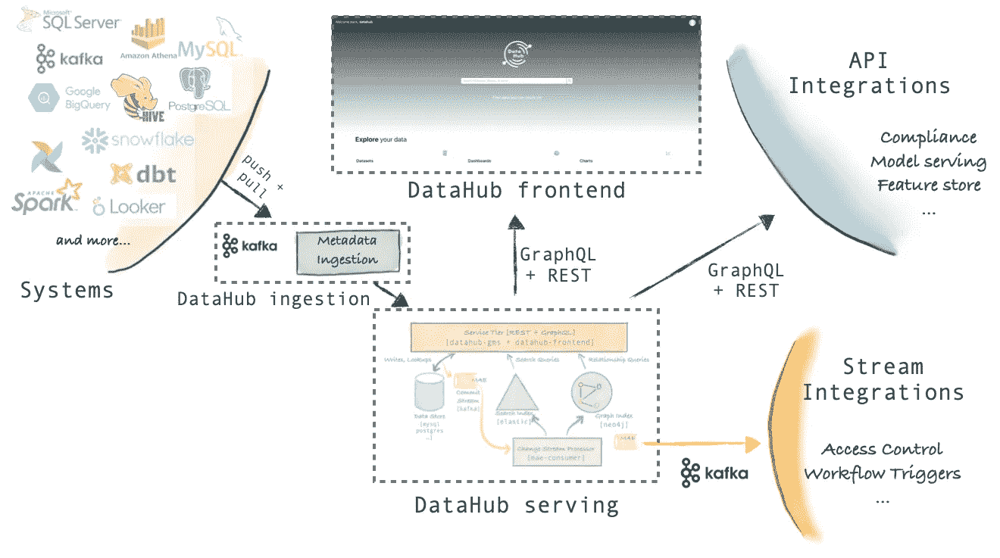
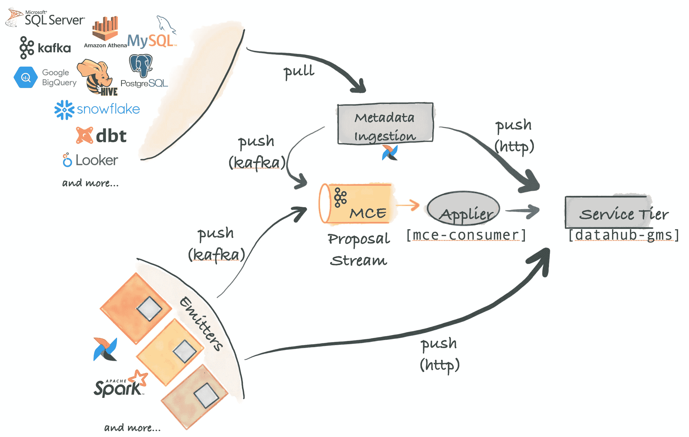
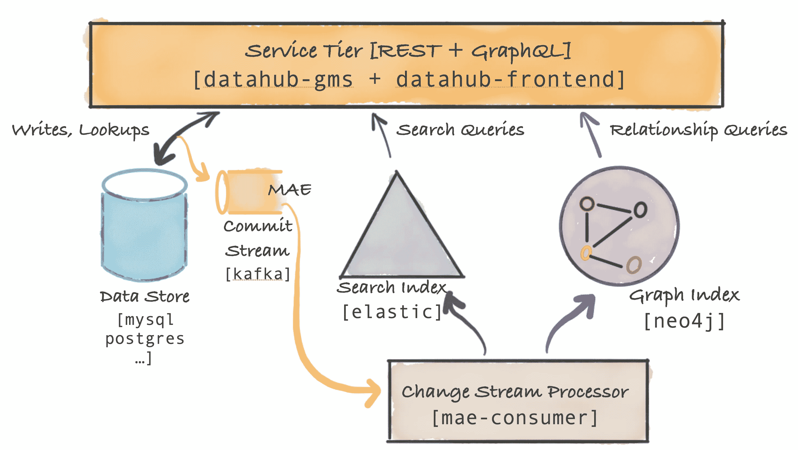
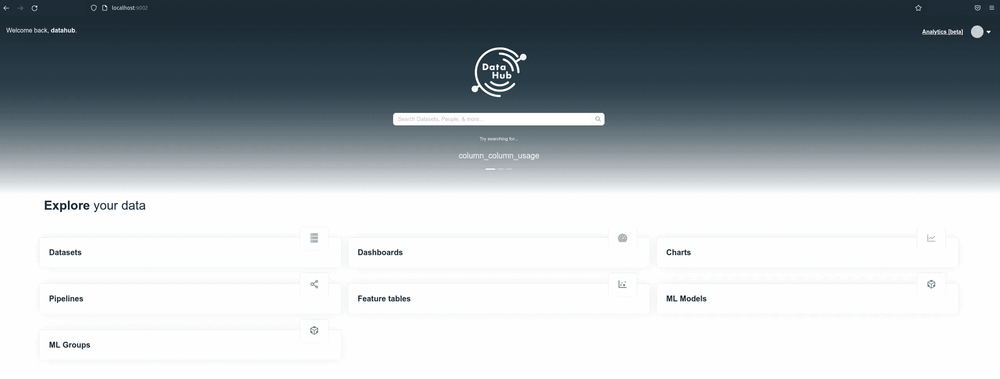
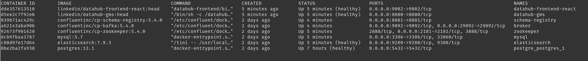
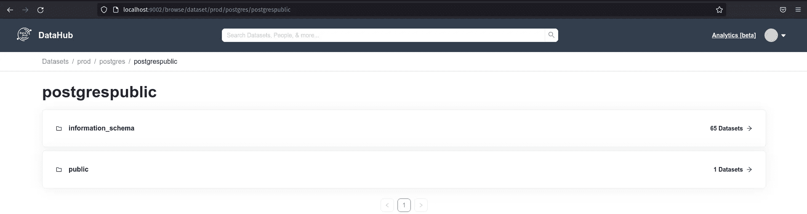
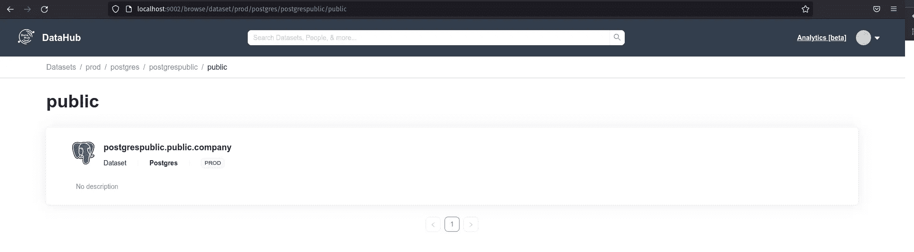
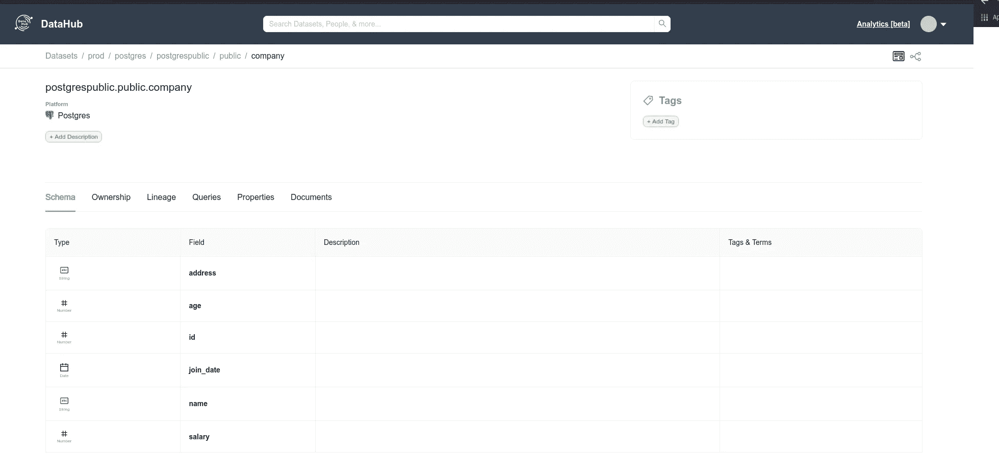
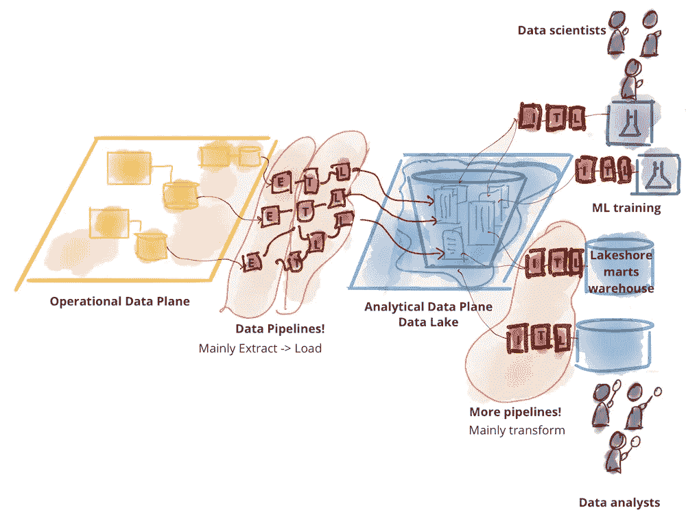

# 零到部署和演进数据目录

> 原文：<https://levelup.gitconnected.com/zero-to-deployment-and-evolution-data-catalog-38864406981a>


Andrew Petrischev 在 [Unsplash](https://unsplash.com?utm_source=medium&utm_medium=referral) 上拍摄的照片

## 这是什么？开源替代品？如何实施？挑战和更多！

本出版物旨在阐明“一些”机构已经开始理解并重视其数据作为内部产品的情况，这种内部产品将在短期内提升、鉴定和区分其产品。不幸的是，这家公司内部的每个业务领域都构建了自己的架构，很多时候没有标准，没有质量或基本的卫生条件，使得发布方式陈旧而缓慢，充满了“游戏”,成为名副其实的数据贫民窟。

在这种混乱的情况下，商业人士通常会被疏远，指责某个“软件”或解决方案速度慢，或者他们“确信”某个信息在整个区域中不存在。

*#如何改变这种局面？如何避免用数据“遮蔽 IT”？防止信息的“贩卖”？*

另一种方法是了解已经存在的内容，组织、编辑和编目可用的数据库以进行分发，并创造机会培养面向数据的组织文化，即创建数据中心。

根据 LinkedIn 工程师的说法，这些是使用他们需要的数据目录和元数据样本的一些情况:

*   搜索和发现:数据模式、字段、标签、用法信息。
*   访问控制:访问控制组、用户、策略。
*   数据沿袭:管道执行、查询、API 注册、API 模式。
*   合规性:数据隐私分类/合规性注释类别。
*   数据管理:数据源配置、接收配置、保留配置、数据清除策略(例如，针对 GDPR 的“被遗忘权”)、数据导出策略(例如，针对 GDPR 的“访问权”)。
*   人工智能解释，再现性:资源定义，模型定义，训练执行运行，问题陈述。
*   数据操作:管道运行、已处理的数据分区、数据统计。
*   数据质量:数据质量规则定义、规则执行结果、数据统计。

注意到不断增长的市场需求，世界各地的许多社区和公司将开发各种解决方案，如 Airbnb 的 Dataportal、网飞的 Metacat、优步的 Databook、LinkedIn 的 DataHub、Lyft 的 Amundsen、Spotify 的 Lexikon 和 Qlik Data Catalog。

在这些和其他许多公司中，主要在采用和使用开源解决方案的社区和公司中脱颖而出的是 Lyft 的 Amundsen 和 LinkedIn 的 DataHub。

由于 Amundsen 是在 DataHub 之前发布的解决方案，并被纳入 LF AI Foundation，因此它获得了很大的社区，许多公司在其生产环境中使用它。

看看 DataHub，我们可以看到 LinkedIn 在开源项目上的成功记录正在重演，就像 Kafka 的案例一样。在最初的几个月里，这个项目获得了一个很大的社区，被许多公司甚至金融机构采用，他们使用它并积极地做出贡献。

从经验、集成数量和丰富的文档来看，我更喜欢 DataHub 和您？



> DataHub 是一个面向现代数据堆栈的开源元数据平台。

## 体系结构



其架构可分为接收、服务和前端:

*   **摄取架构:**



使用插入不同源以提取通过 HTTP 或 Kafka 发送到存储层的元数据的 Python 摄取系统，这些管道可以集成到一个气流中，用于计划的摄取或捕获血统。

*   **服务建筑:**



元数据保存在文档存储中(它可以是 RDBMS，如 MySQL、PostgreSQL，也可以是键值存储，如 Couchbase 等。).

DataHub 有一个元数据提交日志流(MAE ),这是一项服务，可以检查元数据是否有变化，并对发生的修改启动实时更新反应。

*   **前端架构:React App + Graphql + Images:**

您的前端是使用 React 构建的，以支持:

*   可配置性:客户体验必须是可配置的，以便部署组织可以根据他们的需求采用某些方面。这包括设置主题/风格、显示和隐藏特定功能、定制副本和徽标等。
*   可扩展性:扩展 DataHub 功能应该尽可能简单。诸如扩展现有实体和添加新实体之类的更改应该只需要最少的工作，并且在详细的文档中有很好的介绍。

## 集成:

作为一个数据目录，其主要采用点之一是其开箱即用的接收解决方案的数量。使用 DataHub，只需要安装 Docker，安装 Python 库，执行 YML 配置文件传递到摄取类别，访问用户名和密码等信息，以及“sink”目的地。

集成列表:

*   卡夫卡
*   关系型数据库
*   Microsoft SQL Server
*   储备
*   一种数据库系统
*   红移
*   AWS SageMaker
*   雪花
*   SQL 概要文件
*   超集
*   神谕
*   宴会
*   谷歌大查询
*   AWS 雅典娜
*   AWS 胶水
*   德鲁伊特
*   SQLAlchemy
*   MongoDB
*   轻量级目录访问协议
*   LookML
*   Looker 仪表盘
*   文件
*   dbt
*   谷歌大查询
*   卡夫卡连接

没有找到您的数据库或数据源，这是使用 SQLAlchemy 获取元数据或通过 Rest API 或直接在 DataHub 的内部 Kafka 中摄取元数据的替代方法。

除了与数据库、API、Kafka 集成之外，还可以进行集成，并从人工智能模型中搜索信息。

## 部署:

数据目录的另一个问题是它将在哪里以及如何安装？你的认证？备份和日志？

个人关心的是始终采用可以在不同环境中使用的解决方案；可以通过 docker image、Kubernetes environment、AWS 和 GCP 在本地部署云和数据中心。

您的身份验证可以与 JaaS 身份验证、通过 React 的 JaaS 身份验证、Google 身份验证和 Okta 身份验证集成。日志保存在可以远程访问的目录中，数据保存在数据库中。

## 本地演示:


这是一个执行本地 PostgreSQL 安装、创建示例表、安装数据中心以及将 PostgreSQL 元数据接收到数据中心的示例。要执行这个演示，必须安装 Docker、Git 和 Python。

**使用 Docker compose 部署 PostgreSQL】**

使用以下内容创建 docker-compose.yml 文件:

```
version: '3'services:
  postgres:
    image: postgres:13.1
    healthcheck:
      test: [ "CMD", "pg_isready", "-q", "-d", "postgres", "-U", "root" ]
      timeout: 45s
      interval: 10s
      retries: 10
    restart: always
    environment:
      - POSTGRES_USER=root
      - POSTGRES_PASSWORD=password
      - APP_DB_USER=docker
      - APP_DB_PASS=docker
      - APP_DB_NAME=docker
    volumes:
      - ./db:/docker-entrypoint-initdb.d/
    ports:
      - 5432:5432
```

运行以下命令:

```
docker-compose up
```

使用一些数据库连接工具，如 Dbeaver，访问 PostgreSQL 并创建下表:

```
CREATE TABLE COMPANY(
   ID INT PRIMARY KEY     NOT NULL,
   NAME           TEXT    NOT NULL,
   AGE            INT     NOT NULL,
   ADDRESS        CHAR(50),
   SALARY         REAL,
   JOIN_DATE   DATE
);
```

## 数据中心部署

安装 Python 3.6 或更高版本后，在终端中运行以下命令:

```
python3 -m pip install --upgrade pip wheel setuptools
python3 -m pip uninstall datahub acryl-datahub || true  
python3 -m pip install --upgrade acryl-datahubdatahub version
```

在您的终端上安装 DataHub CLI:

```
datahub docker quickstart
```

去[http://localhost:9002](http://localhost:9002)；您的用户名和密码将是“datahub ”,不带引号。



我们的数据中心和 PostgreSQL 正在运行:



**将 PostgreSQL 元数据接收到数据中心:**

克隆数据中心项目:

```
git clone [https://github.com/linkedin/datahub.git](https://github.com/linkedin/datahub.git)
```

导航到摄取脚本文件夹:

```
cd datahub/metadata-ingestion/scripts
```

使用以下内容创建 metadata _ ingest _ from _ postgres . YAML 文件:

```
source:
  type: postgres
  config:
    username: root
    password: password
    host_port: localhost:5432
    database: postgres
    database_alias: postgrespublic
    include_views: True
sink:
  type: "datahub-rest"
  config:
    server: "[http://localhost:8080](http://localhost:8080)"
```

运行下面的命令:

```
./datahub_docker.sh ingest -c ./metadata_ingest_from_postgres.yml
```

通过上面的命令，所有元数据都将被获取并可供访问:



除了收集的元数据之外，还可以为模式、表和列放置描述和标记；找出你的主人的“所有权”，血统，主要查询，属性，以及额外的文件链接。

## 结论:

构建最初混乱的数据世界可能是一项非常复杂的任务。第一步将是对数据进行沉浸和编目，以重构一个具有更好的治理和信息质量的场景。

理想数据网格架构的愿景:



DataHub 是一个强大的数据目录解决方案，除了与不同的数据库集成之外，还支持数据沿袭甚至人工智能模型的编目。然而，这个解决方案并不神奇；有必要监控和接收字段描述和访问管理等数据。

> “没有数据，你只是另一个有观点的人。”爱德华兹·戴明

参考资料:

[](https://medium.com/datahub-project) [## 数据中心项目

### LinkedIn DataHub 是一个开源的数据发现和元数据平台。

medium.com](https://medium.com/datahub-project) [](https://martinfowler.com/articles/data-mesh-principles.html) [## 数据网格原理和逻辑架构

### 我们渴望用数据来增强和改善业务和生活的方方面面，这要求我们在如何…

martinfowler.com](https://martinfowler.com/articles/data-mesh-principles.html) [](https://medium.com/datahub-project/data-in-context-lineage-explorer-in-datahub-a53a9a476dc4) [## 上下文中的数据:数据中心中的沿袭浏览器

### DataHub 旨在使用户能够发现、信任其组织中的数据并对其采取行动。了解在哪里…

medium.com](https://medium.com/datahub-project/data-in-context-lineage-explorer-in-datahub-a53a9a476dc4) [](https://medium.com/swlh/the-5-data-store-patterns-data-lakes-data-hubs-data-virtualization-data-federation-data-27fd75486e2c) [## 5 种数据存储模式—数据湖、数据中心、数据虚拟化/数据联合、数据…

### 如何选择正确的，为什么你可能需要不止一个

medium.com](https://medium.com/swlh/the-5-data-store-patterns-data-lakes-data-hubs-data-virtualization-data-federation-data-27fd75486e2c) [](https://github.com/linkedin/datahub) [## GitHub - linkedin/datahub:现代数据栈的元数据平台

### 📣下一次 DataHub 市政厅会议将于 7 月 23 日上午 9 点至 10 点(太平洋标准时间)举行

github.com](https://github.com/linkedin/datahub) [](https://engineering.linkedin.com/blog/2020/datahub-popular-metadata-architectures-explained) [## 数据中心:流行的元数据架构解释

### 十年前，当我在 LinkedIn 开始我的旅程时，这家公司刚刚开始经历这个领域的飞速发展…

engineering.linkedin.com](https://engineering.linkedin.com/blog/2020/datahub-popular-metadata-architectures-explained) 

*#感谢阅读；请分享这个帖子！:)*