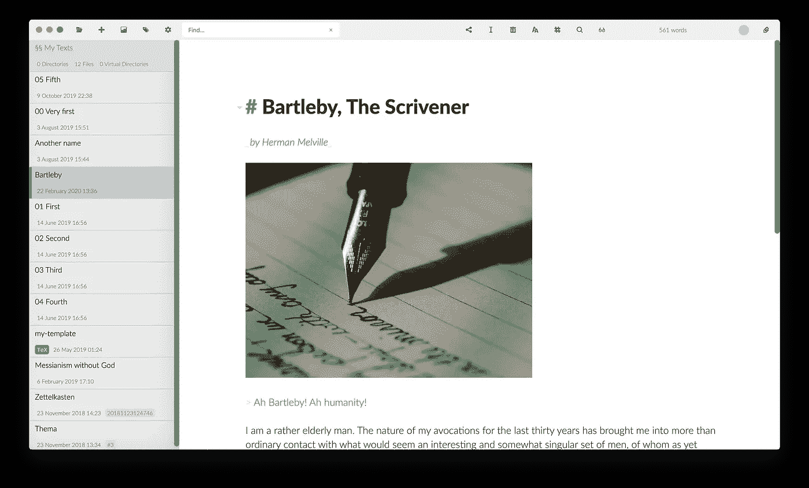
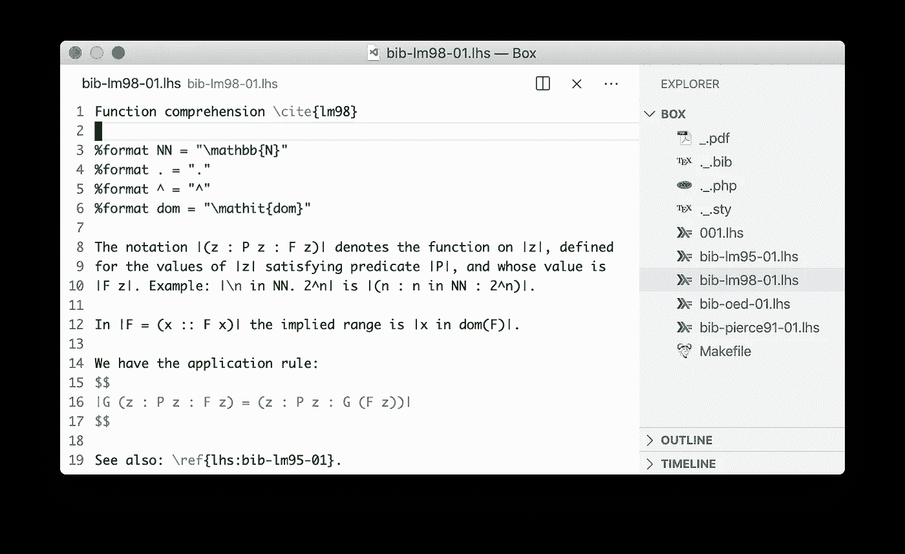
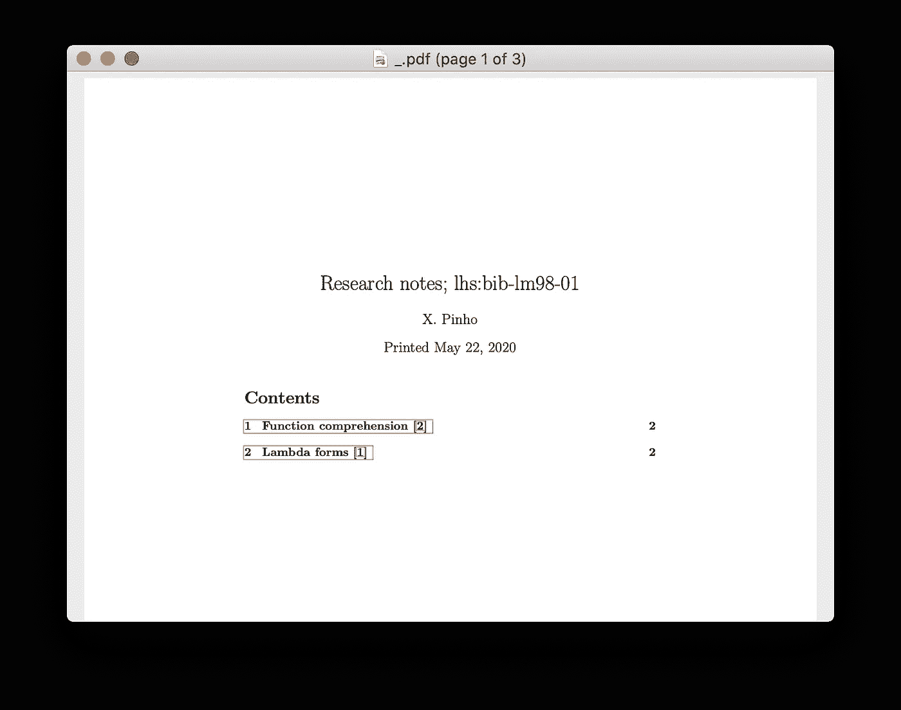

# Zettelkasten + LaTeX + VS Code =生产率++？

> 原文：<https://levelup.gitconnected.com/zettelkasten-latex-vs-code-productivity-a7deb650608e>

## 这是我的手工系统。

*Zettelkasten —* 字面德语意思为*—*滑盖盒最近已经成为互联网讨论中相当流行的知识管理系统。有很好的理由:老实说，像已故的德国社会学家尼克拉斯·卢曼这样的支持者,**是一位多产的作家，他名下有 70 多本书和 400 多篇文章**，这也难怪！

Niklas Luhmann(由[松塔格](https://commons.wikimedia.org/wiki/File:Luhmann.png))以及 VS Code 和 LaTeX。

刚刚获得博士学位——换句话说，我每天都在阅读和注释文章——我认为这可能是一个实验的好机会，看看 Zettelkasten 方法是否对我有好处。至少我不会因为做实验而完全拖延，对吗？

在本文中，我将介绍我目前的设置，它由文档排版系统 LaTeX、VS Code 和一些 PHP 脚本组成，将所有的东西结合在一起。还有 Makefile——我喜欢 Makefiles。

# Zettelkasten 非常(非常)简单的描述

在我看来，Zettelkasten 的关键思想是让你有一个地方存放你所学和(或)制作的所有东西，采用短文本的形式，每个短文本都有一个唯一的 ID，并且在它们之间有尽可能多的参考/关键词。

有希望的是，一旦你的滑动盒(Zettelkasten)有了相当大的增长，你就可以通过简单的遵循链接链来提取明显不相关的受试者之间令人惊讶的联系。 *这是我最着迷的。*

然而，要做到这一点，在插入新的注释时，您还需要注意查找以前的注释中的相关概念，以便更新相关的连接。

照片由 [Maksym Kaharlytskyi](https://unsplash.com/@qwitka?utm_source=medium&utm_medium=referral) 在[unplash](https://unsplash.com?utm_source=medium&utm_medium=referral)上拍摄

当鲁曼打算写一篇文章时，他会从系统地从他的 Zettelkasten 中提取与手头主题相关的所有笔记开始。然后，他面前桌子上的那些笔记，就其本身而言，大部分都写完了:他现在只需要把这些笔记拼凑起来。

# 您为什么推出自己的解决方案？为什么不改用软件 ____？

我尝试过的大部分软件都不支持 LaTeX，这对我和学术界的其他人来说都是一个破坏。而且，即使是那些支持 LaTeX 的人，也经常缺乏设置自定义宏或使用 LaTeX 预处理器的能力，比如 lhs2TeX。更不用说 BibTeX 的支持了。

另一方面，如果 Markdown 是你排版所需要的，那么今天是你的幸运日，因为有很多好的选择！例如，Zettlr 是我最接近达到我所有要求的。它甚至可以在所有三大操作系统上运行，而且是开源的。

资料来源:Zettlr.com

# 好吧，让我们看看你的设置！

所以，我只有这个文件夹，名为*盒子*，里面存放着我所有的*【zettels】*(笔记)。zettels 采用 [*识字 Haskell*](https://wiki.haskell.org/Literate_programming) 格式(`.lhs`)，并由 lhs2TeX 进行预处理。

为了使系统尽可能简单，我采用了一些惯例:

*   每个 zettel 的第一行表示其标题。不需要格式化标签。只发短信。
*   zettel 的 ID 由字符串`lhs:<zettel's-basefilename>`隐式给出。例如，存储在`001.lhs`中的 zettel 具有 ID `lhs:001`。这使得在不使用正则表达式的情况下查找 zettel 引用变得更加容易。(见下一条。)
*   使用 LaTeX 内置的`\ref{}`宏来引用其他注释。这样我就可以让 LaTeX 来处理章节编号和超链接。
*   我制作的笔记被赋予一些随机的数字 ID，例如`001`。如果一个新的注释是对以前注释的补充，我只需在它后面附加一个字母，例如`001a`、`001b`等等。
*   我做的书目笔记被赋予了 ID `bib-<reference>-<id>`。我有一个 pdf 文件夹，里面存放着我所有的参考资料；`<reference>`子字符串应该与相应引用的 PDF 文件名一致。这样，我可以立即从我的 pdf 文件夹中获取给定参考的所有注释。
*   有一个 Makefile，它的工作是编译一个给定 zettel、*的 PDF 版本(文件`_.pdf`)以及它传递引用的所有其他 zettel*，只需通过调用，例如`make bib-lm98-01.pdf`。

## 工作流程

工作流程很简单，*正如它应该做的那样*。

*   如果我读到一些我想写下来的有趣的东西，我会开始一个新的书目模板。如果这个引用对我的 Zettelkasten 来说是新的，我也先把它添加到我的 BibTeX 文件(上面的文件`_.bib`)中。
*   如果我只是想记下一些评论/观察/等等，我会立即将它归档在某个随机 ID 下，然后使用 VS Code 的 grep 特性来查找我可以链接到的可能相关的 zettels。
*   就是这样。我觉得这再简单不过了，真的。

你可能想知道为什么我给我的 BibTeX 取名为`_.bib`。原因是在 VS 代码中，它总是在我的浏览器侧边栏的顶部，因为这是一个我会经常编辑的文件。另一个原因是我喜欢把我的*盒*文件夹想象成“唯一的”包含 zettels 的文件夹，不受其他干扰。

## 支持这一切的源代码

我现在要和你们分享所有让这个工作流程成为可能的源代码。我认为，如果我们从 Makefile 开始，以便看到更大的画面，会更容易。

正如我们所看到的，只有一个规则，那就是将 zettel 编译成 PDF。当被调用时，它首先创建一个临时文件夹(`.tmp`)，将 LaTeX 编译所需的所有(预处理)文件移动到该文件夹中。这是为了让我们的*盒子*不会被那些讨厌的 LaTeX 辅助文件弄得乱七八糟。我们总是在最后销毁那个临时文件夹，以保持东西……*干净*。

然后，我们运行 PHP 脚本`_.php`，它负责为给定的 zettel *以及它传递引用的所有其他 zettel*构建一个有文化的 Haskell 文档。根据上面设置的约定，我们可以通过查找`\ref{lhs:*}`字符串模式找到它引用的所有 zettels。

诚然，这个脚本只是一个黑客，但它仍然很有用。它输出有文化的 Haskell 这一事实并不重要——你也可以让它输出 Markdown 或其他任何东西。重要的是它找到了所有相关的 zettels。

运行，例如`make bib-lm98-01.pdf`，会将 zettels `bib-lm98-01`和`bib-lm95-01`合并到以下 PDF 文件中——后者显示出来是因为它被前者引用:

> 我用这个系统的目的是能够在任何时候，用一个非常简单的命令，将我曾经写下的关于某个主题或参考书目的所有内容编辑成一个 PDF 文件。

# 结论

对我来说，现在决定 Zettelkasten 系统是否能让我更有效率还为时过早。我的计划是让它在接下来的几个月里有机地发展，然后再决定这是否是我一生都在做的事情。[卢曼建议](http://luhmann.surge.sh/communicating-with-slip-boxes):

> 滑动箱需要若干年才能达到临界质量。在那之前，它只是一个容器，我们可以从中取回放入的东西。

我确实想知道卢曼是否因为他的 zettelkesten 系统而如此高效，或者 zettelkesten 只是他组织信息的一种特殊方式。就我个人而言，我支持前者。

无论哪种方式，直到有一个完整的解决方案来满足我对 Zettelkasten 实现的特殊需求，我希望这个手工系统能成为和我同舟共济的人的起点。

*谢谢你的阅读。*